+++
title = '2022 KDD论文阅读：Intelligent Request Strategy Design in Recommender System'
date = 2022-08-30T16:15:19+08:00
author = "Skyan"
tags = ["kdd", "data science", "paper"]
ShowToc = true
ShowBreadCrumbs = true
+++

阿里巴巴2022年KDD上发表一篇[论文](https://arxiv.org/abs/2206.12296)，介绍“瀑布流”推荐产品如何智能地选定请求时机的问题。这篇论文之前作为淘宝端智能的一项成果在知乎发布过，详见[这篇文章](https://zhuanlan.zhihu.com/p/440920682)。今年算是正式在KDD发表论文了。

阅读过程中我也一直将论文的方法和我们所做的类似的项目做对比，结论是思路是一致的，并不落后，但这篇论文的手段更加丰富，资源投入也更多，值得我们参考和学习。

## 背景
论文一开始先介绍什么事“瀑布流”推荐，这对于国内的移动用户而言司空见惯，就是无限下拉无限刷新推荐结果的产品交互形式，国内一般也叫feed信息流。所以需要解决的一个问题是分页请求时机的问题，就是确定在什么时机向后端发送新的推荐请求。一般是每浏览n个item后(也叫一刷)发起后端推荐请求。如果n变小，请求的频度增加，则后端服务请求的压力增加，而且很多用户本来也没有购买或者点击意愿，新增的推荐请求返回的结果也没有转换为最终的业务收益，最终白白浪费了算力。相反，如果n变大，请求的频度减少，则用户反馈延迟较长，用户实时的意愿（例如点击，购买转化等行为）没能及时反馈到后端，导致下一刷展现的还是之前缓存的推荐结果，体验较差而且不能提升产品收益。作者以淘宝App首页推荐为例，统计了每一刷的推荐结果CTR的变化情况，如下图所示：
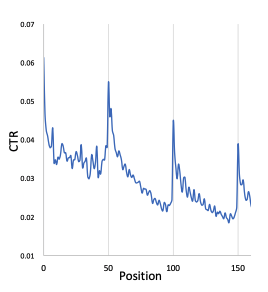

可以明显看出每一刷头几条结果都是点击率很高，但后续衰减也是非常明显的。而且每次一刷更新点击率都有一次迅速提升，原因是新的一刷捕捉到了用户最新的兴趣点，但之后又回归到衰减。

## 问题和解决方案

因此，如何确定什么时机发起下次刷新是这篇论文需要解决的问题，作者给该解决方案定义了一个名词：IRSD（Intelligent Request Strategy Design），还大言不惭的说据他们所知，这是第一个在瀑布流推荐产品中研究IRSD的论文。

作者提出该问题主要有如下几点挑战：
1. 捕捉用户兴趣点动态变化是一个难点，因为用户兴趣点是隐式变化的
2. 不能同时观测到用户增加或者不增加下一刷请求，本质上这是一个反事实现象，所以uplift预估存在巨大的挑战。
> 这一点非常赞同，和我们遇到的难题类似， 不同策略其实无法在一个用户中同时存在，这也是反事实模型需要解决的问题
3. 如何平衡新增下一刷请求的收益和带来的额外资源消耗非常有挑战性，尤其是用户数一直在动态变化
> 这一点和我们遇到的问题类似，如何保持QPS在系统可承载的范围内，同时拿到额外的业务收益，这也是效果-算力之间平衡的难题

为了解决以上调整，他们提出了一种新的范式，即基于Uplift算法的端智能请求框架（Uplift-based On-edge Smart Request Framework (AdaRequest)）。该框架部署在端上，这样可以更极致实时地收集和分析用户行为。该框架由如下几部分组成：用户行为理解模型（CUBE），反事实请求奖励估计（CREST），动态请求规划（DRP）。其中：

* CUBE挖掘用户稀疏的实时行为序列，长期行为序列，以及购买交互序列。通过比较用户实时意图和历史兴趣，CUBE可以评估出用户兴趣点是否有变化
* CREST目标是对treatment和control组的用户分别建模，通过因果推断（causal inference）预估出增益（uplift）。
* DRP动态选择新增请求的比例，用来选取最大化的请求奖励和资源消耗之比，在有限的资源约束前提下最大化请求奖励。

最终这套AdaRequest在手机淘宝的猜你喜欢页面（也就是首页推荐）落地，和固定增加请求比例对比，有GMV提升3%的额外收益。

总的来说，论文定义并调研了瀑布流推荐场景下的IRSD问题，同时提出了AdaRequest范式解决IRSD问题。同时通过在线和离线实验量化证明了AdaRequest的有效性。

## 问题定义
接下来论文介绍了实现的方法。首先定义问题，从形式上IRSD问题定义如下：
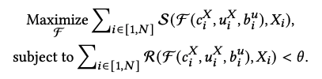

其中S函数代表用户的正向反馈，F函数代表决策结果(1代表请求，0代表不请求)，\(c_i^X\)代表第i个上下文环境，\(u_i^X\)代表第i个用户，\(b_i^u\)代表第i个用户的历史行为，\(X_i\)代表第i刷。R代表新增请求的资源消耗函数。因此第一个公式代表在各种上下文环境、用户、历史行为、刷次中获取的总收益大小。第二个公式代表总资源消耗约束在theta阈值以内。优化目标是找到最优的算法F，使得在满足资源消耗约束条件下，最大化业务收益。

## AdaRequest框架
接下来终于一窥AdaRequest方案的整体框架，如下图所示：
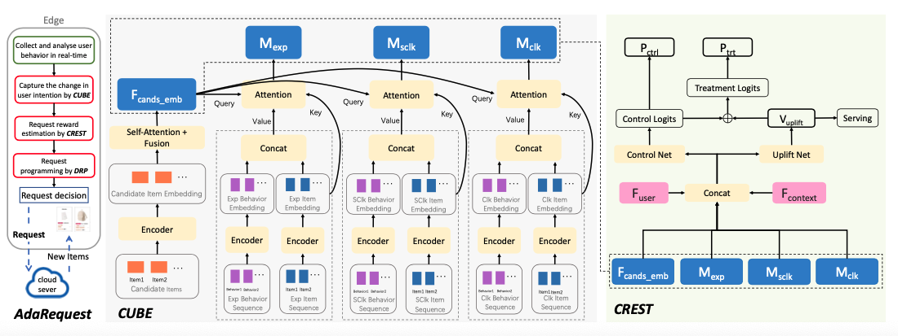

虽然CUBE，CREST，DRP三大组件看起来很高级的样子，其实核心在左边的流程图中：

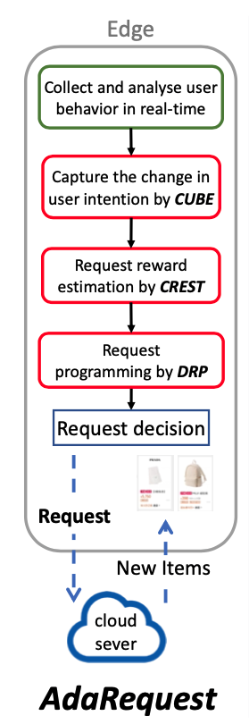

首先在端上实时采集用户行为，第二步CUBE将用户行为转变为用户意图变化情况，转化方式实现采用了一个神经网络来解决，产出用户浏览历史匹配度，用户当前session点击历史匹配度，用户长期点击历史匹配度，以及候选推荐item的embedding向量。第三步CREST将第二步的输出作为输入，再加上用户以及上下文特征向量，可以预估出新增请求的奖励uplift，最终交给DRP来决策是否发起新增请求。

DRP将动态选择一部分高性价比的时机发起新的请求。如果决策新增一次推荐请求，端则向后端发起请求，上传用户实时行为，后端则重新分析用户意图，返回更新的推荐item，更好地匹配用户最新的兴趣点。

因此，该论文所采用的特征体系有：
* 用户特征F(user)
* 候选item特征F(cands)
* 用户细粒度的历史行为特征：
  * 用户的浏览历史F(exp)
  * 用户当前session的点击行为F(sclk)
  * 用户长期点击行为F(clk)
* 粗粒度的当前session的上下文特征F(context)

在这个特征组中，F(sclk)和F(clk)分别代表了用户实时和长期的兴趣点。F(exp)代表了上次请求曝光后用户不喜欢的item，原因是负向反馈也是一种有价值的信号。F(context)代表用户在当前session中的推荐满意程度，例如浏览的深度。论文还很贴心的把所有特征列表附在论文附录。

## CUBE
CUBE组件的目标是从用户实时行为中找出用户意图是否发生变化。由于推荐候选item是由后端服务根据用户历史兴趣推荐选择的，CUBE将结合用户行为，将用户刚刚交互过的item和推荐候选的item进行匹配。如果这两者不是非常匹配，意味着当前候选item并不满足用户当前意图，进一步则意味着用户意图发生了变化，因此此时如果新增一次推荐请求，能收获显著的购买uplift。

具体来说，CUBE将F(exp), F(sclk), F(clk)和F(cands)作为输入，针对特征特点做细粒度的建模。具体来说，F(sclk)特征分为用户行为序列F(sclk_beh)和item序列特征F(sclk_item)，分别通过两个GRU encoder输出向量并拼接在一起。F(exp)和F(clk)类似处理，而F(cands)采用一个GRU encoding编码，并通过mean-pooling操作做fusion融合。

最终，整个模型采用attention作为将候选item和用户以及交互行为序列匹配的算子。F(cand_emb)作为attention的query输入，用于匹配候选item是否满足用户实时意图。以F(sclk)为例，第i个item是否匹配用户意图的attention评分函数如下公式所示：
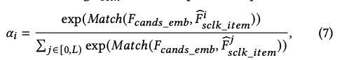

可见alpha_i即当前item的匹配率在所有匹配率中的softmax归一化值。输出向量M(sclk)定义如下：
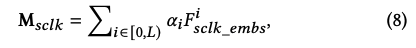

可见M(sclk)即每个item的F(sclk_embs)的加权和，代表了当前候选item是否匹配用户实时意图的程度。

上述的Match函数代表匹配分，代表推荐候选集和用户实时交互的item序列之间的相似程度，即attetion匹配函数。论文实际采用的是内积函数作为匹配函数的实现。M(exp)和M(clk)也是类似方法产出，结果的分布代表了候选item是否匹配用户不喜欢的item以及用户长期感兴趣的item。

## CREST
CREST模块用于预估新增一个额外的推荐请求带来的uplift收益。由于用户无法同时存在有和没有新增推荐请求的状态，因此无法反事实地观察到收益uplift的真实值groundtruth。

为了解决这个问题，作者采用两个独立的预估网络，Control Net用于预估如果没有额外的请求，购买率是多少。以及Uplift Net，用于预估如果有额外的请求，额外的增益uplift是多少。Control Net和Uplift Net加一起，可以预估出如果有额外的请求，那么购买率是多少。

为了训练这两个预估网络，论文将实验用户随机分为两组用于数据收集：control组没有额外请求，而treatment组随机发起额外请求。Control Net用control组的数据训练，而Uplift Net用control组以及treatment组的数据训练。

预估的时候，只有Uplift Net需要运行，来预估出请求reward，作为决策此次额外请求是否需要触发的基础依据。

用因果推断causality的语言来描述，CREST就是用于对新增额外请求实现CATE，描述如下：
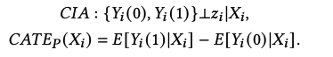

Y(0)代表没有新增请求，Y(1)代表有新增请求，CATE代表对于一个新增请求所获得的uplift值。

实现上，CREST首先拼接CUBE的输出F(user)和F(context)作为一个融合embedding F(fusion)，然后将F(fusion)作为输入，构建两个网络Control Net和Uplift Net。Control Net对来自control组的用户行为建模，输出无新增请求的情况下购买率logit结果。而Uplift Net对control和treatment组用户差异建模，输出购买率uplift的logit值V(uplift)，形式化描述如下：
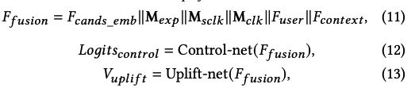

论文采用两个MLP作为Control Net和Uplift Net。logit(ctrl)和V(uplift)之和代表了当有额外请求的情况下的购买率logit(trt)。最终，通过如下公式获取control和treatment组下的购买概率，以及CATE估计值：
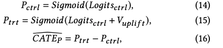

其中\(\bar{CATE_p}\)是CATE_p的估计。由于V(uplift)和CATE_p是正相关关系，因此论文将V(uplift)作为DRP模块的决策依据。模型的训练过程采用交叉熵作为loss函数，如下所示：
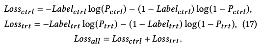

其中Label为1代表样本有购买行为，Label为0代表样本无购买行为，训练目标即为最小化Loss(all)，使得模型预测的P(ctrl)和P(trt)的分布和训练样本中的购买label尽量匹配。

## DRP
DRP模块用于在资源消耗和效果收益之间做平衡。该模块的目标是在新增的请求资源消耗在上限theta范围内的情况下，最大化购买率uplift值。形式化定义如下:
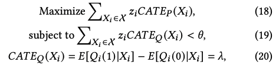

其中CATE_Q为新增请求所带来的新增的资源消耗，Q(1)和Q(0)分别代表有和无新增请求的情况下资源的消耗情况。

对于后端服务而言，每次请求对资源的消耗基本保持一致，因此CATE_Q保持一个常量lambda。由于每次请求资源消耗量为常数，因此论文采用常见的贪心法来获取最优解：
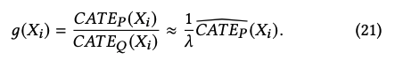

直观的解法即采用g(X)作为一个时间周期内新增推荐请求的比率。由于V(uplift)和CATE正相关，因此可以将V(uplift)作为分数来和一个最小阈值M比较，如果大于阈值则发起新增请求，如果小于则不发起。
和我们的方案一模一样，这样最简单实用

## 实验结果
首先实验的目的是回答三个问题：
1. AdaRequest相对基线方法有多少提升？
2. 不同模块以及特征组合，对AdaRequest最终表现有多少影响？
3. AdaRequest部署到手淘后的线上表现如何？

离线评估所采用的数据集是手淘首页瀑布流推荐请求数据，数量有1.76亿条记录。

参考附录A可以得知，作者将用户随机分到control组和treatment组，保持control组和treatment组的用户基本接近，避免数据有偏。数据抽取了用户的候选item，有展item，用户浏览历史，点击历史，粗粒度上下文特征，点击次数，当前session下用户的购买记录。离线的时候将85%的数据用于训练，15%用于验证。

离线评估指标有：
* Qini 50。通过Qini分可以反映uplift预估的表现，以及所选取的新增请求表现。
* Qini AUUC。不同阈值情况下，Qini曲线下的面积。
* MSE Y*。用于评估uplift效果。来自经典论文《Causal inference and uplift mod-elling: A review of the literature》
* AUC&MSE。用于评估购买率预估表现
在线评估指标有：
* PR In N，度量额外请求返回的N个item的平均购买率，代表该次额外请求带来的收益
* GMV是一个时间周期内的总收益
论文提到了各指标的量级，其中Qini AUUC是10^-4，Qini50是10^-4, MSE Y*是10^-3, MSE是10^-3，PR in N是10^-3。

实验评估基线如下：
* StaticR，PoolR，RandR。StaticR和RandR在页面到底的时刻固定或者随机插入一次请求。PoolR基于端上后端item的数量来决定是否新增请求
* Greedy。Greedy策略使用AdaRequest的特征预估购买率的绝对值，并且用购买率绝对值作为决策依据而不是uplift值
* ClassTrans。ClassTrans和Greedy不同之处在于通过类变换方法来预估uplift值。
* TwoModel。对control和treatment组分别训练两个模型，用两个模型预估值的差来估计uplift。即t-learner。
* OneModel。将control和treatment作为0/1特征输入到一个模型中来预估uplift值。计算uplift需要用1和0分别两次前向传播获得，即s-learner。

## 总体表现
对于第一个问题，离线评估结果如下：
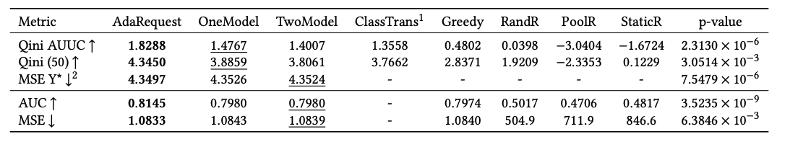

可以看出AdaRequest在个性指标中表现都最佳。

AUUC曲线如下所示：
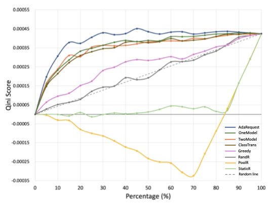

可以看出表现最好的也是AdaRequest。

## 消融研究(Ablation Studies)
消融研究用于评估AdaRequest各个组件以及各个特征的有效性。采用打开/关闭各个组件然后评估指标的方式，来判断各个组件的重要度。结果如下：
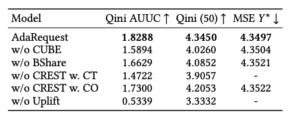

可以看出一旦缺少任何一个组件，各项指标都表现恶化。因此AdaRequest是最佳组合方案。

同时也消融研究了特征的重要度：
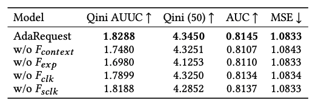

也可以看出各类特征都发挥了他们应有的作用。

## 在线实验表现和分析
AdaRequest框架在手机淘宝的猜你喜欢瀑布流推荐场景中落地应用。框架每次运行需要500ms，作者觉得非常高效了。在四种情况下触发AdaRequest：1）用户点击一个item；2）用户往下滑n个item；3）用户下滑并且停止；4）用户删除一个item（不喜欢）。

线上实验结果如下：
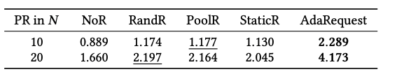

可以看出AdaRequest表现都是最好的。

为了体现同样增加QPS比率的情况下的额外业务收益。作者又评估了在不同阈值下，增大的QPS以及GMV的增益之间的数据，如下图所示：
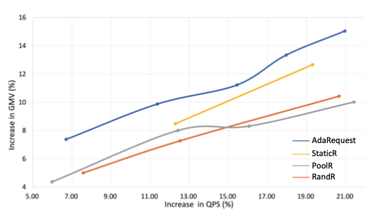

可以看出，虽然增加更多的请求比率，QPS也同等比例增加，但AdaRequest一直处于指标的领先位置，证明了AdaRequest表现最优。
> 要获得这样一组曲线，线上实验得分按照不同阈值分非常多组，整个实验耗时也很长，不清楚作者们具体是怎么做的

## 结论
论文调研了学术上和工业界的IRSD问题，目标是在资源受限的前提下最大化捕获用户意图的变化。提出了一个最优框架AdaRequest用来解决该难题。并且通过离线和在线实验，证明了分析的合理性和AdaRequest框架的有效性。最后说明了一下，这篇论文是由浙大上海高等研究院繁星科学基金支持的，这也是为啥这篇论文九个作者中六个来自阿里巴巴，其余有两个来自浙大，另一个来自新加坡国立大学。

## 感想
读完这篇论文，感慨良多。这篇论文从阿里出来一点也不奇怪，学术届-工业界紧密合作，高举高打，起点高，立意高，资源充足（据说端智能方向持续做了三年多），能产出这样优秀的结果并不奇怪。相对我们在推荐场景中所做的智能架构工作，虽然采用的方法类似，想法同样不落后，但具体推进过程中专业人才欠缺，投入资源不够丰富，最终产出还是有点差距。
