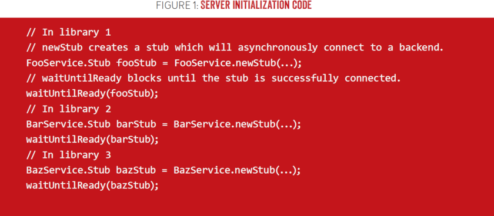
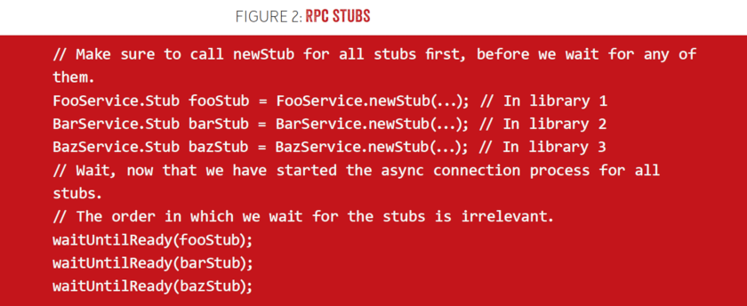
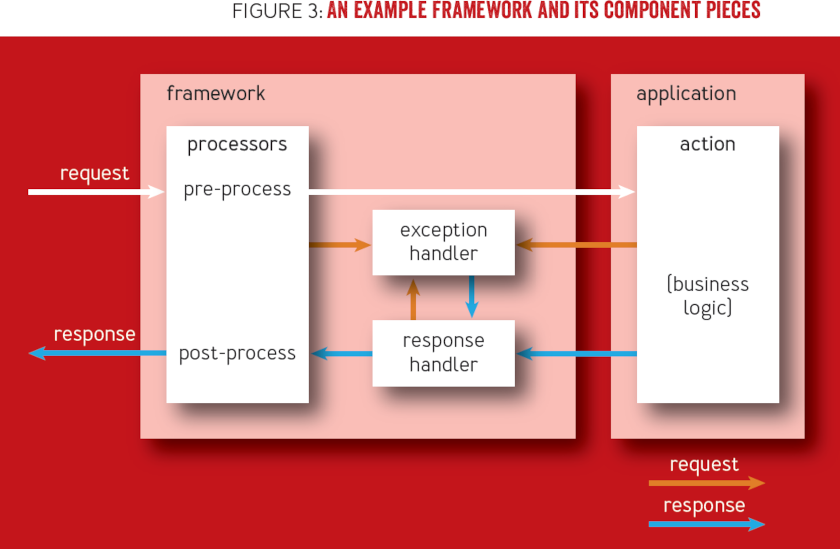
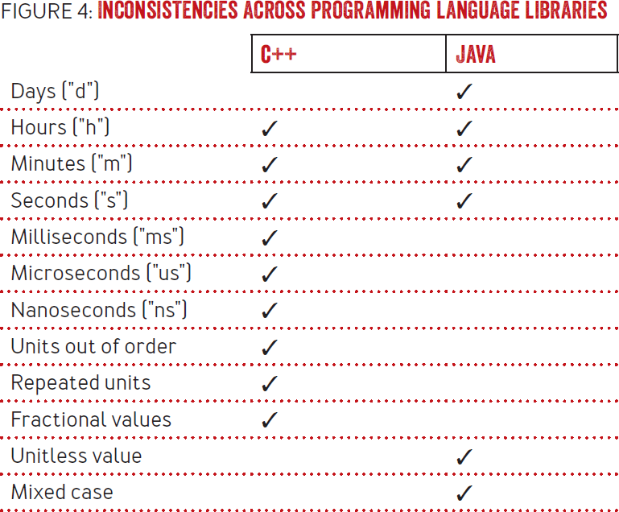
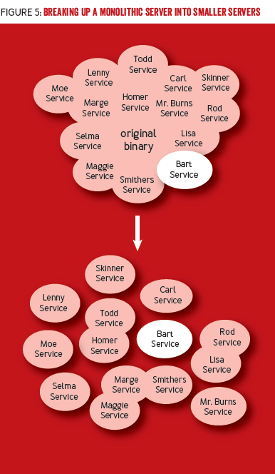
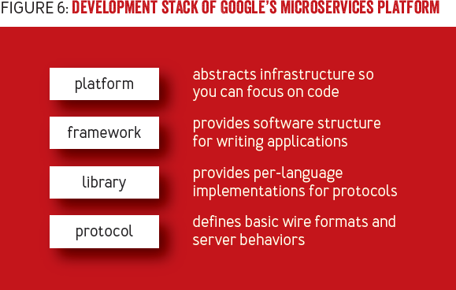

+++
title = '程序框架的最佳实践【翻译】'
date = 2022-12-05T10:15:19+08:00
author = "Skyan"
tags = ["framework", "programming"]
ShowToc = true
ShowBreadCrumbs = true
+++

> [原文](https://queue.acm.org/detail.cfm?id=3447806)作者Chris Nokleberg and Brad Hawkes来自Google，Java框架开发者

**原标题：程序框架最佳实践——虽然很强大，但并不适合所有人**

共享代码库鼓励代码复用，实现不同团队技术的一致性并改进产品效率和质量。开发者需要选择合适的库，研究如何正确配置，最终把所有的库组装在一起。程序框架可以通过对库的默认安装和配置，来简化开发流程，提供更好的一致性，当然也损失了一些库的便利性。

框架不仅是一堆库的集合，还控制了整个程序的生命周期。确定的框架行为可以为开发开拓空间——例如，不用为每个程序应用都深入审查安全和隐私相关的代码。框架提供了跨团队和跨语言的功能一致性，同时也是更高级的自动化和智能系统的基础。

这篇文章先从框架的核心方面综述开始，然后深入到框架的优势、妥协以及我们推荐实现的最为重要的框架功能。最后，这篇文章展示了一个Google的实际框架应用案例：如何开发一个微服务平台，使得Google可以打破单一代码库的限制，以及框架如何使这一切成为可能。

## 什么是框架
框架和共享代码库在很多方面都类似。在Google，有两个技术原理用于区分框架和库：依赖反转和可扩展性。虽然看起来比较容易，但本文所讨论的框架很多优势，原则上都是从这两个原理衍生出来的。

### IOC（依赖反转）
当从头开始开发一个程序的时候，工程师来决定程序的流程——这通常称为普通控制流。在一个基于框架的程序中，则是由框架来控制流程以及调用用户的代码——这叫做反转控制流。反转控制流有时也被引用为好莱坞原则：“别给我们打电话，我们会给你打电话”。框架控制流很好地定义了不同程序之间的标准。理想情况下，程序只需要实现它们特有的逻辑，而由框架来解决所有其他构建一个微服务所需要的各种细节。

### 可扩展性
扩展性是区分库和框架的第二个重要特点，它和依赖反转互相配合。因为框架的控制流是由框架负责的，唯一的改变框架运行方式的方法只能通过它暴露出来的扩展点。例如，一个服务端框架可能有一个扩展点是允许一个应用程序在每个请求来的时候运行一些代码。扩展点的模式也意味着框架的其他不可扩展性部分很固定，应用程序无法改变。

## 框架的好处
框架除了提供共享代码库所能提供的功能之外，还有很多好处，它们对不同的角色在不同方面都有益处。

### 对开发者
开发者这个角色最终决定是否使用一个可用的框架，也是最显然从框架中获益的角色。大部分的开发者的好处在于提升生产力，简便高效以及可应用最佳实践。开发者可以写很少的代码，利用内置的框架功能。由于框架处理了各种样板代码，因此他们所写的代码可以大幅简化。框架提供了合理的默认配置，消除了无意义而且浪费时间的决策判断，从而提供了充足的最佳实践。

### 对产品团队
除了为开发者提供生产力以外，框架也为产品团队解放了团队浪费在重复建设基础设施的资源。产品团队因此可以更关注于使他们产品与众不同的功能开发了。

框架可以让产品团队的开发与底层基础设施的变更隔离开，这也能让他们从中受益。虽然并不是普遍适用，但框架提供了额外的抽象，这意味着有些基础设施的迁移可以被当做实现细节，完全由框架维护者全权处理。

Google产品的发布需要很多团队的确认。例如，一个发布协调工程师负责审查产品安全性和有效性，同时有一个信息安全工程师检查程序应用的场景安全漏洞防范设计。当负责审查的团队熟悉框架并可以信任框架的功能保证时，框架就可以帮助简化审查流程。产品发布以后，标准化流程可以让系统更加便于管理。

### 对公司
从公司层面来说，常用的框架可以减少开发者上手启动一个新应用的时间，从而提升开发者的灵活性。如果一个公司有一个足够大的程序员社群，投入资源在高质量的文档和培训程序员将变得非常有价值。这也有助于吸引社群贡献文档和代码。一个被广泛应用的框架意味着，对框架很小的改进投入可以换来巨大的收益影响。

在过去一段时间，收敛框架架构可以使针对全局性的变更有广泛的应用范围。例如，如果你依赖一个统一的微服务/RPC框架，而且带宽比CPU更贵，那么框架可以基于成本权衡来优化默认的压缩参数。

## 框架的权衡
虽然框架有上述的多种好处，但也面临着各种权衡。

### 死板的框架能够掩盖创新
框架常常决定支持哪种技术方案。由于支持所有能想到的技术是不现实的，所以一个比较死板的框架也是有明显的好处的——那就是，它们更鼓励使用某种技术或者更偏好某种设计模式。

死板的框架可以极大简化一个开发者从无到有创建一个系统的工作量。当开发者有很多种方式来完成同一种任务时，他们很容易陷入是否会影响整个系统的细节决策中。对于这些开发者而言，接受一个框架所推荐的技术，可以让他们把重点放在构建他们系统的业务逻辑上。有一个普适并且一致的技术偏好对于整个公司而言更有利，虽然这个答案还不尽完美。

当然，你也必须处理程序和团队的长尾问题，有些产品需求或者团队喜好和现有的框架可能并不完全适配。框架的维护者被放在一个判断什么是最佳实践的位置上，也会需要确认一个不方便的使用案例是否“真实”，因为这个案例可能对每个用户来说都不方便。

另一个需要重点考虑的是，即使某些技术在今天看来的确是一个最佳实践，但技术也在不断快速地进化，对于框架而言也有一定的风险无法跟上技术创新的发展。采用不同的程序设计方案可能开发成本更高，因为开发者既需要学习框架实现细节，也需要框架维护者的协助。

### 普适性也会导致不必要的抽象
很多框架优势，例如通用的控制面板（后面解释），只有当大部分关键重要的应用都基于这个框架才有真正的意义。这样的一个框架必须足够普适来支持绝大多数用户的场景，这也意味着必须拥有丰富的请求生命周期，以及任何程序都需要的所有的扩展点。这些需求有必要在应用和底层库之间增加若干间接层，这些层也会增加学习成本以及CPU开销。对于应用开发者而言，软件栈中的更多层也会导致调试更复杂。

另一个框架潜在的缺陷是，它们需要工程师额外学习。当新来的Google员工学习如何让一个“hello world”样例运行的时候，他们经常会被他们所需要学习的技术的数量所抓狂。一个功能完备的框架也会让这个情况更糟而不会更好。

Google已经开始尝试让每个框架的核心尽量简单符合预期，让其他功能都成为可选模块，从而来解决这些问题。Google也会尝试提供配套框架的工具，可以帮助了解框架内部结构来简化调试。最终，虽然框架有一些你必须学习的成本，但你需要确保任何一个给定的框架提供了足够的好处来弥补这个成本。不同的编程语言的框架也许有不同的权衡组合，对于开发者而言这也是一个新的决策点和成本/收益权衡场景。

## 重要的框架特性
如上所述，反转控制和扩展性是框架最为基础的两个特点。除了这些基础能力以外，框架还需要负责若干其他功能。

### 标准化程序生命周期
再次重申，反转控制意味着框架拥有并且使一个应用程序的整个生命周期标准化，但这样的结构带来什么样的好处呢？我们以避免级联故障为例来说明这个问题。

级联故障是一个典型的引起系统超载的原因，Google内部也很有很多。它可能发生在分布式系统的部分服务失败，增加了其他部分失败的可能。关于级联故障更多的原因，以及如何避免他们，参考SRE(Site Reliability Engineering (O'Reilly Media, 2016))中的定位级联故障这一章。

Google的服务框架有很多内置的避免级联故障的保护功能，两个最重要的原则是：
* 持续运行。如果一个服务能成功响应请求，那么就应该保持。如果它能处理一部分请求但不能处理其他部分请求，那么就必须继续运行，而且响应它能服务的请求。
* 快速启动。一个服务必须尽量快地启动。更快地启动意味着可以快速从崩溃中恢复。服务必须避免类似启动时顺序等待RPC访问外部系统返回这样的操作。

Google生产环境给每个服务配置了一个成为健康状态(可以响应请求)的时长。如果超时了，系统则认为一个无法恢复的故障发生了，则终止这个服务进程。

有一个常见的反模式，常发生在缺乏框架的场景中：一个库创建他们管理的RPC连接，并等待连接可用。当服务端代码随着时间推移不断膨胀，你能获得一个实际有几十个这样的有序依赖的库。这样的结果是，处理初始化代码有效展开的话看起来如图1所示：


在通常的情况下，这样的代码工作很好。但因为没有任何潜在问题的提示，这样的代码会有个特殊问题。这个问题只有当一个相关的后端服务慢了或者同时挂了才会显现出来——这时关键服务启动已经延迟了。如果服务启动足够慢，那它将会在有机会处理请求之前被杀死，这会导致一场级联故障。

一种可能的改进是先创建RPC stubs，如图2所示，然后并行等待它们初始化完毕。在这种情况下，你只需等待stub初始化时间最长的那个而不是初始化时间之和。


虽然处理的并不十分完美，但这个有限的重构也说明了你需要某种在库所创建的RPC stubs之间的协调机制——它们必须可以有等待stub以及库以外的某些资源的能力。在Google的案例中，这样的事情是由服务端框架负责的，同时它也有如下功能：

* 通过定期拉取可用性来并行等待所有stubs可用(<1秒)。一旦配置的超时到了，即使并不是所有后端服务都准备好，服务依然可以继续初始化。
* 去掉用于人工或者机器可读的调试日志，而是用集成标准化监控和报警来代替。
* 通过一个通用的机制来支持插拔不同的资源，而不仅是RPC stubs。技术上来说，仅有返回布尔值的函数（为了“我是否准备好”）以及对应的名字，是有打印日志的必要。这些插拔点常被那些处理资源的通用库（例如：文件API）所使用；程序开发者通常只需要用这个库，就能自动地拥有这些能力
* 提供一个中心化的方式配置特定的关键后端服务，可以改变他们启动或者运行时的行为。

对任何一个单独的库来说，这些功能可能（也正确地）被认为是多了，但实现这些功能，能够让你在一个集中的地方实现，并在所有用这个库的后端服务都能生效。这也是有意义的一件事情。就像共享库是一种在不同应用程序中分享代码的方式，在这个定义下，框架也是一种在不同库之间共享功能的方式。

因为有类似这些的功能，SRE们更愿意支持基于框架的服务。他们也经过鼓励他们对口的程序员选择基于框架的开发方案。框架提供了一个生产规范的基础水平。这个生产规范将一堆没有关联的库关联到一起时是非常难以实现的——但也不是不可能。

### 标准化的请求生命周期
虽然细节取决于应用程序的类型，但很多框架支持在总的程序生命周期以外的生命周期管理。对于Google的服务端框架而言，最为重要的任务单位就是请求。除了遵循类似依赖反转的模型以外，请求生命周期管理的目标是将请求的不同方面的职责划分成独立的可扩展的代码片段。这允许程序开发者只关注于开发让他们的应用程序独一无二的实际业务逻辑。

这里有一个这样的实际使用的框架例子，它的组件片段见图3：

* Processors——拦截请求和返回的包。常用于打印日志，但也有一些短路请求的功能（例如，强制在整个程序中不强制执行不变量）
* Action——程序业务逻辑，接受请求，返回一个对象，可能有一些副作用。
* Exception handler——将一个未捕捉的异常转换为一个响应对象。
* Response handler——序列化一个响应对象给客户端。



虽然程序能从框架的扩展点中收益，程序代码的绝大部分都是以响应的形式执行，包括程序特有的业务逻辑。

这里分离的原因的可能会对网络安全领域非常有帮助。例如，Google开发了很多Web程序，所以一个强烈的诉求是可以防范各种不同的网络安全漏洞的供给，例如XSS（跨站脚本攻击）。XSS漏洞经常来自程序代码返回一个字符串响应，而这个响应包含一段没有充分清理或者编码的数据。修复这类错误的经典方法是简单地在缺少转码的数据中增加转码，然后等待测试和代码审查时可以避免将来类似的问题发生（路人：并没有）。

本质上来说，这种方法并不能行。因为程序所编码的底层API天然更容易发生这种类似XSS的错误，因为他们接受字符串或者类似的结构化/非类型化的数据。例如，Java Servlet API给程序提供一个原始的Writer，你可以传入任何字符。这个方法为开发者带来太多的负担，无法做正确的事情；相反，Google的安全团队专注于设计本质安全API，例如：

* 带上下文感知编码的HTML模板系统
* 防止SQL注入的数据库API
* "安全HTML"包装器类型，带有规定其值可在各种上下文中安全使用的约定

Google服务端框架的请求生命周期完善了这些API的使用，使得程序代码从来不需要处理原始字符串或者字节流。相反，这些代码返回给上层响应对象，类型像是SafeHtmlResponse，只在可以保证安全约定的方法中创建。将这些响应对象转为字节流是response handler的任务，它们往往是框架的内置部分。Google有时需要自定义的response handler，但所有使用的方式必须被安全组审查——这是在创建的时候强制要求的。

这样单纯的影响是Google将使用这些框架的应用程序的XSS漏洞的数量减少到基本为零。可以想象，Google的安全团队非常强烈鼓励使用框架，而且也为很多框架做了很多贡献，用于改进所有框架用户的安全水位。一个标准的基于框架的服务，可以有效跳过定制服务启动时所要求的需要安全或隐私的审查，因为这些框架已经足够信任到保障某些行为。

当然，结构化的可扩展的请求生命周期的好处远超于将业务逻辑从响应序列化中剥开。最为基本的收益是它保证每个组件都比较小，而且容易被理解，有利于长期的代码健康。这样Google其他的基础架构团队可以很容易的扩展框架功能，且无需和框架团队一起直接协作。最后，应用程序可以引入自己的独特功能，无需触及每个操作。在某些情况下，这些功能是领域相关的，但其他功能如果足够通用，最终也能上升到框架中去。

## 常用控制面板
我们所谓的控制面板指所有非该程序特有的输入和输出，此时该可执行文件被视为黑盒。这些输入输出包括运维控制，监控，日志和配置。

为不同服务统一标准把很多很麻烦的问题变得简单。无论哪个服务，多么麻烦，开发和运维都能知道哪些信息有效以及去哪看。如果这个服务的某个操作需要修改，每个人都知道去哪改以及怎么该。

除了让人们更方便地操作服务，在不同服务间统一常用的控制面板也会让可共享的自动化变得更加切实可行。例如，如果所有的服务都以一种标准的形式输出错误，发布流水线实现自动化的灰度将变得可行：你首先将一个新版可执行文件发布到少数服务器上，然后在继续发布到更多服务器之前可以检查是否有错误指标上涨。你可以从SRE（Site Reliability Engineering (O'Reilly, 2016)）的书中「进化SRE参与模型」这一章中找到更多关于通用控制面板的好处。

框架提供了在不同程序控制面板之间强制某级别以上的一致性的绝好的机会。虽然普遍来说，只有少数人关心控制面板的准确构成，但对于一个公司而言，确定一致的控制面板标准有非常大的价值。一致意味着你可以很方便地共享和扩展横跨不同程序之间的自动化任务。通过简化与周边生态的集成方式，你可以常收获使用标准的好处，而与标准本身的优点无关。

实现一个通用控制面板的挑战在于，框架维护者经常是第一个发现不同编程语言代码库之间有不一致的人。例如，所有语言都有一个命令行参数的符号用来表示时长（时间的长度）。理想情况下，这个语法应该在不同语言之间兼容，至少对于最基本的例子例如“1h30m”是兼容的。但我们深入细节之后，一幅不同的图景展开，如图4所示：




最近，代码库的负责人已经很好地意识到了跨语言的一致性的价值，并且开始将一些一致性的设计加入到考虑范围。在框架层面，Google已经开始在不同编程语言开发的服务中使用测试防护来运行同一套测试套件，用来保持一致性的持续。

## 模块化
无论好坏，在Google是没有一个集中式的软件工程师权威机构。虽然大部分开发者都在一个代码仓库下工作，不同团队的工程实践大相径庭。对某一个具体项目技术的选择常常是由项目的技术组长来决定，仅有少量的需要从上往下的确认授权。可以理解的是，人们更期望选择他们更加有经验的技术。因此，为了让一门新技术能够获得普遍的接受，它必须要么有非常巨大的价值，要么有非常低的门槛，一般情况下是，它两者兼有。

对于Google的服务端框架而言，核心的生命周期管理和请求分发是最为迫切需求的功能。所有其他功能都只能算可选。不同的模块来实现他们的功能，基于前面提到的，框架所暴露的不同的生命周期管理钩子。应用开发能够选择哪个模块添加到服务中，在大部分情况下甚至一个核心功能都只需要一行就可以添加：

```java
install(new LoadSheddingModule());
```

实际的可用的标准模块列表数量有上百个，包括的功能有授权，实验和日志等。
对于一个框架是否能在Google内部接受，能否增量式地给服务添加框架功能的能力是一个大加分项。它允许“hello world”这样的样例以及原型服务更小和简单易懂，同时也可以在合适的时机非常容易地扩展为全功能的服务。

如果你有特殊功能需求的情况下，模块之间的独立性也允许替换一个框架标准模块为程序定制模块。因为标准框架模块和程序定制的模块使用同一套扩展APIs，将一个很有用的功能上移到框架中是一件常见的移动代码的操作。一旦这些实践在生产环境中证明了价值，那么框架就不断采纳它们，逐渐成为最佳实践的集合。

高度的内聚封装性意味着框架维护者可以大幅修改模块的实现，而无需接触任何应用代码。这对于下线一个过时的后端服务或者需要API变更而言非常有用（这也很常见）。Google框架已经将很多应用开发和需要操作复杂耗时的迁移隔离开，对于很多团队而言，这也是今天框架最为吸引人的优势之一。

框架维护者的其中一个角色是保障模块与模块之间正确地协作。维护者常常选择默认模块列表，提供推荐模块以及限制哪种模块用于哪种场景。其中一个挑战是对其中粒度达成一个合适的平衡：虽然开发者更倾向更方便的细粒度模块，但对于框架的维护者而言保证所有的模块组合都能正常一起工作是一件很难的事情。

## 微服务
广泛应用框架所带来的的标准化为实现更高层次的工具和自动化带来了机会。这将允许Google创建微服务平台，以及打破单一服务架构。

### 在微服务之前：单体架构
共享代码库和框架的存在使得开发Google内部生产质量的代码的实际工作变得非常简单。虽然写代码只是在Google部署一个程序流程中的一个步骤。其他关键因素包括集成测试，为隐私和安全等方面所做的发布审查；申请生产环境资源，操作发布，收集保存日志，实验，以及调试和解决故障。

历史上来说，处理所有这些事情是一件非常麻烦的流程，无论这个服务大小，所有的服务负责人都必须参与完成。结果为了避免部署一个新服务，小一点的团队新增一个新服务时，往往找一个现有的服务，在其中添加他们的代码。这种方式下，小团队只需要关注开发他们自己的业务逻辑，然而所有的事情都是“免费”的。当然，一旦有足够多的团队采取这种方法，这种寄生在已有服务上的功能将很显然不再是免费的。这种实惠的结构最终导致在Google内部发生多次的灾难：本来好好的服务不断变大增长，直到他们变成巨大而且无法维护的单一架构。

单体架构有很多负面后果。在开发者生产一线，你必须处理更慢的编译，更慢的服务启动，以及在你尝试提交变更的时候，你的提交前测试将有更高的可能性失败。例如，有一个重要的Google Search有关的C++程序变得如此之大，以至于它已经无法在当时技术限制的情况下（12GB）链接二进制程序。

当开始发布的时候，功能将变得更加难以及时推送到单体服务中去。随着单体架构的增长，贡献开发者的数量也在增长，这就很自然地导致更多阻碍的错误。一个延迟的发布可能使得下一次发布更加困难，这能导致一个恶性循环。

在生产环境中，单体架构在一堆看起来不相关的服务间造成了一种危险的共享命运，一旦被非预期的交互引起更多故障。独立于其他服务以外来扩展服务变得不可能，使得后端资源供给变得更加困难。

### 远离面向服务器的世界
在Google，尽管大家都很清楚一个单体架构不可持续，但仍然没有很好地替代品。简单地强制大家不再往单体程序中加功能，将导致一连串很严重的后果。因此，Google需要降低产品发布以及运行新服务的繁琐成本，这将允许基于纯粹生产环境的因素而不是开发者的方便来决定哪些服务接口组成一个服务程序。如图5所示。


从开发者只关注他们专有程序服务中的业务逻辑，以及其他任何工作都应该尽可能自动化的目标开始倒推，很多需求最终变得清晰：

* 开发者必须声明和实现服务接口，而不是写main方法；编排一个二进制程序如何运行起来的工作交给微服务平台角色来负责。
* 自动化所需的所有元数据，包括生产配置，都应与服务代码一起以声明性格式存在。
* 服务间的资源和依赖关系都应该是显式和声明性的。理想情况下，你应该能够仅通过查看服务领域的元数据来可视化整个生产拓扑。
* 服务必须相互隔离，以便任意服务接口可以重新组合成一个新服务。除了其他要求以外，这意味着避免全局状态和副作用。

当这些需求都被满足后，实际上所有正式的手工流程都能够被自动化。例如，测试架构可以用元数据来组装服务依赖图的一部分来运行集成测试。

在Google，我们开发了一个使用这些原则的微服务平台。最开始目的是分解一个巨大的单体服务。该服务由于密集的功能开发而导致快速的扩张。一旦平台提供了便利，它就被Google其他团队有机地使用，最终分拆为一个独立的官方支持项目。

今天平台已经成为新服务开发事实上的标准，部分因为它同时对小团队以及大团队都具有吸引力。因为高度的自动化，小团队能很容易的在数天就启动一个具备Google质量的生产服务，然而在以前即使遵循最佳实践，启动一个新服务也需要数月。对于大型团队来说，团队之间的一致性减少了支持成本，而共享的平台意味着通常不需要为团队特定的基础架构团队配备人员。

另一个迁移到微服务的好处是鼓励开发者更多地思考服务之间正确的分工，从而带来更加合理的系统架构。使用gRPC和protocol buffers这样的技术作为独立系统之间的边界，强迫你来思考API的设计，而仅在同一个进程中调用函数是不需要思考这些问题的。RPC系统也是语言无关的，所以每个微服务负责人可以独立的决定使用哪种语言开发。

剩下一个挑战，也是未来工作充满机会的领域，就是提供更高阶的工具来管理数量不断增长的微服务。例如，在之前时代开发的监控控制台的假设是相对少数的几个程序，因此这将需要一个新用户界面来满足更多数量的程序监控需求，特别是人们全面采用微服务平台之后。

### 和框架之间的关系
框架是构造Google微服务平台工作的一个重要组件，有如下原因：
* 框架的生命周期管理中内置的依赖反转，自然地提供一种模型，让程序开发者仅需要将他们的服务实现交给平台管理
* 常用控制面板服务（跨服务和语言）是多种平台能力所需的，包括发布管理，监控以及日志
* 模块化意味着平台和程序代码都能够提供独立的模块，当组装在一起的时候，能够以一种合理的方式运行成一个完整的服务。

图6展示了Google微服务平台完整的开发栈。



如前所述，框架能比代码库提供一个更为强大的封装水平，能够简化程序开发以及提供与底层库的隔离。类似的，微服务平台更加超越了代码层次，进一步封装其他组件，例如生产配置。这将允许更高级的简化以及隔离。例如，平台维护者可以（如果有必要的话）自动化地应用一个紧急的代码修复或者配置变更，来重新编译所有受影响的二进制程序，并以一种统一的方式将他们发布到生产环境——而在以前是不可能的。

当然，使用微服务平台也会带来新的挑战。这其中最大的就是为了让微服务平台功能正常运行，所有之前不变的方式可能变得很麻烦甚至改变程序代码开发的方式。例如，Google的Java服务程序共享一个统一的线程池。为了满足服务之间相互隔离的需求，这意味着不能允许一个阻塞式的每个请求一个线程的模型——因为这将使一个阻塞服务非常容易地用光所有的线程，并把其他服务资源抢光。因为这个原因，服务被强制要求仅允许异步方式，这个方案也不是所有的团队都非常习惯的。

另一个挑战是在微服务之间增加服务调用可能会为请求整体增加耗时。在某些情况下，超时可以被架构优化所减轻，这些优化常作为微服务重写的一部分。对于微服务平台，Google也保证，如果服务请求正好来自同一台服务器上部署的其他服务，那么将采用进程间通信来优化耗时。

## 结论
虽然框架能成为一种强大的工具，它们也有一些缺点，甚至不能对所有的组织都产生价值。框架维护者需提供标准，以及定义适当的行为规范，而不是过于规范的约束。一旦框架处于适当的平衡中，它们就能够提供大量的开发者生产力红利。框架的广泛应用带来的一致性就为其他团队带来好处，例如SRE和安全等这些从程序质量中受益的团队。额外的，框架的结构提供了构建更高层次抽象的基础，例如微服务平台。因为这将解锁系统架构和自动化的新机会。在Google，这样的框架和平台已被广泛采用，并且产生重大的积极影响。
