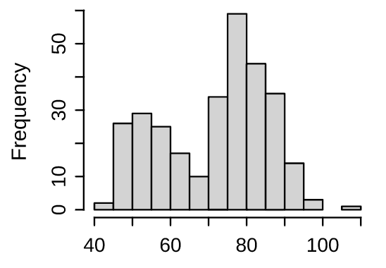
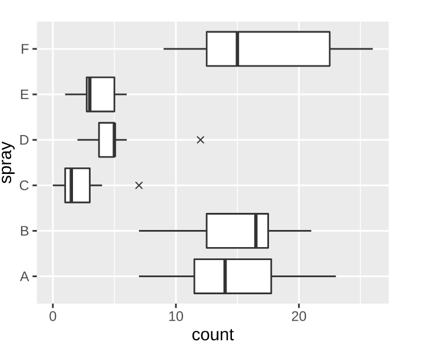
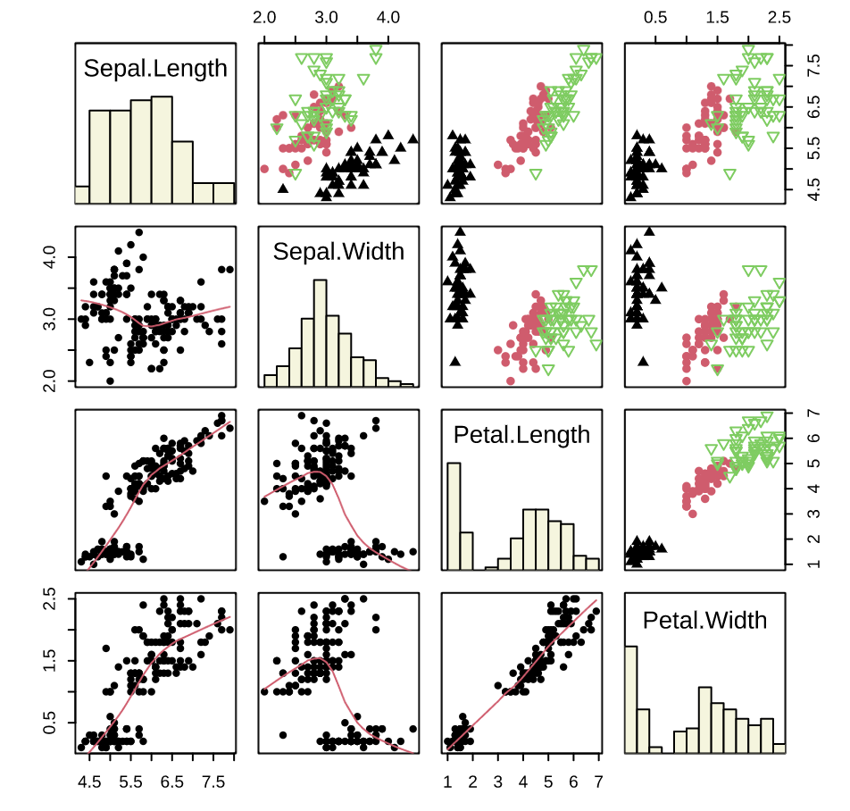
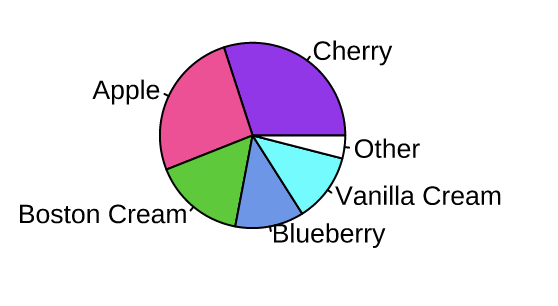
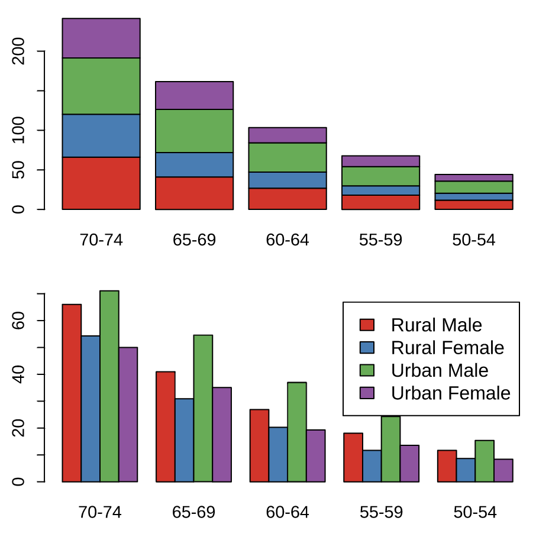

+++
title = '互联网数据分析入门(系列之一)'
date = 2022-01-30T16:15:19+08:00
author = "Skyan"
tags = ["data science", "data"]
ShowToc = true
ShowBreadCrumbs = true
+++

## 前言
随着互联网行业的不断发展，数据作为最基础的生产资料发挥了极其重要的作用。随着大数据平台的普及，针对各种数据的分析是一项非常重要的基础技能。通过数据分析，我们可以从用户数据中发现新的用户喜好，从业务数据中发现业务的优化方向，从性能数据中发现潜在的性能瓶颈，从线上日志中发现异常指标等等。熟练掌握数据分析的一些常用方法，还会让程序员的水平更上一个台阶。可以不夸张地说，数据分析是程序员除了编程以外最为重要的技能。

但很多时候，大家对数据分析产生一些误解，容易神秘化或者低估数据分析的能力。常见的误解列举如下：

* **Q：** 数据分析就是操作Excel，小学生才玩这个。
* **A：** 实际上Excel的确是数据分析最为方便的工具，但数据分析不止于此，python，R，Matlab，Tableau甚至shell都是数据分析常用的开发语言。当然Excel如果用的好，也会产生让人叹为观止的效果。

* **Q：** 数据分析只有做机器学习模型的程序员才需要学。
* **A：** 严格意义上开发训练机器学习模型也是数据分析方法中的一种。数据分析不仅限于给机器学习模型使用，也可以应用到更为广泛的问题分析中，包括性能分析，线上问题排查定位等，基本涵盖了程序员的日常工作。

* **Q：** 数据分析就是用awk，wc，sort等工具写几个脚本统计下数
* **A：** 数据分析范围肯定不只是用工具做个统计，还有建模，实验，可视化等等都是数据分析的范围，近年来更流行的名词叫“数据科学”，很多公司也成立了数据科学团队专门做更广泛意义的数据分析。

既然数据分析这么有用，那我们怎么从哪里开始做数据分析呢？本文作为系列第一篇文章，先从数据分析的整体层次，基础方法和工具介绍开始，更深入的内容等系列后续文章。

整体来说，数据分析可以分为三个层次，分别是观察型分析，干涉型分析，以及反事实分析。篇幅所限，不再详述这三个层次是怎么回事。感兴趣的同学可以阅读参考书目[^1]。

通常意义上所说的数据分析方法主要还是属于观察型分析，重点在于发现数据的规律，从噪声中找到有价值的信号，找到不同现象和数据之间的关联关系。这些分析方法，基本上可以满足大部分常见的数据分析需求。而更高级的“干涉型分析”和“反事实分析”，则需要更深入的工具和方法才能解决。

本文介绍5种基础的数据分析方法，包括指标，汇总，相关，检验，可视化，最后列举了常见的分析工具。

## 指标
为什么把“指标”作为数据分析方法的第一个方法呢？这是因为很多人在数据分析的过程中，逐渐迷失了自己分析的目标，陷入了为了分析而分析的怪圈。因此，在数据分析之前，我们必须要定义清楚我们这次分析的对象是什么。互联网产品将数据汇总后的结果定义为指标，因此一次分析本质上就是在研究这个指标的相关特性。如果指标没有定义清楚，那么分析就难以找到正确的方向。在数据分析中，需要分析的核心指标也叫“北极星”指标，因为这些指标就像北极星一样，永远固定在天球的极北点。

按照统计方法来分，互联网产品中常见的指标可以分为
* 计数型
* 统计型(加和，最大最小等函数)
* 比率类
* 聚合二级指标。

将计数型和其他统计型计算区分开的原因是，计数有一类是去重计数，它要求计数的时候做去重操作，这样就不是一个简单地统计函数可以计算的，因此需要将计数函数和其他计算函数区分开。除了一级和二级聚合计算以外，所有的指标都需要窗口范围。例如天级，周级，月级等，这里不再逻辑。指标的以及和二级计算方式分类如下表所示：

| 一级聚合 | 二级聚合 | SQL样例 | 指标样例 |
| --- | --- | --- | --- |
| 计数,去重计数 |  | SELECT COUNT(pv); SELECT COUNT(DISTINCT uid) | PV(Page View) DAU(Daily Active Users)|
| 统计类(加和，最大，最小，中位数，80分位等) |  |SELECT SUM(dur); SELECT SUM(show);  SELECT MEDIAN(time); SELECT PERCENTILE(time, 0.8) | 总时长,总下发量,总展现量, 耗时中位数，80分位耗时 |
| 比率类 |  | SELECT SUM(clicks)/SUM(shows); SELECT SUM(duration)/COUNT(pv); | PV点击率，点展比，页均停留时长 |
| 计数,去重计数 | 平均 | SELECT AVG(show) FROM (SELECT COUNT(DISTINCT sid) AS show GROUP BY uid) | 人均展现次数，人均邀请人数 |
| 统计类(加和，最大，最小，中位数，80分位等) | 平均 | SELECT AVG(dur) FROM (SELECT SUM(dur) AS dur GROUP BY uid) ; SELECT AVG(dur) FROM (SELECT MEDIAN(dur) AS dur GROUP BY uid) ; | 人均时长，人均最大停留时长，人均耗时中位数 |
| 比率类 | 平均 | SELECT AVG(pvctr) FROM (SELECT SUM(clicks)/SUM(shows) AS pvctr GROUP BY uid) ; SELECT AVG(dur) FROM (SELECT SUM(dur)/COUNT(pages) AS dur GROUP BY uid)  | 人均PV点击率，人均页均停留时长 |

我们做任何数据分析之前，先定义清楚我们的分析目标是哪些指标。例如我们想分析展现量和哪些因素有关，那么我们可以需要先对齐展现量指标的定义公式，是人均展现量，还是总展现量，还是去重展现量。如果指标定义不清楚，那么分析很可能南辕北辙，并不是我们想要分析的方向。定义清楚问题之后，我们再开始后面的分析。

## 汇总
汇总的思想非常简单，当我们需要从海量的数据中迅速找到数据的分布规律时，汇总能给我们最为简洁和准确的信息。汇总工具分为两类，一个是统计量，常见的有均值，标准差，中位数等。另一个是汇总方法，有上卷，下钻等汇总方法。

常见的统计量用一张表分类展示如下所示[^2]：
| 类型 | 统计量 | 定义 | 用途 |
| --- | --- | --- | --- |
| 位置统计量 | 均值 | sum(x_i)/n | 最常用的统计量，用于查看数据/指标的平均大小，受极端值影响很大 |
| 位置统计量 |中位数(分位数) | 从小到大排序后数据中间的值或者两个的平均值 | 数据分布中间位置的值，不受极端值影响，一般和均值搭配参考 |
| 位置统计量 | 众数 | 样本值中出现最多的一个数 | 比较粗略，用途不大 |
| 变异统计量 | 方差var | sum((x-xbar)^2)/n | 查看数据的分散程度，方差越大分散程度越大，但会受到极端值影响 |
| 变异统计量 | 标准差std | sqrt(var(x)) | 常用标准差作为离散程度的评估指标，因为标准差的量纲和原始数据相同。正态分布中±1σ包括68%的数据，±2σ包括95%的数据，±3σ包括99.7%的数据，但也会受到极端值影响 |
| 变异统计量 | 变异系数 | 方差/均值*100% | 表示变量相对于其平均值的变化情况， 是一个无量纲的量，越大表示数据越分散 |
| 变异统计量 | 极差 | 样本的最大值减去样本的最小值 | 比较直观地反映样本值分散程度，但容易受到极端值影响。|
| 变异统计量 | 四分位间距 | 3/4分位数-1/4分位数的差 | 最靠近分布中心的50%的样本值所占的范围大小， 可以反映样本分散程度， 而且不受到极端值影响。 |
| 分布形状统计量 | 偏度 | E(X-EX)^3/(Var(X))^{3/2} | 偏度反映了分布的对称性，偏度为0表示数据分布是对称的，偏度>0表示数据右偏，偏度<0表示数据左偏 |
| 分布形状统计量 | 峰度 | E(X-EX)^4/(Var(X))^2 - 3 | 峰度反映了分布的两个尾部的衰减速度情况，峰度>0表示数据衰减速度较慢，例如厚尾分布，说明数据存在比较多的极端值，即与分布中心很远的值 |

我们通过各种统计量，对数据可以做各种概括性分析。但还需要按照不同粒度来进行汇总，这就涉及到不同的汇总方法：上卷和下钻。分别定义如下：

* 上卷：按照某一个维度聚合所有的明细数据。例如，将每个用户的时长按照设备型号聚合，成为每一种设备型号所贡献的时长。
* 下钻：按照某一个维度分解指标数据，例如，将用户总时长按照落地页拆解，具体分解到每一个页面的总时长。

上卷适合将明细数据按照指定的维度进行汇总分析，适合找到某一个维度下不同维度值之间的关系。例如设备型号是一个维度，iPhone8，iPhoneX，Samsung Galaxy S10是不同的维度值。如果我们希望找到指标在不同维度值之间的差异，异常，或者相关性，则适合先将明细数据上卷到维度值粒度，然后进行后续的分析。上卷的时候需要选用合适的聚合函数，常见的就是计数类(COUNT)，统计类(AVG, MEDIAN,SUM等)，比率类(SUM/SUM等)。

下钻适合将一个大指标按照指定的维度进行拆解，特别适合指标的归因分析。例如我们希望能优化时长，那么首先需要分析到的就是时长在App每个页面的分布情况。这个时候就可以按照页面粒度将总时长进行拆解。我们通过分解每个页面时长的占比，就能定位到用户时长在哪些页面占比较大，而这些页面往往就是我们产品和策略的优化重点。

将上卷和下钻结合起来，可以满足数据分析的基本功能。一种常见的分析方法如下：
1. 定义需要优化的指标，也是我们数据分析的核心目标。例如总时长
2. 找到一些感兴趣的维度，进行指标的下钻，查看不同维度值对该指标的贡献程度。例如总时长按照页面维度进行拆解
3. 定位到关键的维度值进行针对性分析，筛选出这些维度值内的明细数据。例如定位到落地页
4. 将这些明细数据按照特定维度进行上卷，查看哪些维度有异常值。例如将落地页用户时长记录按照设备和地域进行上卷求和
5. 从上卷中发现数据的规律，找到一些可能的优化点。例如发现北京iPhone用户贡献了大部分的时长（举例，非实际情况）

## 相关
相关性一般用来找到两类数据之间的联系，这样从统计上可以预测出如果调整A，那么相关的B也会对应的调整。但相关性是一个非常复杂的话题，需要时刻牢记相关性的金句：**“相关不等于因果”**。

很多情况下发现两类数据之间的相关性只是分析的第一步，而找到因果性才是我们最终的目标。而发现因果性不能简单使用发现相关性的工具和指标，而需要使用更为复杂的工具，例如AB Test，因果推断等。但在本文中，我们只是简单介绍一些相关性分析的工具，还不涉及到因果。

常用的相关性的分析工具有相关系数以及相关系数矩阵。分别介绍如下：
### Pearson相关系数
* 定义：
$$
  \rho = \rho(X, Y) = \frac{E[(X - EX)(Y - EY)]}{\sqrt{\text{Var}(X) \cdot \text{Var}(Y)}}=\frac{  \text{Cov}(X, X)}{\sqrt{\text{Var}(X) \cdot \text{Var}(Y)}}
$$
* 度量两个变量间的线性关系，取值于[-1,1]的数， 当接近于1时代表X和Y有很强的线性相关关系，接近-1时代表有很强的负线性相关关系，接近0的时候代表没有线性相关性。
* 需要注意：相关系数只考虑了两个变量之间的线性相关性，例如\(X \sim (0,1)\)，\(Y=X^2\)是X的函数，但是X和Y的相关系数等于零。 实际数据中， 样本相关系数绝对值很小不表明两个变量相互独立； 样本相关系数绝对值较大， 则两个变量之间很可能是不独立的， 但不能仅靠相关系数确认两个变量之间有线性相关性： 非线性的相关也可能导致相关系数绝对值较大。

### Spearman相关系数
* 定义：
$$  \rho = 1- \frac{\displaystyle 6\sum_{i=1}^{N}d_i^2}{N(N^2-1)}$$
其中di表示两个变量分别排序后成对的变量位置差，N表示N个样本，减少异常值的影响。
* 优点：Pearson 线性相关系数必须假设数据是成对地从正态分布中取得的，并且数据至少在逻辑范畴内必须是等间距的数据；Spearman对原始变量的分布不作要求，属于非参数统计方法，适用范围要广些。理论上不论两个变量的总体分布形态、样本容量的大小如何，都可以用spearman相关系数来进行分析。简单来说Spearman相关系数更加鲁棒，不受原始分布影响

### 相关系数矩阵
* 多个变量两两之间的相关系数组成的矩阵，叫做相关系数矩阵。例如下面是一个典型的样例：

| | duration | click | quota |
| --- | --- | --- | --- |
| duration | 1 | 0.614835 | 0.056448 |
| click | 0.614835 | 1 | 0.070156 |
| quota | 0.056448 | 0.070156 | 1 |

从上面可以看出，duration变量和click变量有较强的相关关系(0.6)，而和quota有较弱的正相关关系(0.05)。而且比较而言，click和quota之间的相关关系比duration-quota的相关性更强(0.07>0.05)，这里可能存在相关性条件。

## 检验
### 假设检验

假设检验是一种对自己做出的假设进行数据验证的过程。不严谨地说，假设检验是一门做出拒绝的理论。

检验结果有两种：拒绝原假设(reject H0)，无法拒绝原假设(fail to reject H0)。实验者往往将主观不希望看到的结果（新策略没有效果）置于 原假设 （从英文命名就可以看出来感情色彩 - 它叫null hypothesis），而将原假设的互斥事件，即对事实本身有利的结果（新策略有提升）置于 备则假设 （alternative  hypothesis），如此构成的假设检验目的在于用现有的数据通过一系列理论演绎 拒绝原假设 ，达到证明备择假设是正确的，即某项改进有效的目的，所以这一套方法也被称作 _null hypothesis significance testing (NHST)_ 。假设检验是AB实验的理论基础，AB实验所有实验结论都是通过假设检验的理论计算而来的。

由于线上的AB实验大部分都是小流量抽样，所以每个实验版本统计的指标都存在随机抽样误差，因此在做出推论的过程中，一切都围绕概率展开。这意味着假设检验无法做到对结果100%确定。但所幸，统计理论可以告诉我们在每一步中犯错的机会。因此，事先知晓我们可能犯什么错 ，以及有多大机会犯错就成了设计和解读假设检验的关键所在。

实验者在假设检验的过程中可能会做出两类错误判断，被命名为 第一类错误 （弃真）和 第二类错误 （取伪）。
* 第一类错误(Type I Error)：H0为真，拒绝H0。“本身没提升，但误判为有提升”
* 第二类错误(Type II Error)：H1为真，接受H0。“本身有提升，但没有察觉提升”

两类错误相互冲突, 即它们通常是往相反的方向移动。我们通常是控制第一类错误的概率, 优化第二类错误的概率. 为了控制第一类错误概率, 统计显著性水平会在假设检验之前事先确定, 例如5%. 如果P值小于设定的显著性水平, 我们就拒绝H0， 这样第一类错误的概率就是设定的统计显著性水平。

在频率统计学中 ，显著性水平（α）以及 (1 - 检验效力 power)（beta） 分别描述了实验者犯第一类错误和第二类错误的概率。在统计上，还经常使用p值(p-value)来代替显著性水平，更方便计算和判断。P值就是当原假设为真是所得到的样本观察结果或更极端结果出现的概率。如果P值很小，说明这种情况发生的概率很小，但如果出现了，根据小概率原理，我们就有理由拒绝原假设。P值越小，说明实验发现的差异是因为抽样误差导致的概率越小，极大程度上还是由于本质上存在差异造成，我们拒绝原假设的理由越充分。一般来说，p值小于0.05代表实验有显著性差异。

计算p值的方法一般流程如下：
1. 提出假设：H0: μ1= μ2，H1: μ1!= μ2
2. 构造统计量，例如t统计量，z统计量
3. 根据统计量计算出对应的p值
4. 得出结论：若p<0.05，则拒绝原假设，选择相信备择假设；若p>=0.05，则无法拒绝原假设。

假设检验常用的统计量有t统计量，t统计量可以用来检验两个样本平均数与其各自所代表的总体的差异是否显著，对应到AB实验来说就是检验均值类指标在A版本和B版本所代表的总体之间是否有显著差异。双总体t检验一般用于AB实验不同实验版本间指标差异的检验，统计量定义如下：
$$t=\displaystyle \frac{\bar{y} - \bar{x}}{\sqrt{sd(\bar{x})^2/n_x + sd(\bar{y})^2}/n_y}$$
其中sd代表样本均值的标准差，nx和ny代表两组样本量，ybar和xbar代表样本均值。通过比较t统计量和t分布对比，换算成p值，判断如果小于0.05则为统计显著。

上述例子中的假设检验，一般都属于参数检验。参数检验是在总体分布形式已知的情况下，对总体分布的参数进行推断的方法。参数检验除了t检验，还有很多其他参数检验方法，这里不再详述。

### 非参数检验
假设检验还有一个方向是非参数检验，在总体方差未知或知道甚少的情况下，利用样本数据对总体分布形态等进行推断的方法。通俗来说，就是检验样本是否符合某一种概率分布。常见的非参数检验方法有卡方检验和K-S检验。

#### 卡方检验
卡方检验根据样本数据，推断总体分布与期望分布或某一理论分布是否存在显著差异，是一种吻合性检验，通常适于对离散值的总体分布的分析。例如样本数量，某分类数量等。卡方检验的计算方法是：
$$\chi^2 = \displaystyle \sum_{i=1}^{k}\frac{(f_i-np_i)^2}{np_i}$$

利用该方法，对比卡方分布值，可以很方便地换算成p值，这样就可以判断样本是否符合期望的分布形式。

例如AB实验中常见的一类需求是，各个实验版本的流量分配是否符合预期，例如进入某一实验版本的流量是否是总流量的1%，由于抽样有随机性，实验流量肯定不可能是精确的1%，而卡方检验可以用概率的方式判断误差有多大。在各实验版本流量平均分配的情况下，pi为第i个实验版本设置的流量比例，fi代表实际的流量比例，n代表总抽样样本数，代入公式就可以计算出卡方统计量以及对应的p值，经过判断是否<0.05就能得到是否显著。

#### K-S检验
K-S检验全称是Kolmogorov–Smirnov test，能够利用样本数据推断样本来自的总体是否服从某一理论分布，是一种拟合优度的检验方法，适用于探索连续型随机变量的分布。例如时长，点击率等。K-S检验的具体计算方法比较复杂，这里不再详述。但在各种分析工具中，K-S分析算法都在标准工具中。

K-S检验可以做单样本检验，检验样本分布是否符合某一理论概率分布。也可以做双样本检验，用来检测两组样本所对应的总体分布是否相同。在AB实验中，双样本分布可以用来检测AA实验各版本人群是否均匀。

## 可视化
可视化是指如何将数据通过图形的方式表现出来。常说一图胜千言，然而现实情况是由于大家掌握的图形种类太少，使用的作图工具缺乏灵活性，这在很大程度上制约了统计图形的发展，使得统计图形在数据分析中应有的潜力没有被充分挖掘出来。但实际上，如果充分了解统计图形以及对应的应用场景，数据可视化可以成为“探索性分析”的基础工具，成为近50年来统计学最重要的思想之一[^3]。

这里介绍几种常见的可视化图形，图形部分参考文献[^4]。
| 图形名称 | 样例 | 解释 | 
| --- | --- | --- | 
| 直方图 |  | 展示连续数据分布最常用的工具，它本质上是对密度函数的一种估计 |
| 箱线图 |  | 箱线图（Box Plot 或 Box-and-Whisker Plot）主要是从四分位数的角度出发 描述数据的分布，它通过最大值（Q4Q4）、上四分位数（Q3Q3）、中位数（Q2Q2）、下四分位数（Q1Q1）和最小值（Q0Q0）五处位置来获取一维数据的分布概况 |
| 散点图 |   | 散点图通常用来展示两个变量之间的关系，这种关系可能是线性或非线性的。图中每一个点的横纵坐标都分别对应两个变量各自的观测值，因此散点所反映出来的趋势也就是两个变量之间的关系。 |
| 散点图矩阵 |   | 散点图矩阵（Scatterplot Matrices）是散点图的高维扩展，它的基本构成是普通散点图，只是将多个变量的两两散点图以矩阵的形式排列起来，就构成了所谓的散点图矩阵，它通常包含 p×pp×p 个窗格（pp 为变量个数）。散点图矩阵从一定程度上克服了在平面上展示高维数据的困难，对于我们查看变量之间的两两关系非常有用。 |
| 饼图 |   | 饼图是目前应用非常广泛的统计图形，然而，根据统计学家（主要是 Cleveland 和 McGill）和一些心理学家的调查结果 (Cleveland 1985)，这种以比例展示数据的统计图形实际上是很糟糕的可视化方式 |
| 条形图 |  | 条形图目前是各种统计图形中应用最广泛的，但条形图所能展示的统计量比较贫乏：它只能以矩形条的长度展示原始数值，对数据没有任何概括或推断 |

## 分析工具
常见的数据分析工具有python三件套（Pandas、Numpy、Matplotlib），Excel，R等。列举如下：
* Numpy：Python的一种开源的数值计算库。该库可用来存储和处理向量和矩阵，比Python自身的list结构要高效的多，支持大量的向量与矩阵运算，此外也提供大量的数学函数库。实际上，另一个开源库scipy提供了更全面和高级的数学函数库，两者通常结合使用。
* Pandas：基于NumPy 的一个开源库。该工具是为解决数据分析任务而创建的。Pandas 提出了一种标准的数据模型Series和DataFrame，提供了高效地操作大型一维和多维数据所需的工具。Pandas提供了大量能使我们快速便捷地分析，统计多维数据的函数和方法
* Matplotlib：Matplotlib 是一个 Python 的绘图库。仅需要几行代码，便可以生成直方图，条形图，散点图等基本上所有的可视化图形，是数据分析的利器。

上述三个Python的开源库都需要基于python语言开发，除此以外，还有如下工具：

* R语言：R是用于统计分析和可视化的语言，用于统计计算和统计制图的优秀工具。R是由统计学家发明，并有各国统计学界的专家维护的开源语言。由于它天然的统计基因，因此该语言在分析数据和做可视化分析的时候非常方便，在学术界非常流行。
* Excel：微软出品的一款电子表格软件。通过友好的交互界面，出色的计算功能和图表工具，再加上成功的市场营销，使Excel成为最流行的个人计算机数据处理软件。基本上学习电脑的第一步都是学习Excel软件。将Excel软件的函数，数据透视表，以及图表三种功能都熟练掌握之后，基本可以完成一项非常合格的数据分析任务了。

## 总结
数据分析**一半是科学，一半是艺术**。科学的部分在于它基于的统计学和概率学的理论基础，艺术的部分在于它需要紧密和实际业务场景结合，具体情况需要具体分析。

如果只重视数据分析的科学性，容易陷入分析的怪圈，为了分析而分析，而不考虑分析的目的以及意义。而过于陷于业务艺术的分析，又往往由于理论部分的缺失，导致分析错误的产生，并无法获得真实的结果。

做好一次数据分析，需要有扎实的理论基础，再加上对业务的深刻理解，这对分析人员的要求其实非常高。因此，只有重视数据分析，对数据分析存在敬畏之心，小心翼翼，逐步递进，通过不同的方法相互印证，再保持和对业务更为了解同学的深入讨论，才能做好一次互联网领域的数据分析，才能获得实际有价值的业务结果。

## 参考文献
[^1]: Pearl Judea and Dana Mackenzie. The Book of Why. Penguin Books, 2019.

[^2]: Dongfeng LI. 统计计算. 2019.

[^3]: Andrew Gelman, Aki Vehtari. What are the most important statistical ideas of the past 50 years. 2021.

[^4]: 赵鹏,谢益辉,黄湘云. 现代统计图形. 2021.

