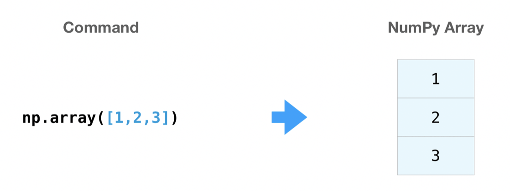

+++
title = 'Numpy & Pandas入门(系列之二)'
date = 2022-02-20T16:15:19+08:00
author = "Skyan"
tags = ["data science", "data"]
ShowToc = true
ShowBreadCrumbs = true
+++

## 背景和环境搭建

Numpy和Pandas是目前最为流行的数据分析工具之二，基于Python语言开发。Numpy偏向数值计算，Pandas偏向数据分析，底层也是基于Numpy数据结构。两者结合可以完成一系列令人眼花缭乱的数据分析任务，并在机器学习，统计分析，因果推断等领域得到广泛应用。

作为入门，首先需要搭建开发环境。这里建议直接采用miniconda+VS Code的方式搭建，简单高效，步骤如下：
1. 打开[miniconda](https://docs.conda.io/en/latest/miniconda.html)，找到适合自己操作系统的安装包，安装miniconda
2. 国内环境推荐使用清华的conda和pip镜像，参考[pypi镜像](https://mirrors.tuna.tsinghua.edu.cn/help/pypi/) 和[anaconda镜像](https://mirrors.tuna.tsinghua.edu.cn/help/anaconda/)
3. 打开命令行，运行`conda install pandas numpy`
4. 打开[vscode官网](https://code.visualstudio.com/#alt-downloads)，安装VS Code
5. 打开VS Code，安装Python，Jupyter插件
6. 在VS Code打开`Command Palette (⇧⌘P) `，运行`Jupyter: Create New Jupyter Notebook` 命令
7. 然后就能看到一个Jupyter Notebook，选择Python环境为刚才安装minicoda所在的位置
8. 一个基本Python环境已经搭建好了， 之后就可以愉快的开发了，注意保存代码

在开发之前，需要先学习下narray，Series和Dataframe这几个基本的数据结构，搞懂这几个数据结构以及对应的计算模式，开发代码就会更加高效和方便。

所有的运算就基于这三个数据结构来做运算，计算过程类似矩阵或者集合的运算。编程的范式和传统的过程式编程有区别，不再是线性的执行顺序，而是集合和集合之间的关系运算。

例如，我们经常写foreach循环遍历数组中每一个元素进行运算，但用numpy就不需要，因为它直接提供了各种数组间运算的函数。再比如我们想将数据按照维度的聚合计算，对于pandas而言直接调用groupby函数即可。

下面分别介绍这三种基础数据结构。

## narray
narray是numpy的基础数据结构，它本质上是有一个多维数组，1维的就是一个数组array或者向量vector，2维是一个矩阵matrix，3维甚至更高维就是一个张量tensor。所以这个“n”代表维度，narray全称也就是“N-dimensional array”。

一个narray如下所示，一个维度称为一个axis。下面这个narray有两个axes，第一个axis长度为2，第二个axis长度为3。
```bash
>>> import numpy as np
>>> a = np.array([[1, 2, 3, 4], [5, 6, 7, 8]])
>>> a
[[1, 2, 3, 4], 
[5, 6, 7, 8]]
```

需要时刻记住，narray对应的是一个多维数组，如下图所示：
 

numpy提供了一系列方便创建narray的函数，如下所示：
```bash
>>> np.zeros(2)
array([0., 0.]) # 0数组
>>> np.ones(2)
array([1., 1.])  # 1数字
>>> np.empty(2)
array([ 3.14, 42.  ])  # 随机值
>>> np.arange(4)
array([0, 1, 2, 3]) # 等差序列
>>> np.arange(2, 9, 2)
array([2, 4, 6, 8])   #等差序列
>>> np.linspace(0, 10, num=5)
array([ 0. ,  2.5,  5. ,  7.5, 10. ])   #线性区间
>>> np.ones(2, dtype=np.int64)
array([1, 1])   #将默认数据类型从float64改为int64
```

narray的切片选取方法有：
```bash
>>> data = np.array([1, 2, 3])
>>> data[1]
2
>>> data[0:2]
array([1, 2])
>>> data[1:]
array([2, 3])
>>> data[-2:]
array([2, 3])
```
可视化如下：


narray一个比较方便的功能就是选取元素可以直接在[]操作符运算，如下所示：
```bash
# 选择小于5的元素
>>> a = np.array([[1 , 2, 3, 4], [5, 6, 7, 8], [9, 10, 11, 12]])
>>> print(a[a < 5])
[1 2 3 4]
# 选择>=5的元素
>>> five_up = (a >= 5)
>>> print(a[five_up])
[ 5  6  7  8  9 10 11 12]
# 选择偶数
>>> divisible_by_2 = a[a%2==0]
>>> print(divisible_by_2)
[ 2  4  6  8 10 12]
# 组合条件选择
>>> c = a[(a > 2) & (a < 11)]
>>> print(c)
[ 3  4  5  6  7  8  9 10]
# 条件运算结果是bool数组
>>> five_up = (a > 5) | (a == 5)
>>> print(five_up)
[[False False False False]
 [ True  True  True  True]
 [ True  True  True True]]
# 如果没有符合条件的元素返回空数组
>>> not_there = np.nonzero(a == 42)
>>> print(not_there)
(array([], dtype=int64), array([], dtype=int64))
# nonzero函数可以直接返回非0值的index
>>> b = np.nonzero(a < 5)
>>> print(b)
(array([0, 0, 0, 0]), array([0, 1, 2, 3]))
```

narray对象可以直接参与各种运算：
```bash
>>> data = np.array([1, 2])
>>> ones = np.ones(2, dtype=int)
>>> data + ones
array([2, 3])
>>> data - ones
array([0, 1])
>>> data * data
array([1, 4])
>>> data / data
array([1., 1.])
```


还有一种广播的运算，实现批量运算
```bash
>>> data = np.array([1.0, 2.0])
>>> data * 1.6
array([1.6, 3.2])
```


还可以做各种聚合运算：
```bash
>>> data.max()
2.0
>>> data.min()
1.0
>>> data.sum()
3.0
```


二维甚至更高维的数组运算也是类似的，稍微需要学习的是多维数组的切片选取方法，这个查找numpy帮助文档即可。

下面举一个具体的例子，计算MSR的公式如下：
$$MeanSquareError=\displaystyle \frac{1}{n} \displaystyle \sum_{i=1}^{n}(Y'_i-Y_i)^2$$
用numpy实现如下，一行代码即可：
```python
error = (1/n) * np.sum(np.square (predictions- labels))
```
计算过程可视化如下：


numpy的所有函数都基于narray这个数据结构，因此掌握这个数据结构，再调用该库的其他函数就更加游刃有余。详见[numpy文档](https://numpy.org/doc/stable/user/absolute_beginners.html)。

## Series 和 DataFrame
Series和DataFrame是Pandas的两个基础数据结构。简单来说Series对应numpy的一维数组，DataFrame对应numpy的二维数组。但Pandas提供了多种方法，让我们在处理数据分析任务的时候更加方便，例如清洗数据，解决缺失值，读写文件，数据可视化等。

DataFrame的每一列就是一个Series，如下图所示：


注意上图深色部分是索引，浅色部分是数值。

Pandas最为强大的是IO，分析和可视化的能力，我们按照这个顺序来介绍。

Pandas支持直接读写csv，XLS，JSON等格式的文件，样例如下：
```bash
# 加载包
>>> import pandas as pd
>>> import matplotlib.pyplot as plt
# 将csv文件读取到内存中，返回一个DataFrame，read_csv函数有多种参数，例如定义分隔符，表头，数据类型
>>> titanic = pd.read_csv("data/titanic.csv")
# 查看DataFrame
>>> titanic
     PassengerId  Survived  Pclass                                               Name  ...            Ticket     Fare  Cabin  Embarked
0              1         0       3                            Braund, Mr. Owen Harris  ...         A/5 21171   7.2500    NaN         S
1              2         1       1  Cumings, Mrs. John Bradley (Florence Briggs Th...  ...          PC 17599  71.2833    C85         C
2              3         1       3                             Heikkinen, Miss. Laina  ...  STON/O2. 3101282   7.9250    NaN         S
3              4         1       1       Futrelle, Mrs. Jacques Heath (Lily May Peel)  ...            113803  53.1000   C123         S
4              5         0       3                           Allen, Mr. William Henry  ...            373450   8.0500    NaN         S
..           ...       ...     ...                                                ...  ...               ...      ...    ...       ...
886          887         0       2                              Montvila, Rev. Juozas  ...            211536  13.0000    NaN         S
887          888         1       1                       Graham, Miss. Margaret Edith  ...            112053  30.0000    B42         S
888          889         0       3           Johnston, Miss. Catherine Helen "Carrie"  ...        W./C. 6607  23.4500    NaN         S
889          890         1       1                              Behr, Mr. Karl Howell  ...            111369  30.0000   C148         C
890          891         0       3                                Dooley, Mr. Patrick  ...            370376   7.7500    NaN         Q

[891 rows x 12 columns]
# 查看前8行
>>> titanic.head(8)
   PassengerId  Survived  Pclass                                               Name  ...            Ticket     Fare  Cabin  Embarked
0            1         0       3                            Braund, Mr. Owen Harris  ...         A/5 21171   7.2500    NaN         S
1            2         1       1  Cumings, Mrs. John Bradley (Florence Briggs Th...  ...          PC 17599  71.2833    C85         C
2            3         1       3                             Heikkinen, Miss. Laina  ...  STON/O2. 3101282   7.9250    NaN         S
3            4         1       1       Futrelle, Mrs. Jacques Heath (Lily May Peel)  ...            113803  53.1000   C123         S
4            5         0       3                           Allen, Mr. William Henry  ...            373450   8.0500    NaN         S
5            6         0       3                                   Moran, Mr. James  ...            330877   8.4583    NaN         Q
6            7         0       1                            McCarthy, Mr. Timothy J  ...             17463  51.8625    E46         S
7            8         0       3                     Palsson, Master. Gosta Leonard  ...            349909  21.0750    NaN         S

[8 rows x 12 columns]
# 查看每列的数据类型
>>> titanic.dtypes
PassengerId      int64
Survived         int64
Pclass           int64
Name            object
Sex             object
Age            float64
SibSp            int64
Parch            int64
Ticket          object
Fare           float64
Cabin           object
Embarked        object
dtype: object
```

类似的，Excel等格式的文件都支持读写，直接查看Pandas手册即可。

读取数据之后，选择列和过滤数据，都可以用[]操作即可，如下所示：
```bash
#选择两列，返回一个DataFrame
>>> age_sex = titanic[["Age", "Sex"]]
>>> age_sex.head()
    Age     Sex
0  22.0    male
1  38.0  female
2  26.0  female
3  35.0  female
4  35.0    male
# 选择一列，返回一个Series
>>> age = titanic[["Age"]]
>>> age.head()
Age
0  22.0
1  38.0
2  26.0
3  35.0
4  35.0
# 选择age列大于35岁的行
>>> above_35 = titanic[titanic["Age"] > 35]
>>> above_35.head()
    PassengerId  Survived  Pclass                                               Name     Sex  ...  Parch    Ticket     Fare Cabin  Embarked
1             2         1       1  Cumings, Mrs. John Bradley (Florence Briggs Th...  female  ...      0  PC 17599  71.2833   C85         C
6             7         0       1                            McCarthy, Mr. Timothy J    male  ...      0     17463  51.8625   E46         S
11           12         1       1                           Bonnell, Miss. Elizabeth  female  ...      0    113783  26.5500  C103         S
13           14         0       3                        Andersson, Mr. Anders Johan    male  ...      5    347082  31.2750   NaN         S
15           16         1       2                   Hewlett, Mrs. (Mary D Kingcome)   female  ...      0    248706  16.0000   NaN         S

[5 rows x 12 columns]
# age列大于35的boolean标志
>>> titanic["Age"] > 35
0      False
1       True
2      False
3      False
4      False
       ...  
886    False
887    False
888    False
889    False
890    False
Name: Age, Length: 891, dtype: bool
# 组合筛选条件
>>> class_23 = titanic[(titanic["Pclass"] == 2) | (titanic["Pclass"] == 3)]
>>> class_23.head()
   PassengerId  Survived  Pclass                            Name     Sex   Age  SibSp  Parch            Ticket     Fare Cabin Embarked
0            1         0       3         Braund, Mr. Owen Harris    male  22.0      1      0         A/5 21171   7.2500   NaN        S
2            3         1       3          Heikkinen, Miss. Laina  female  26.0      0      0  STON/O2. 3101282   7.9250   NaN        S
4            5         0       3        Allen, Mr. William Henry    male  35.0      0      0            373450   8.0500   NaN        S
5            6         0       3                Moran, Mr. James    male   NaN      0      0            330877   8.4583   NaN        Q
7            8         0       3  Palsson, Master. Gosta Leonard    male   2.0      3      1            349909  21.0750   NaN        S
# 非空数据筛选
>>> age_no_na = titanic[titanic["Age"].notna()]
>>> age_no_na.head()
   PassengerId  Survived  Pclass                                               Name  ...            Ticket     Fare  Cabin  Embarked
0            1         0       3                            Braund, Mr. Owen Harris  ...         A/5 21171   7.2500    NaN         S
1            2         1       1  Cumings, Mrs. John Bradley (Florence Briggs Th...  ...          PC 17599  71.2833    C85         C
2            3         1       3                             Heikkinen, Miss. Laina  ...  STON/O2. 3101282   7.9250    NaN         S
3            4         1       1       Futrelle, Mrs. Jacques Heath (Lily May Peel)  ...            113803  53.1000   C123         S
4            5         0       3                           Allen, Mr. William Henry  ...            373450   8.0500    NaN         S

[5 rows x 12 columns]
```

还可以指定行筛选
```bash
# age>35的行选取name列
>>> adult_names = titanic.loc[titanic["Age"] > 35, "Name"]
>>> adult_names.head()
1     Cumings, Mrs. John Bradley (Florence Briggs Th...
6                               McCarthy, Mr. Timothy J
11                             Bonnell, Miss. Elizabeth
13                          Andersson, Mr. Anders Johan
15                     Hewlett, Mrs. (Mary D Kingcome) 
Name: Name, dtype: object
# 第9-25行，第2-5列
>>> titanic.iloc[9:25, 2:5]
    Pclass                                 Name     Sex
9        2  Nasser, Mrs. Nicholas (Adele Achem)  female
10       3      Sandstrom, Miss. Marguerite Rut  female
11       1             Bonnell, Miss. Elizabeth  female
12       3       Saundercock, Mr. William Henry    male
13       3          Andersson, Mr. Anders Johan    male
..     ...                                  ...     ...
20       2                 Fynney, Mr. Joseph J    male
21       2                Beesley, Mr. Lawrence    male
22       3          McGowan, Miss. Anna "Annie"  female
23       1         Sloper, Mr. William Thompson    male
24       3        Palsson, Miss. Torborg Danira  female

[16 rows x 3 columns]
# 直接更新0-3行第3列
>>> titanic.iloc[0:3, 3] = "anonymous"
>>> titanic.head()
   PassengerId  Survived  Pclass                                          Name  ...            Ticket     Fare  Cabin  Embarked
0            1         0       3                                     anonymous  ...         A/5 21171   7.2500    NaN         S
1            2         1       1                                     anonymous  ...          PC 17599  71.2833    C85         C
2            3         1       3                                     anonymous  ...  STON/O2. 3101282   7.9250    NaN         S
3            4         1       1  Futrelle, Mrs. Jacques Heath (Lily May Peel)  ...            113803  53.1000   C123         S
4            5         0       3                      Allen, Mr. William Henry  ...            373450   8.0500    NaN         S

[5 rows x 12 columns]
```

还可以进行映射，例如希望将某一列格式变换，如下所示：
```bash
# 直接在列上运算，和narray类似
>>> air_quality["london_mg_per_cubic"] = air_quality["station_london"] * 1.882
>>> air_quality.head()
                     station_antwerp  station_paris  station_london  london_mg_per_cubic
datetime                                                                                
2019-05-07 02:00:00              NaN            NaN            23.0               43.286
2019-05-07 03:00:00             50.5           25.0            19.0               35.758
2019-05-07 04:00:00             45.0           27.7            19.0               35.758
2019-05-07 05:00:00              NaN           50.4            16.0               30.112
2019-05-07 06:00:00              NaN           61.9             NaN                  NaN

# 甚至可以在列和列之间运算
>>> air_quality["ratio_paris_antwerp"] = (
   ...:     air_quality["station_paris"] / air_quality["station_antwerp"]
   ...: )
   ...: 
>>> air_quality.head()
                     station_antwerp  station_paris  station_london  london_mg_per_cubic  ratio_paris_antwerp
datetime                                                                                                     
2019-05-07 02:00:00              NaN            NaN            23.0               43.286                  NaN
2019-05-07 03:00:00             50.5           25.0            19.0               35.758             0.495050
2019-05-07 04:00:00             45.0           27.7            19.0               35.758             0.615556
2019-05-07 05:00:00              NaN           50.4            16.0               30.112                  NaN
2019-05-07 06:00:00              NaN           61.9             NaN                  NaN                  NaN

# 列名可以重命名
>>> air_quality_renamed = air_quality.rename(
   ...:     columns={
   ...:         "station_antwerp": "BETR801",
   ...:         "station_paris": "FR04014",
   ...:         "station_london": "London Westminster",
   ...:     }
   ...: )
   ...: 

>>> air_quality_renamed.head()
                     BETR801  FR04014  London Westminster  london_mg_per_cubic  ratio_paris_antwerp
datetime                                                                                           
2019-05-07 02:00:00      NaN      NaN                23.0               43.286                  NaN
2019-05-07 03:00:00     50.5     25.0                19.0               35.758             0.495050
2019-05-07 04:00:00     45.0     27.7                19.0               35.758             0.615556
2019-05-07 05:00:00      NaN     50.4                16.0               30.112                  NaN
2019-05-07 06:00:00      NaN     61.9                 NaN                  NaN                  NaN

# 可以用函数来重命名列
>>> air_quality_renamed = air_quality_renamed.rename(columns=str.lower)
>>> air_quality_renamed.head()
                     betr801  fr04014  london westminster  london_mg_per_cubic  ratio_paris_antwerp
datetime                                                                                           
2019-05-07 02:00:00      NaN      NaN                23.0               43.286                  NaN
2019-05-07 03:00:00     50.5     25.0                19.0               35.758             0.495050
2019-05-07 04:00:00     45.0     27.7                19.0               35.758             0.615556
2019-05-07 05:00:00      NaN     50.4                16.0               30.112                  NaN
2019-05-07 06:00:00      NaN     61.9                 NaN                  NaN                  NaN

# 更多类似的例子
>>> df["three"] = df["one"] * df["two"]
>>> df["flag"] = df["one"] > 2
>>> df
   one  two  three   flag
a  1.0  1.0    1.0  False
b  2.0  2.0    4.0  False
c  3.0  3.0    9.0   True
d  NaN  4.0    NaN  False
# 还可以用lambda函数来做列变化，这个适合一些比较复杂的逻辑
>>> iris.assign(sepal_ratio=lambda x: (x["SepalWidth"] / x["SepalLength"])).head()
Out[85]: 
   SepalLength  SepalWidth  PetalLength  PetalWidth         Name  sepal_ratio
0          5.1         3.5          1.4         0.2  Iris-setosa     0.686275
1          4.9         3.0          1.4         0.2  Iris-setosa     0.612245
2          4.7         3.2          1.3         0.2  Iris-setosa     0.680851
3          4.6         3.1          1.5         0.2  Iris-setosa     0.673913
4          5.0         3.6          1.4         0.2  Iris-setosa     0.720000
```

汇总操作和narray类似，简单方便：
```bash
>>> titanic.head()
   PassengerId  Survived  Pclass                                               Name  ...            Ticket     Fare  Cabin  Embarked
0            1         0       3                            Braund, Mr. Owen Harris  ...         A/5 21171   7.2500    NaN         S
1            2         1       1  Cumings, Mrs. John Bradley (Florence Briggs Th...  ...          PC 17599  71.2833    C85         C
2            3         1       3                             Heikkinen, Miss. Laina  ...  STON/O2. 3101282   7.9250    NaN         S
3            4         1       1       Futrelle, Mrs. Jacques Heath (Lily May Peel)  ...            113803  53.1000   C123         S
4            5         0       3                           Allen, Mr. William Henry  ...            373450   8.0500    NaN         S

[5 rows x 12 columns]
# 求age列均值
>>> titanic["Age"].mean()
Out[4]: 29.69911764705882
# age列中位数
>>> titanic[["Age", "Fare"]].median()
Age     28.0000
Fare    14.4542
dtype: float64
>>> titanic[["Age", "Fare"]].describe()
              Age        Fare
count  714.000000  891.000000
mean    29.699118   32.204208
std     14.526497   49.693429
min      0.420000    0.000000
25%     20.125000    7.910400
50%     28.000000   14.454200
75%     38.000000   31.000000
max     80.000000  512.329200
# 指定聚合函数
>>> titanic.agg(
   ...:     {
   ...:         "Age": ["min", "max", "median", "skew"],
   ...:         "Fare": ["min", "max", "median", "mean"],
   ...:     }
   ...: )
   ...: 
              Age        Fare
min      0.420000    0.000000
max     80.000000  512.329200
median  28.000000   14.454200
skew     0.389108         NaN
mean          NaN   32.204208
```
还可以按维度groupby，如下：
```bash
# 取sex和age列，按照sex列聚合，取age列均值
>>> titanic[["Sex", "Age"]].groupby("Sex").mean()
              Age
Sex              
female  27.915709
male    30.726645

# 按照sex列聚合取所有其他列的均值
>>> titanic.groupby("Sex").mean()
        PassengerId  Survived    Pclass        Age     SibSp     Parch       Fare
Sex                                                                              
female   431.028662  0.742038  2.159236  27.915709  0.694268  0.649682  44.479818
male     454.147314  0.188908  2.389948  30.726645  0.429809  0.235702  25.523893

# 按照sex列聚合，取age列的均值
>>> titanic.groupby("Sex")["Age"].mean()
Sex
female    27.915709
male      30.726645
Name: Age, dtype: float64
```

一图胜千言


对于文本列，有一系列单独处理的函数，值得一提：
```bash
>>> titanic.head()
   PassengerId  Survived  Pclass                                               Name  ...            Ticket     Fare  Cabin  Embarked
0            1         0       3                            Braund, Mr. Owen Harris  ...         A/5 21171   7.2500    NaN         S
1            2         1       1  Cumings, Mrs. John Bradley (Florence Briggs Th...  ...          PC 17599  71.2833    C85         C
2            3         1       3                             Heikkinen, Miss. Laina  ...  STON/O2. 3101282   7.9250    NaN         S
3            4         1       1       Futrelle, Mrs. Jacques Heath (Lily May Peel)  ...            113803  53.1000   C123         S
4            5         0       3                           Allen, Mr. William Henry  ...            373450   8.0500    NaN         S

[5 rows x 12 columns]
# DataFrame和Series通过一个叫做str的accessor来提供各种字符串处理方法
>>> titanic["Name"].str.lower()
0                                braund, mr. owen harris
1      cumings, mrs. john bradley (florence briggs th...
2                                 heikkinen, miss. laina
3           futrelle, mrs. jacques heath (lily may peel)
4                               allen, mr. william henry
                             ...                        
886                                montvila, rev. juozas
887                         graham, miss. margaret edith
888             johnston, miss. catherine helen "carrie"
889                                behr, mr. karl howell
890                                  dooley, mr. patrick
Name: Name, Length: 891, dtype: object
# 还可以直接对每一行进行字符串split
>>> titanic["Name"].str.split(",")
0                             [Braund,  Mr. Owen Harris]
1      [Cumings,  Mrs. John Bradley (Florence Briggs ...
2                              [Heikkinen,  Miss. Laina]
3        [Futrelle,  Mrs. Jacques Heath (Lily May Peel)]
4                            [Allen,  Mr. William Henry]
                             ...                        
886                             [Montvila,  Rev. Juozas]
887                      [Graham,  Miss. Margaret Edith]
888          [Johnston,  Miss. Catherine Helen "Carrie"]
889                             [Behr,  Mr. Karl Howell]
890                               [Dooley,  Mr. Patrick]
Name: Name, Length: 891, dtype: object
# 取split后第一个元素
>>> titanic["Surname"] = titanic["Name"].str.split(",").str.get(0)
>>> titanic["Surname"]
0         Braund
1        Cumings
2      Heikkinen
3       Futrelle
4          Allen
         ...    
886     Montvila
887       Graham
888     Johnston
889         Behr
890       Dooley
Name: Surname, Length: 891, dtype: object
# 字符串匹配
>>> titanic[titanic["Name"].str.contains("Countess")]
     PassengerId  Survived  Pclass                                               Name     Sex  ...  Ticket  Fare  Cabin Embarked  Surname
759          760         1       1  Rothes, the Countess. of (Lucy Noel Martha Dye...  female  ...  110152  86.5    B77        S   Rothes

[1 rows x 13 columns]
# 取最大长度字符串
>>> titanic.loc[titanic["Name"].str.len().idxmax(), "Name"]
'Penasco y Castellana, Mrs. Victor de Satode (Maria Josefa Perez de Soto y Vallejo)'
```
数据处理完后，最后可以进行可视化，DataFrame自带可视化接口，如下所示：
```bash
# 读取文件，指定第一列为index
>>> air_quality = pd.read_csv("data/air_quality_no2.csv", index_col=0, parse_dates=True)
>>> air_quality.head()
                     station_antwerp  station_paris  station_london
datetime                                                           
2019-05-07 02:00:00              NaN            NaN            23.0
2019-05-07 03:00:00             50.5           25.0            19.0
2019-05-07 04:00:00             45.0           27.7            19.0
2019-05-07 05:00:00              NaN           50.4            16.0
2019-05-07 06:00:00              NaN           61.9             NaN
# 趋势图，默认x为index，y为每一列
>>> air_quality.plot()
<AxesSubplot:xlabel='datetime'>
# 散点图，需要指定x和y列
>>> air_quality.plot.scatter(x="station_london", y="station_paris", alpha=0.5)
<AxesSubplot:xlabel='station_london', ylabel='station_paris'>
# 箱线图，默认给每一列画一个箱线
>>> air_quality.plot.box()
<AxesSubplot:>
```


其他方法和细节直接查看[pandas手册](https://pandas.pydata.org/docs/user_guide/index.html)

## 总结
了解narray，Series和DataFrame的基本数据结构和基本方法，更详细的功能直接查看手册：

* [Numpy手册](https://numpy.org/doc/stable/user/basics.html)
* [Pandas手册](https://pandas.pydata.org/docs/user_guide/index.html)

再次说明一点，在使用Numpy和Pandas之前，掌握其设计思想是非常重要的一件事。这类多维数组，函数式，immutable data，copy on write的思想，从narray到tensorflow的tensor，再到spark甚至lisp，都是一脉相承，持续传承。
