+++
title = '数据可视化指南（系列之三）'
date = 2022-03-10T16:15:19+08:00
author = "Skyan"
tags = ["data science", "data"]
ShowToc = false
ShowBreadCrumbs = true
+++

## 可视化
作为数据分析的一个重头戏，数据可视化被称为数据分析的半壁江山一点不为过，当然另外半壁就是统计学。

数据可视化将枯燥的并不直观的一维统计数字，直接通过二维甚至三维图形的方式展现给人们。图像的信息含量远大于数字，使得人们可以直接发现数据的趋势，找到异常点，甚至洞察更深层次的规律。

数据可视化并不是简单的用Excel画个线图或者柱状图就可以搞定，事实上，数据可视化属于一门严格的统计学方向「探索性数据分析」，这是由美国著名统计学家John. W. Tukey于1977年首创，借助图形对数据进行探索性分析的方法。美国统计学家Wilkinson于2005年给出了一个很好的数据可视化框架，它直接导致了R包ggplot2的发明，并影响了世界上最好的数据可视化软件之一Tableau。所有这一切历史其实想说明，数据的可视化并不是想当然地画图，而是需要对所要解决的问题和适合表达的图形有非常明确的认识和理解，才能真正发挥数据可视化的潜力，开发出统计图形的价值。

用于数据可视化的图形的种类其实有多种多样，我们需要首先了解每种分类，以及适合的分析场景。如下表所示：

| 变量（度量）个数 | 分析目标 | 图形名称 | 图形样例 | 使用场景 |
| --- | --- | --- | --- | --- |
| 一个 | 不同类别下数据展示 | 条形图 | 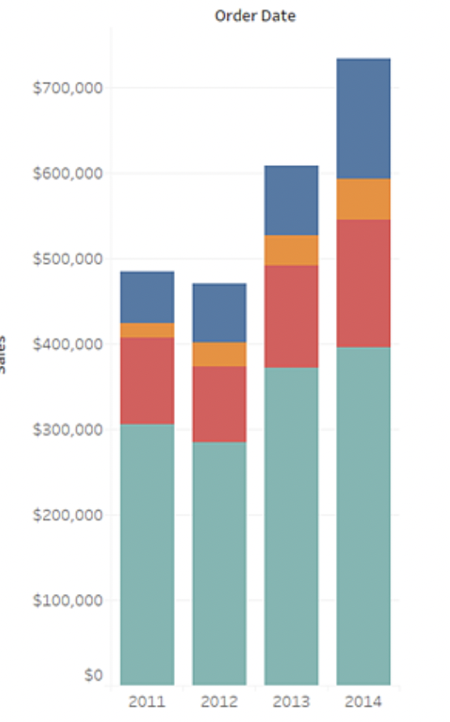 | 在各类别之间比较数据，一个坐标轴是维度，另一个坐标轴是度量。表示在维度的不同维度值下，度量的大小情况。 条形图还可以叠加更多维度拆解，例如在每个类别下继续按照另一个维度类型拆解，查看更细粒度的指标情况|
| 一个 | 数据的统计分布 | 直方图 | 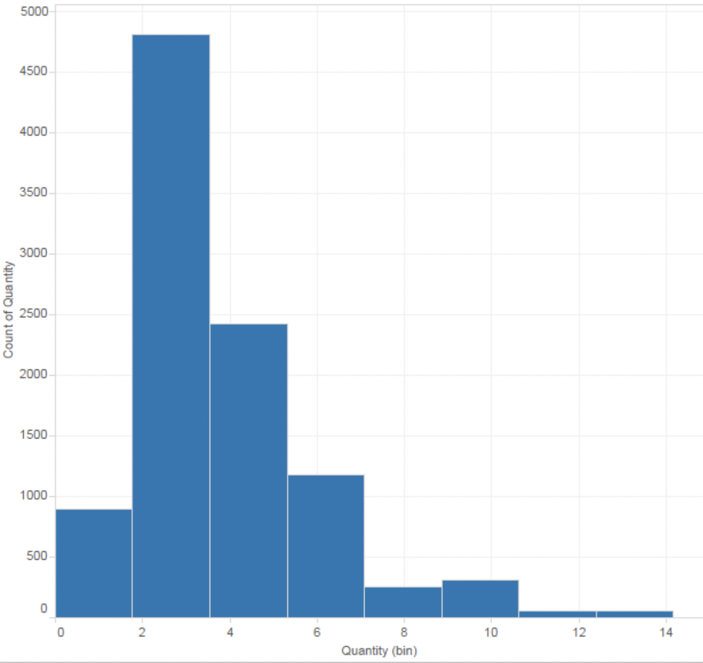 | 展示连续数据分布最常用的工具，它本质上是对密度函数的一种估计。通过将连续度量的值分组为数据桶，来观察数据的分布规律 |
| 一个 | 数据分位点分布 | 箱线图 | 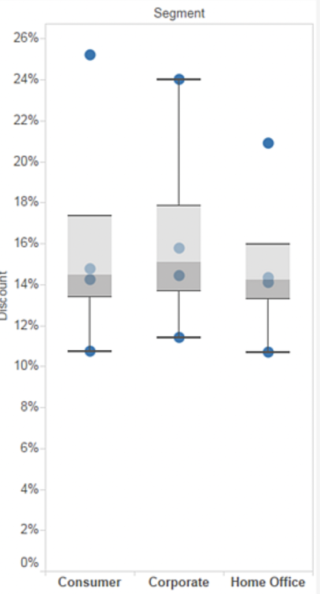 | 主要是从四分位数的角度出发 描述数据的分布，它通过最大值，上四分位数，中位数，下四分位数和最小值五处位置来获取一维数据的分布概况。通过每一段数据占据的长度，我们可以大致推断出数据的集中或离散趋势（长度越短，说明数据在该区间上越密集，反之则稀疏）。|
| 一个 | 数据在不同类别下的占比 | 饼图 | 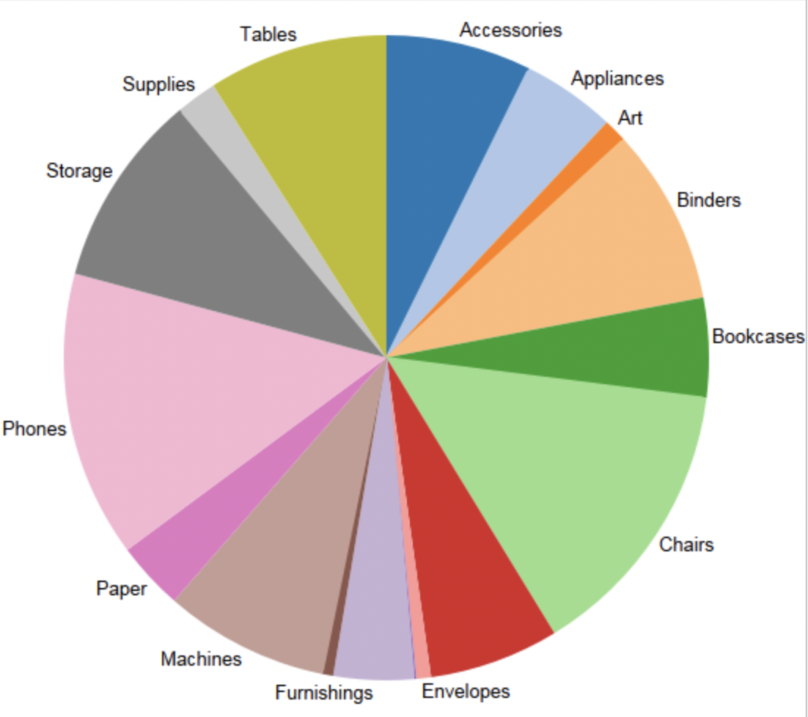 | 每一个扇形的角度与相应数据的数值大小成比例，但实际上通过饼图来查看不同类别占比的差别并不是很直观，有时还不如条形图直观 |
| 一个 | 数据在不同地理位置之间的分布 | 地图 | 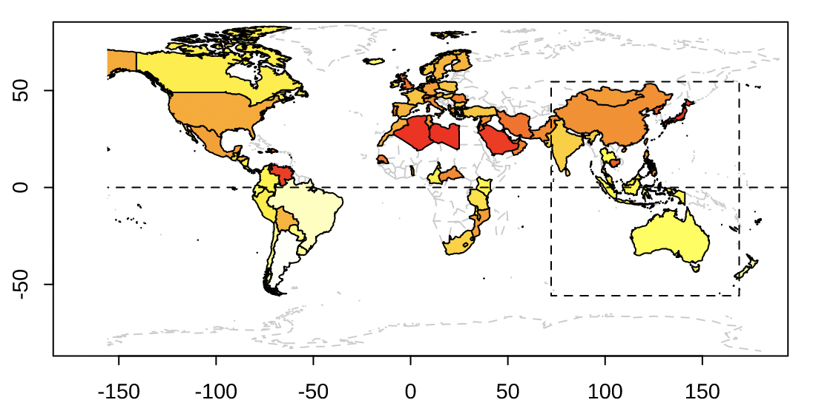 | 展示和地理位置有关的数据分布关系时，最合适的工具 |
| 一个 | 数据随着时间的趋势变化 | 折线图 | 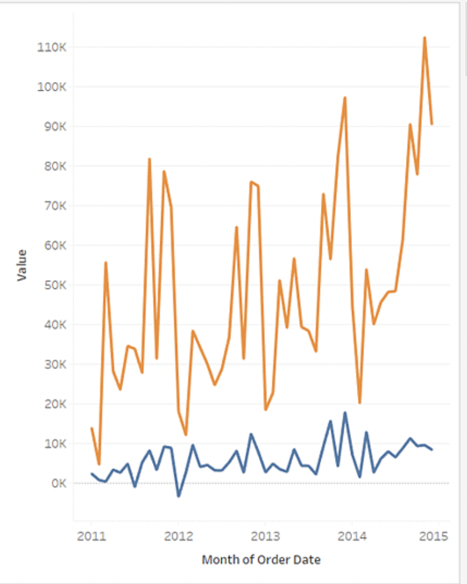 | 将视图中的各个数据点连接起来。折线图为直观显示一系列值提供了一种简单方法，适合显示数据随时间变化的趋势，或者预测未来的值。|
| 一个 | 数据随着时间的趋势变化以及按维度拆解 | 面积图 | 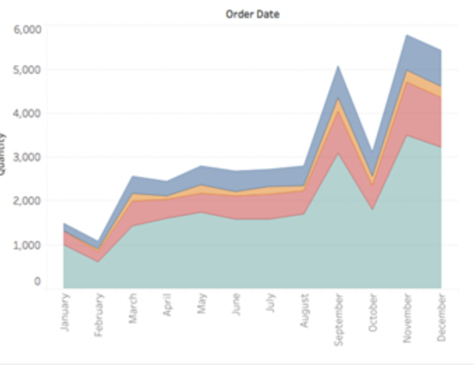 | 和折线图类似，只是将折现下方的区域按照不同类别维度填色，展示各类别随时间变化的趋势|
| 二个 | 两个变量之间的相关关系 | 散点图 |  | 散点图通常用来展示两个变量之间的关系，这种关系可能是线性或非线性的。图中每一个点的横纵坐标都分别对应两个变量各自的观测值，因此散点所反映出来的趋势也就是两个变量之间的关系。|
| 二个 | 两个变量之间的相关关系 | 热图 | 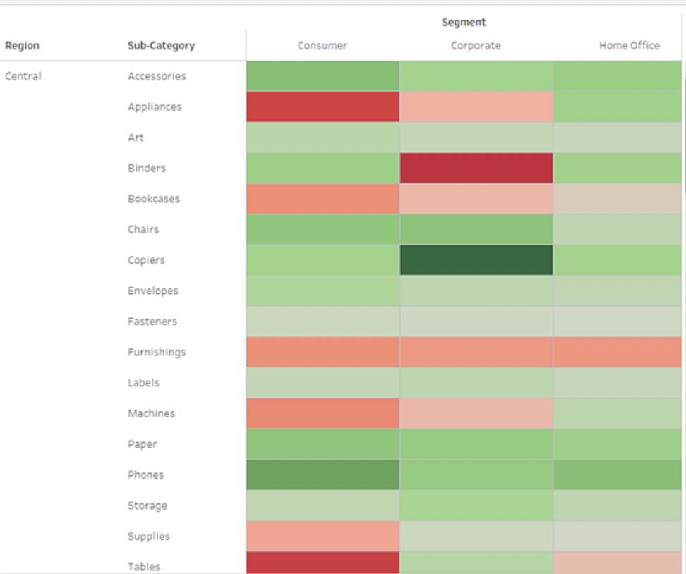 | 热图用矩阵表示两个变量之间的相关关系，同时将单元格数值用颜色表达，如颜色深表示数值大。跟进一步，热图还可以表达聚类关系，即在颜色图的边界区域加上聚类的谱系图，这样可以同时观测数值分布和聚类的结果 |
| 二个 | 两个变量之间的相关关系 | 密度图 | 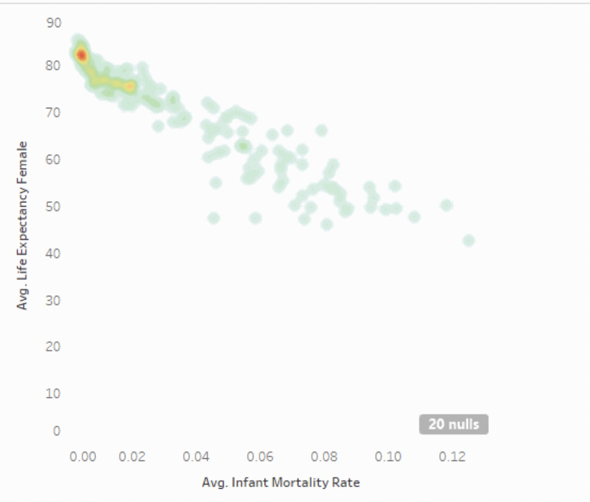 | 在散点图的基础上，通过颜色进一步突出相关关系，以及热点区域 |
| 三个 | 三个变量之间的关系 | 三维透视图 | 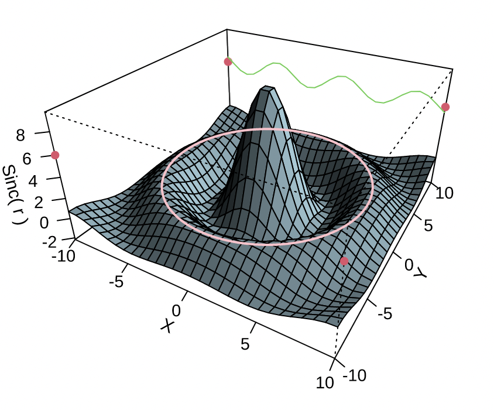 | 通过三维透视的形式，将三个变量变成三个维度，直接展示三者之间的关联。但三维图容易受到视角变化的影响，因此需要不断调整视角观测到真实的规律
| 三个 | 三个变量之间的关系 | 等高线图 | 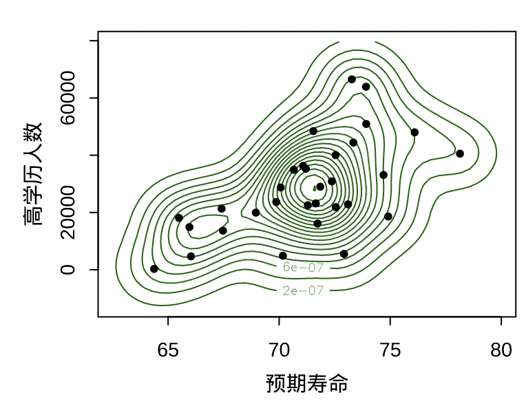 | 将三维透视图的等高线展示在二维图像上，这样视角更广，不用担心视角的问题 |
| 多个（>=3) | 三个甚至更多变量之间的关系 | 散点图矩阵 | 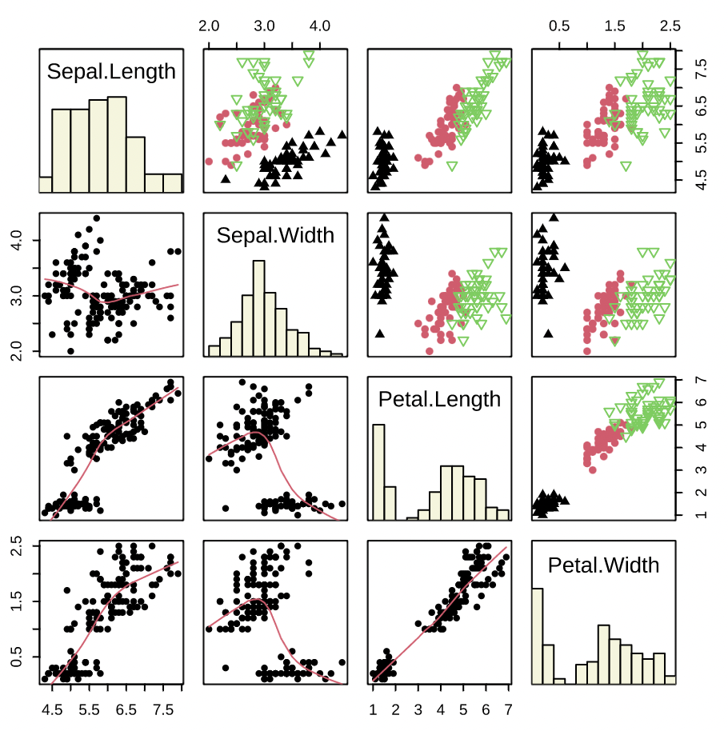 | 散点图的高维扩展，只是将多个变量的两两散点图以矩阵的形式排列起来，就构成了所谓的散点图矩阵。它从一定程度上克服了在平面上展示高维数据的困难，对于查看变量之间的两两关系非常有用。|

在正式画图之前，我们还需要区分度量(变量)和维度的概念，这为我们能画出正确的图形奠定基础。

* 度量：也叫变量，是指我们需要分析，观察的对象。例如：展现次数，点击次数，点击率，时间，这些都是度量，都是我们需要观察的变量。变量可以是离散的，例如次数，个数，也可以是连续的，例如点击率，出价，时间等。度量可以是累加型的，例如点击次数，交易总量，也可以是非累加型的，例如去重用户数，点击率等。
* 维度：是指在变量值可以进一步拆解的类别。例如用户类型，设备型号，地域等，这些都是维度。维度是用来拆解度量的，一般是离散值。度量在维度的不同维度值下按照不同的聚合逻辑进行聚合。例如点击次数是相加，去重用户数是去重计数。

下面我们以常用的直方图和散点图为例，介绍统计意义的数据可视化是如何应用的。下面可视化软件用的Tableau，大家也可以用python的matplotlib库或者R语言的ggplot2库编程实现，MS Excel不推荐使用，主要是Excel对于复杂的图形难以满足要求。

以一份点展数据为例，数据如下所示，一行一个用户
| 展现 | 点击 | 点展比 |
| --- | --- | --- |
| 1000 | 99 | 0.099 |
| 1041 | 1026 | 0.985591 |
| 1063 | 101 | 0.095014 |
| 1072 | 166 | 0.154851 |
| 1084 | 472 | 0.435424 |
| 1582 | 127 | 0.080278 |
| ... | ... | ... |

这个数据的每一列都是度量（变量），现在我们想对展现这个度量进行分析，首先可以通过直方图来看它的分布情况：
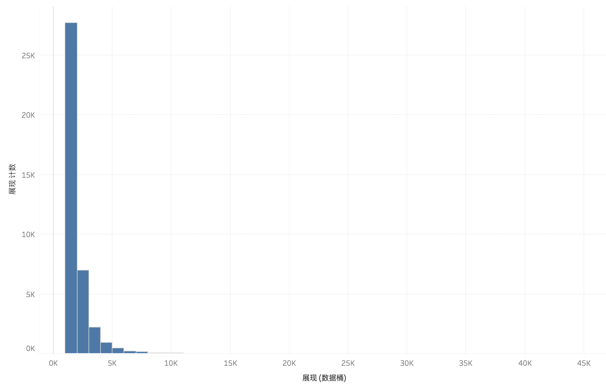

从这张图我们可以清楚看到展现的分布情况：大部分数据集中在3K以下，呈幂分布状态，尾部很长。这就是对展现度量的直观印象。而这样的规律，如果从柱状图或者饼图，是无法观察得到的。

同样，如果我们想观察展现和点击两个度量之间的相关关系，只需要散点图即可观察：
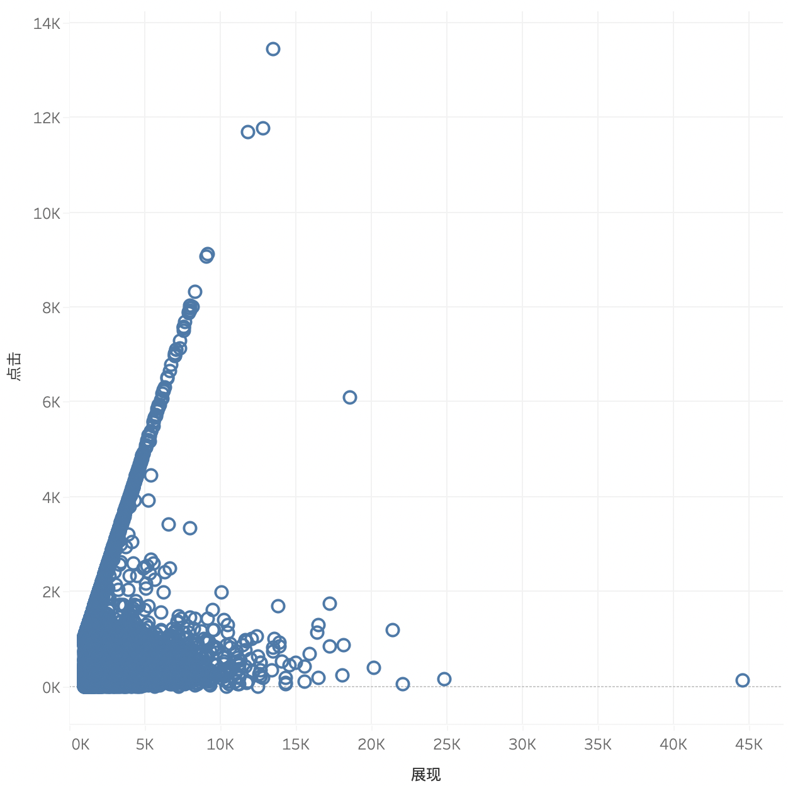

从上图可以直观看到两个度量之间的相关关系，例如，非常明细看到，在这份数据中，左上角存在一些聚集性现象，呈现一些奇怪的线性相关关系。这样可以通过进一步的分析探索，例如继续观测点击/展现（即点击率）的直方图，可以看到异常区域的聚集。

上述只是一个非常简单的例子，实际工作中，数据可视化有多种表现方式，呈现的图形也多种多样。下面这张图是一个比较好的指引图：

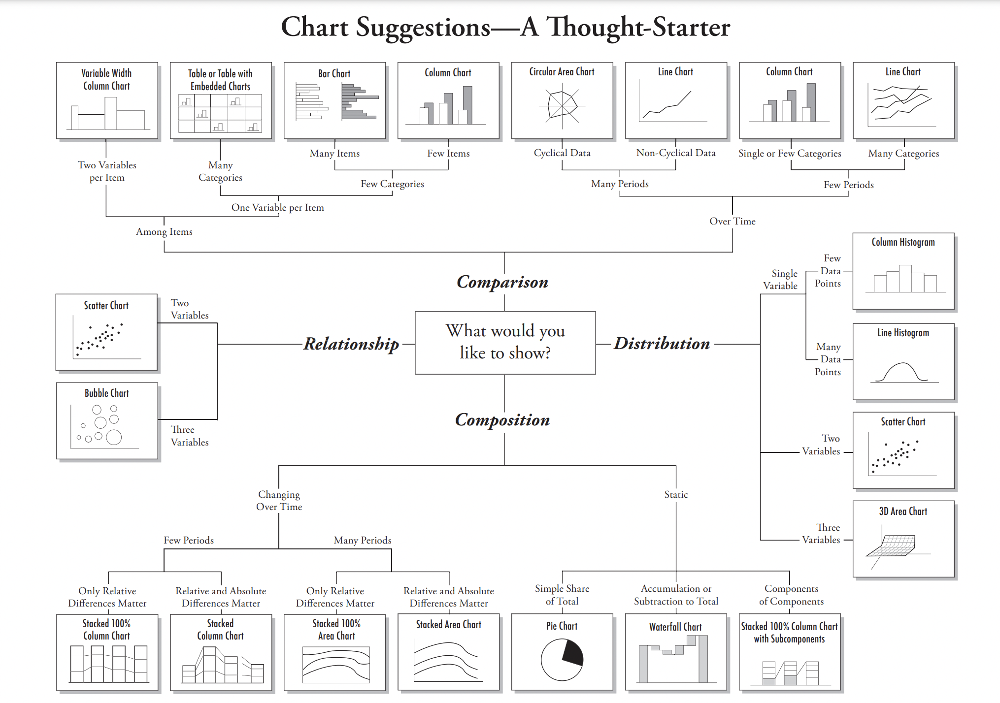

其他可参考学习的资料有：
* [现代统计图形](https://bookdown.org/xiangyun/msg/)，赵鹏，谢益辉等著
* [Matplotlib文档](https://matplotlib.org/stable/tutorials/introductory/pyplot.html)
* [R for Data Science](https://r4ds.had.co.nz/data-visualisation.html)

总之，数据可视化需要在实践中通过真实数据不断练习，通过图形来发掘数据深层次的规律和异常，当最终找到线索并验证真实的那一刻，你会感觉很爽。
