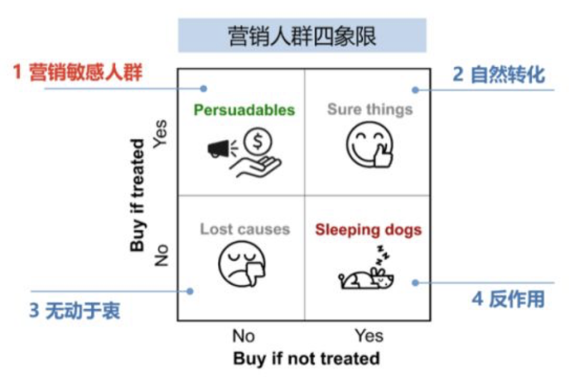
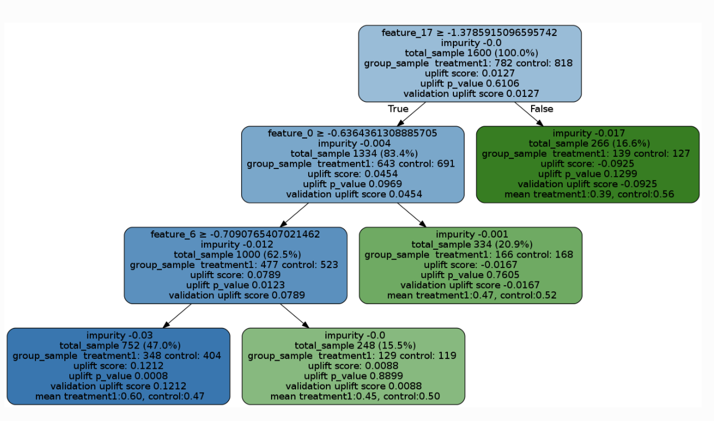

+++
title = 'CATE效应入门(系列之四)'
date = 2022-03-30T16:15:19+08:00
author = "Skyan"
tags = ["data science", "data"]
ShowToc = true
ShowBreadCrumbs = true
+++

## 背景
随着互联网的逐步普及和兴起，在线A/B实验获得了越来越广泛地应用。无论是营销策略，交互样式，机器学习模型，搜索算法都依赖在线A/B实验来进行试错和迭代。

实际上，A/B实验的思想最早起源于R.A.Fisher在20世纪20年代进行的针对农业的田间实验(Field Experimentation)，之后经过近一个世纪现代统计学的蓬勃发展，逐步成熟应用到各行各业。

在最近50年，随着科技的进步，人类可获取数据量呈现指数级增长，统计学从此有了更多的研究空间，并进入了一个飞速发展的阶段，诞生了因果推断[^1]等更深刻的思想。A/B实验不再仅限于分析平均实验效应(ATE, Average Treatment Effect)，还进入到了有条件的平均实验效应(CATE, Conditional Average Treatment Effect)，进一步深入挖掘数据内部的规律。

通俗来说，ATE只是对比不同实验版本之间指标的差异，而CATE对比的是不同维度条件下不同实验版本之间指标的差异。而这个思想以及相关的方法，能够进一步挖掘产品，模型，算法，策略的潜力，实现“物以类聚人以群分”的个性化方案，同时也能够更深入的理解实验背后的因果关系。

## ATE和CATE
在介绍CATE的具体算法之前，我们先理解ATE的理论基础。这里我们采用Neyman-Rubin的潜在产出模型(potential outcome framework)的理论框架来描述ATE的基本原理。

设Wi表示个体i进入实验组与否，在实验组中取1，对照组取0 (多实验版本的可以做相应的推广)；Yi 表示个体 i 的结果变量，就是我们所观察的实验指标。另外记 \({Y_i(1),Y_i(0)}\) 表示个体 i 接受处理或者对照的潜在结果 (potential outcome)，那么 \( Y_i(1)−Y_i(0) \)表示个体 i  在实验组中的个体因果作用。不幸的是，每个个体要么接受处理，要么接受对照\({Y_i(1),Y_i(0)}\) 中必然缺失一半，个体的因果作用是不可识别的。观测的结果是：
$$Y_i=W_iY_i(1)+(1–W_i)Y_i(0)$$
但是，在 W 做随机化的前提下，我们可以识别总体的平均因果作用 (Average Treatment Effect; ATE):
$$ATE = E\{Y_i(1) – Y_i(0)\}$$
这是因为实验组是随机抽样，个体进入实验组与否和Y是独立不相关，即Wi和Yi正交，如下面推导所示：
$$
ATE = E\{Y_i(1)\} -E\{Y_i(0)\} \\
 =  E\{Y_i(1) \mid W_i =1\}  -E\{Y_i(0)\mid W_i=0\}  \\
 =  E\{Y_i \mid W_i =1\} – E\{Y_i \mid W_i=0\}
$$
所以ATE是可以通过随机化，从由观测的数据估计出来。

进一步，我们定义每个个体的特征为Xi，是一个d维的特征向量。对于每一个个体，如果我们想判定这个个体是否适合实验组还是对照组，得先估计该个体在实验组和对照组之间潜在结果。定义Di为每个个体的ITE(Individual Treatment Effect)如下：
$$D_i:=Y_i(1)-Y_i(0)$$
然而我们无法直接观察Di，这也是因果推断的一个基本问题：每一个个体要么在实验组(W=1)中，要么在对照组(W=0)中，无法同时存在。因此需要定义一个CATE的估计量如下：
$$\tau(x):=E\{D_i|X=x\}=E\{Y_i(1)-Y_i(0)|X=x\},$$

为了估计出CATE，近十年来，学术界和工业界提出了uplift模型，基于机器学习的因果推断模型等方法来解决。CATE也在广告营销，医药，经济学，公共政策等领域获得了广泛地应用。我们所熟悉的应用场景有：
1. 用户营销。在营销场景中，有一句名言：“我知道我的广告费有一半浪费了，但遗憾的是，我不知道是哪一半被浪费了”。通过CATE方法，可以识别出真正有效的可转化人群，更加精准地投放，实现更高的ROI。在营销场景中的CATE模型可以从A/B实验中，也可以从历史数据中建模估计出
2. 用户个性化推荐。适合有多种选项的场景中，通过CATE可以预估出不同用户在不同选项的偏好情况，这样实现千人千面，实现最大化推荐效果的目的。

CATE的经典解决方法为uplift建模(uplift modeling)，包括树方法(uplift tree)，元学习(Meta-learner algorithms)等。此外还有工具变量，神经网络等新的方法来解决CATE预估问题，这个领域也是在不断迭代中，在产品营销，用户增长等领域处于热门研究方向。

## Uplift Modeling
Uplift即为增益，Uplift models主要用于预测一个treatment(例如发优惠券)对个体(例如给某个消费者)的增量价值(例如这个消费者购买概率的提升值)，实质上是上面提到的ITE(Individual treatment effect )个体的因果效应的估计。

Uplift模型是指用户的增益效果的一系列模型，即可以预测某种行为对某些客户的影响。评估客户的uplift效果既是一个因果推断问题也是一个机器学习问题[^2]。

这是因果问题是因为这需要预测一个人受到的两种完全相反action的结果差异(一个人要么收到促销要么没有收到，不能同时收到或者不收到)。为了克服这种反事实的性质，Uplift模型强烈依赖于随机试验，即将客户随机分为实验组(treatment)和对照组(control)。

Uplift模型同样是一个机器学习问题，因为它需要训练不同的模型并且根据一些性能指标选择最可靠的模型。这也需要交叉验证策略以及潜在的特征工程。 

以营销为例，Uplift Modeling将用户分为如下四类：

1. 敏感人群Persuadables：对营销活动不发券不购买，发券才会购买的人群
2. 自然转化人群Sure thing：无论是否发券，都会购买
3. 无动于衷人群Lost cause：无论是否发券都不会购买，难以触达，可以选择放弃
4. 反作用人群Sleeping dogs：与Persuadables恰好相反，对营销活动比较反感，不发券的时候有购买行为，发券后不再购买

Uplift Modeling通过将用户分为四类，施加不同的方案，实现整体实验效果ROI最大化的目标。

下面介绍两类经典的Uplift Modeling算法[^4]，Uplift Tree和Meta-Learners[^3]。

## Uplift Tree
Uplift Tree模型[^5][^6]基于决策树或者随机森林算法，正式定义如下，在一个随机实验中，定义p(Xi=x)=1/2为所有样本的倾向性得分，ATE的估计定义为：
$$\hat \tau = \underbrace{\displaystyle \frac {\sum_iY_i^{obs}W_i}{\sum_iW_i} }_{\text{p}}- \underbrace{\displaystyle \frac {\sum_iY_i^{obs}(1-W_i)}{\sum_i(1-W_i)} }_{\text{q}}$$

定义树模型分裂的信息增益为如下形式：
$$\Delta_{gain}=D_{after\_split}(P^T, P^C)-D_{before\_split}(P^T, P^C)$$
其中\(P^T\)和\(P^C\)分布代表命中实验组的结果变量的概率分布，以及对照组的结果变量的概率分布。树模型每一层分裂的标准就是信息增益散度。常见的有三种度量散度的指标：KL, 欧式距离以及卡方，定义如下：
$$KL(P:Q)=\displaystyle \sum_{k=Left,Right}p_klog\frac{p_k}{q_k} \\
E(P:Q)=\displaystyle \sum_{k=Left,Right}(p_k-q_k)^2\\
\chi^2(P:Q)=\displaystyle \sum_{k=Left,Right}\frac{(p_k-q_k)^2}{q_k}\\
$$
那么在决策树或者随机森林算法中，采用上述分裂散度指标的一种来作为损失函数，层层分裂，最终获得一个完整的树模型。该模型可以直接可视化查看，如下图样例所示：

## Meta-learner Algorithms
元学习算法是一个估计CATE效应的框架，该框架理论上可以用任何一种机器学习算法来估计。元学习算法既可以将是否进入实验组作为一个特征变量来建一个模型(如S-learner)，也可以针对实验组和对照组分别建模，然后互相组合估计出CATE(如T-learner，X-learner，R-learner)。

### S-learnner
S-learner通过建一个模型来预估CATE：
#### Stage 1
将是否进入实验组Wi作为一个指示变量，再结合其他特征X，共同训练出一个回归模型，来预测结果变量μ(x)
$$\mu(x) = E[Y \mid X=x, W=w]$$
#### Stage 2
模型的输出值，也就是CATE估计如下：
$$\hat\tau(x) = \hat\mu(x, W=1) - \hat\mu(x, W=0)$$

### T-Learner
T-learner同样包括两步：
#### Stage 1
分别训练两个机器学习模型，分别预测实验组和对照组的平均结果 μ0(x) and μ1(x):
$$\mu_0(x) = E[Y(0)|X=x] \\
\mu_1(x) = E[Y(1)|X=x]$$
#### Stage 2
模型的输出值，也就是CATE估计如下：
$$\hat\tau(x) = \hat\mu_1(x) - \hat\mu_0(x)$$
### X-Learner
X-learner是T-learner的一个扩展，包括如下三步：
#### Stage 1
分别训练两个机器学习模型，分别预测实验组和对照组的平均结果 μ0(x) and μ1(x):
$$\mu_0(x) = E[Y(0)|X=x] \\
\mu_1(x) = E[Y(1)|X=x]$$
#### Stage 2
互换样本互相预估，即将对照组的样本i的特征输入给μ1(x)模型预估，将实验组的样本j的特征输入给μ0(x)模型预估，定义D1和D0如下：
$$D^1_i = Y^1_i - \hat\mu_0(X^1_i) \\
D^0_i = \hat\mu_1(X^0_i) - Y^0_i$$
然后用机器学习模型训练两个模型，分别预估平均效应τ1(x)=E[D1|X=x], and τ0(x)=E[D0|X=x] 。
#### Stage 3
定义 CATE 为τ1(x) and τ0(x)的一个加权平均：
$$\tau(x) = g(x)\tau_0(x) + (1 - g(x))\tau_1(x)$$
其中g为倾向性得分， g∈[0,1]. 对于均匀随机实验，g=0.5。

### R-Learner
R-learner使用交叉验证方法m^(−i)(xi)和倾向性得分e^(−i)(xi)来共同预估。它包括两步：
#### Stage 1
通过交叉验证方法来拟合机器学习模型m^(x) and e^(x)
#### Stage 2
最小化损失函数L^n(τ(x)):
$$\hat{L}_n(\tau(x)) = \frac{1}{n} \sum^n_{i=1}\big(\big(Y_i - \hat{m}^{(-i)}(X_i)\big) - \big(W_i - \hat{e}^{(-i)}(X_i)\big)\tau(X_i)\big)^2$$
上述Meta-learner框架中的机器学习模型一般采用回归模型，经典的XGBoost，MLP，LGBM都是常用的基模型。

## 结论
CATE效应将传统的A/B实验更进一步地深入分析，将实验在不同样本人群中的效应进一步分解。通过Uplift建模方法，我们可以很方便地预估出不同人群的CATE，从而可以实现最大化实验效果的目的。该方向成熟的算法虽然近十年内陆续诞生，但对于很多互联网公司而言还比较新（我称之曰：C虽旧邦，其命维新）。随着互联网增长红利的逐步消退，国内互联网业务增长逐渐放缓，这类深入挖掘用户喜好，更看重性价比ROI的算法，将会获得更多的注意力和重视。

## 参考文献

[^1]: 丁鹏, ["因果推断简介"系列](https://cosx.org/tags/%E5%9B%A0%E6%9E%9C%E6%8E%A8%E6%96%AD).

[^2]: [Causal ML Manual](https://causalml.readthedocs.io/en/latest/index.html).

[^3]: S. R. Kunzel, J. S. Sekhon, P. J. Bickel, and B. Yu, “Meta-learners forestimating heterogeneous treatment effects using machine learning,” Jun.2017.

[^4]: P. Gutierrez and J.-Y. Gerardy, “Causal inference and uplift modeling a review of the literature,” JMLR: Workshop and Conference Proceedings67, 2016.

[^5]: Susan Athey and Guido Imbens. Recursive partitioning for heterogeneous causal effects.arXiv preprint arXiv:1504.01132, 2015a.

[^6]: Susan Athey and Guido W Imbens. Machine learning methods for estimating heterogeneouscausal effects. stat, 1050:5, 2015b.