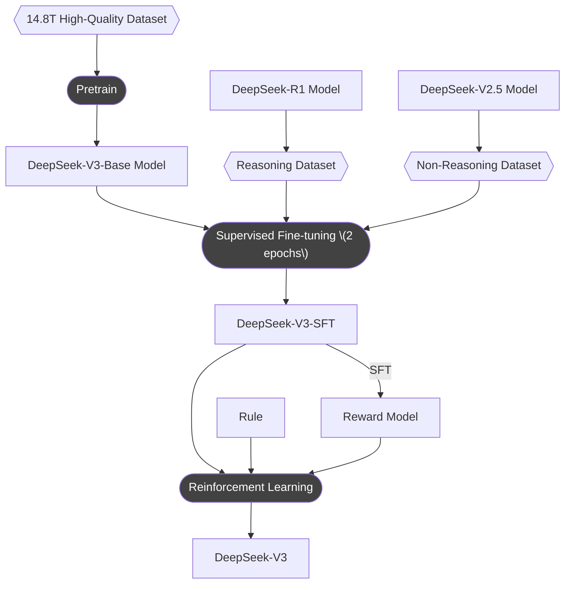
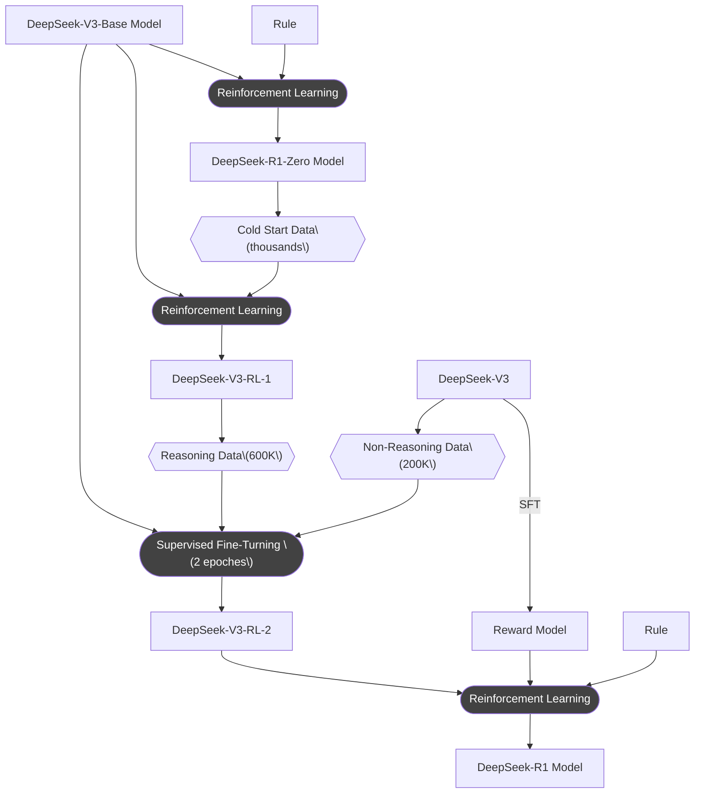
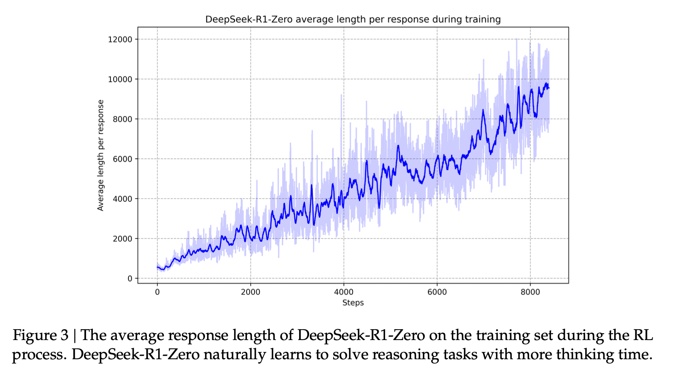
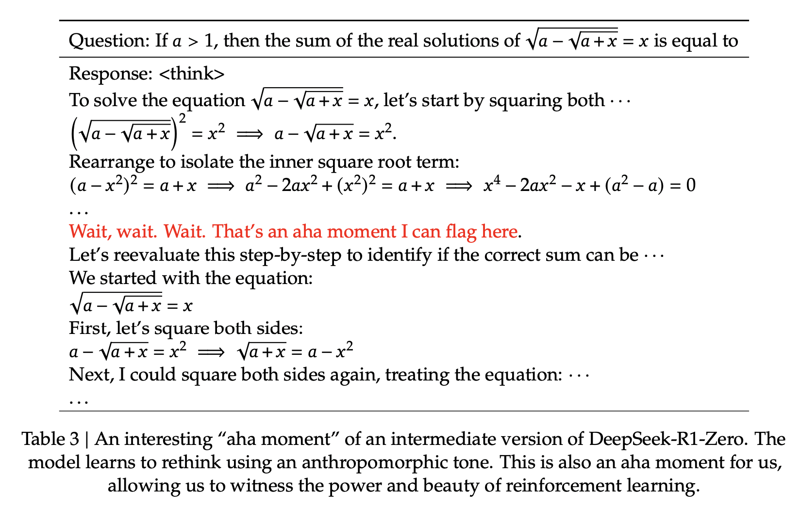

+++
title = 'DeepSeek V3/R1 训练笔记'
date = 2025-02-13T15:02:00+08:00
author = "Skyan"
tags = ["LLM", "training"]
ShowToc = true
ShowBreadCrumbs = true
+++

## 1. 概述
最近学习了下DeepSeek-V3[^1]和R1[^2]的论文，整个训练流程虽然复杂，但描述还是比较清楚的。也从中对大模型最新的训练流程，管中窥豹，可见一斑。

## 2. DeepSeek-V3 训练流程
首先DeepSeek-V3的训练比较直观，就是Pretrain→SFT→RL这种经典的方式，如下图所示：

需要注意的是SFT这个阶段所使用的语料，采用了自我进化的思想，即推理数据集由DeepSeek-R1生成，而非推理类数据集，由DeepSeek-V2.5生成。

这样的好处不言而喻：新一代的模型将由上一代模型进一步蒸馏，可以预想，DeepSeek的下一代模型很可能继续由DeepSeek-V3和R1来蒸馏，如此反复递归，每一代模型都将它最精华的部分**遗传**给下一代模型，形成了类似生物进化的演进方式。

还有一个需要注意的就是在RL阶段，使用了两种方式来作为奖励，一个是使用SFT后的V3模型生成的Reward Model，这种适合非推理类数据集的评判。而另一个是采用规则的方式来制作奖励，适合推理类数据集的评判，例如数学、编程类的数据集，确保了评判的稳定性和可靠性。

这种采用SFT后的V3模型来生成Reward Model的方法，又一次实现了自我进化的思想，即Reward Model也是由自身的基础模型(V3 SFT)来评判，对齐了调优目标。DeepSeek团队认为，这种Self-Rewarding的方式，是一种范式的创新，探索出一条大模型自我调优的新路线。

整个训练过程还有很多细节，例如RL采用GRPO算法，包括预训练和后训练过程中的训练参数，数据集细节，以及评估方法等。从中可以看出，大模型的训练过程，有大量的时间和精力是放在高质量数据集的准备，各种评测集的评估验证等各种数据操作中，同时精巧的训练pipeline也必不可少，需要仔细思考大模型的自我进化、蒸馏遗传、进化等多种思想，确保大模型可持续迭代，持续进化，朝向更高智能进化。

## 3. DeepSeek-R1 训练流程
相比之下，DeepSeek-R1的训练流程就更为复杂，关键在于如何让大模型学会长思考推理。但从论文抽丝剥茧一看，本质上的主流程，还是SFT→RL这个流程，但SFT采用什么数据集来调优，RL采用什么模型来作为Reward Model，则是需要精巧的设计。R1的论文写的行云流水，有很多业界首次提出的新发现，读起来大呼过瘾。

整体流程如下图所示：

整个训练流程中，处处可见自我进化，跨代遗传的思想。这也为后续模型迭代，指明了发展路线。

首先，DeepSeek-R1-Zero模型所起到的作用，本质上只是生成高质量带推理过程数据集的作用，这个模型完全基于DeepSeek-V3-Base模型，纯粹通过RL训练而成。在训练过程中，还发现了RL过程中的scaling law，如下图所示：

可以显著看出，随着RL迭代次数的增加，R1-Zero的推理思考长度也在不断增加，推理时间也在不断增加。自然的，模型也获得了推理复杂推理任务的能力。这种学习完全是模型与强化学习环境交互过程中，自发的、自主的、非人为而学会的。这种过程让我有一种上帝的感觉，亲眼看到一个**准生物体**的完全自发的进化，本质上，这和复杂系统理论的自组织理论(Self-Organization Theory)有异曲同工之妙。

另外一个令人兴奋的发现就是模型的Aha Moment，模型自己在进化过程中，会突然顿悟，学会主动增加思考步骤，来推理解决复杂问题。论文也指出，这不仅是模型的Aha Moment，也是研究人员的Aha Moment，即，通过强化学习，只需要给出正确的引导激励，模型就会自主进化，找到解决问题的策略，而无需人工干预，实现了智能的自我涌现。这进一步表明了强化学习的潜力，完全可以为人工智能开启更高水平的智能打开了思路，为未来更自主和普适的智能水平，铺平道路。

其次，DeepSeek-V3-Base模型基于DeepSeek-R1-Zero模型生成数千条高质量冷启数据集进行RL，所产生的模型只是用于生成SFT的高质量推理数据集(600K)。而对于非推理类数据集(200K)的生成，则是复用DeepSeek-V3训练流水线，使用DeepSeek-V3生成的高质量非推理类数据集。

注意这里有个容易让人疑惑的点，就是在DeepSeek-V3论文中提到，V3的SFT依赖的推理类语料来自R1模型生成，但在DeepSeek-R1的论文中，却用了V3来辅助生成非推理类语料。所以V3和R1是否存在训练过程中的循环依赖呢？我猜测，这里所说的R1或者V3，很可能是同时训练，互相共享**知识**的中间过程模型，先是DeepSeek-V3-Base先训练生成，在这个基础上训练R1的一个中间版本，然后再基于R1的数据，蒸馏V3的推理能力，犹如双螺旋，使两个模型互相进化而生。

通过上述生成的高质量推理以及非推理类数据集，原始的DeepSeek-V3-Base模型经过两轮SFT，可以训练出具备推理能力的基础R1模型。而这个SFT所采用的800k高质量数据集，则可以作为基础数据集，进一步SFT蒸馏Qwen，Llama等模型。评测发现，经过SFT整理后的Qwen和Llama模型，极大提升了推理能力，实现了知识的传承迁移。

最后，SFT后的R1模型，还需要经过最后一轮RL实现全场景的对齐，提高模型的有用性和无害性，完善推理能力。减轻模型生成过程中的任何潜在风险、偏见或有害内容。最终，通过复用V3的强化学习流水线，生成的多样化的数据分布，使得最终训练出一个可以面向终端用户的高质量深度思考模型。

R1的训练过程虽然看起来非常复杂，但细读之后，却又是恰到好处，非常合理。尤其是和V3的训练过程结合来看，更加体现了这两个模型相辅相成，互相进化，互相迁移学习知识的思想。

## 4. 结语
通过学习DeepSeek-V3和R1两个非常优秀大模型的训练过程，我们可以看到智能如何从无到有，自我涌现，自我进化的过程，论文同时也指明了一条知识如何在大模型代际间遗传的技术路线。

我也大胆预测，很快我们就会看到不用再区分“慢思考”和“快思考”的大语言模型，而是能自我进化出，同时具备“慢思考“和“快思考“的大语言模型。而所谓“慢思考”、“快思考”，只是历史中的一个中间阶段。未来的大模型，必然是统一的，自然的，可进化的智能体，这种智能体通过“涌现”，“顿悟”等非线性复杂系统现象，必然带给我们一个又一个的惊喜，让我们拭目以待。

## 5. 参考文献
[^1]: Liu A, Feng B, Xue B, et al. Deepseek-v3 technical report[J]. arXiv preprint arXiv:2412.19437, 2024.
[^2]: Guo D, Yang D, Zhang H, et al. Deepseek-r1: Incentivizing reasoning capability in llms via reinforcement learning[J]. arXiv preprint arXiv:2501.12948, 2025.