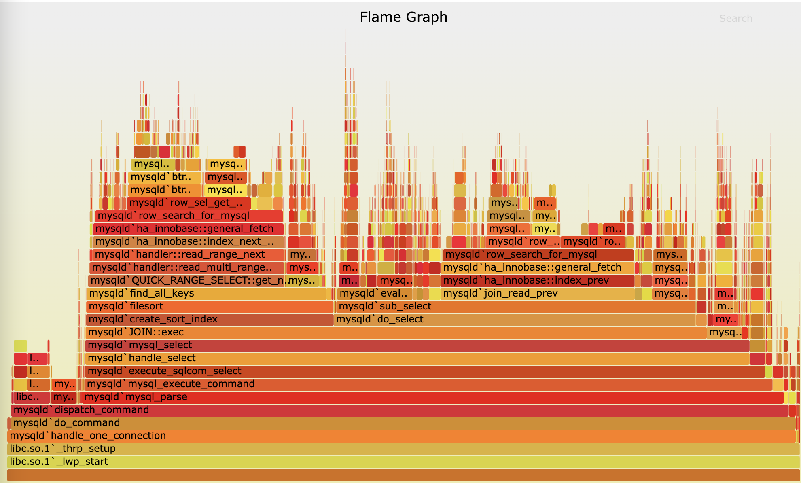
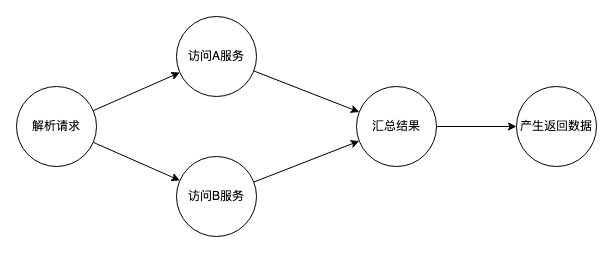
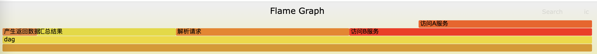

+++
title = 'FlameGraph火焰图原理'
date = 2022-12-05T10:15:19+08:00
author = "Skyan"
tags = ["programming", "performance"]
ShowToc = true
ShowBreadCrumbs = true
+++

FlameGraph是世界知名计算机性能优化专家Brendan Gregg发明的一种性能数据可视化方法。通过不同色块可交互的展示，可动态展示系统运行时的性能热点。FlameGraph如下图所示：


按照作者介绍，FlameGraph可以用于分析CPU耗时，内存分配，非CPU耗时(线程等待，调度性能)，混合运行时(CPU和非CPU运行混合)，以及性能对比这5种性能分析的可视化。我们常用FlameGraph生成CPU耗时分析图，用来找到服务运行性能的热点，并专项优化以节省资源成本。其实，FlameGraph也有一套标准数据格式，根据这个格式，可以在任何适合的场景中生成所需要的FlameGraph，并可视化可交互地展示和分析。

FlameGraph适合用于有调用栈的数据可视化，通过一种类似柱子的布局，加上暖色调的颜色，很像火焰一样的图案，所以被称为火焰图。以大家常用的CPU耗时火焰图为例，它的组成元素如下：

* 一个函数调用栈用一列方框组成，每个方框代表一个函数
* y轴代表函数调用的深度，从底向上逐层递进调用，最顶端的函数代表性能采集时刻正在运行的函数，下面是它的父函数，依次类推
* x轴代表不同采集栈的集合。需要注意的是x轴并不代表时间顺序，同一层的函数按照字母序从左往右排列。这样如果两个同名函数在同一层，将会被合并成一个区块。
* 方框的宽度代表该函数在调用栈抽样中出现的次数，如果宽度越宽，代表这个函数在栈抽样中出现的越频繁，从CPU耗时的角度来说，也表示这个函数更耗时。
* 如果方框宽度足够则展示函数的全名，如果不够则展示部分或者不展示，鼠标放上去可以展示全名
* 每个方框的背景色其实并没有什么特别，其实就是选取了一组随机的暖色调。主要是为了方便眼睛能区分不同层的方框。
* 一个火焰图可以用于可视化单线程，多线程，多进程甚至多主机的性能数据。也可以为每个线程生成一份独立的火焰图用于更详细的分析。
* 方框的宽度不仅限于表示抽样次数，也可以表示其他指标。例如宽度可以表示线程阻塞的时长，这样的一个火焰图可以很清晰的看出哪些函数在阻塞线程，以及整个线程阻塞时函数的调用栈情况

以上即是一个火焰图静态的组成部分，更为有趣的是，Gregg也为火焰图增加了互动功能，使得用户体验更佳。

火焰图本身是一个SVG文件，配合Javascript，支持鼠标悬浮，点击放大，以及搜索功能：

* 鼠标悬浮：当鼠标光标放置到一个方框上方时，可以展示该方框的详细数据（函数名，采样次数，以及占比）
* 点击放大：当鼠标点击一个方框时，火焰图按照垂直方向放大，该方框以上的函数将被放大展示，其他部分浅色处理，方便聚焦一个函数的分析
* 搜索：可以用Ctrl/Command+F快捷键或者右上角搜索功能，按照函数名搜索。搜索到的函数会高亮显示，还是在右下角展示所有搜索到的函数出现次数占比

火焰图生成流程是怎样的呢？按照Gregg开源的[flamegraph.pl](https://github.com/brendangregg/FlameGraph/blob/master/flamegraph.pl)程序，生成一个火焰图只需要3步：

1. 从perf，dtrace，gperftools等程序中获取运行时的调用栈数据
2. 转换为折叠栈格式(Fold stacks)
3. 调用flamegraph.pl生成火焰图

原理非常简单。所以搞懂火焰图只需要明白折叠栈是怎么回事即可。首先一个函数的调用栈可能长这样：
```
func_c
func_b
func_a
start_thread
clone
```

```
func_d
func_a
start_thread
clone
```

```
func_d
func_a
start_thread
clone
```

上面展示了三次性能抽样，每次抽样从底向上显示了一个调用栈，折叠栈格式如下：
```
clone;start_thread;func_a;func_b;func_c 1
clone;start_thread;func_a;func_d 2
```

其实就是将三个栈做了一个汇总，将同样的栈汇总到一起，每个函数用';'分隔，最后加空格和打印出现次数。

前面还可以加上程序的名称，例如cpp，如下也是一个合法的folded stacks：
```
cpp;clone;start_thread;func_a;func_b;func_c 1
cpp;clone;start_thread;func_a;func_d 2
```

有了折叠栈数据，即可利用[flamegraph.pl](https://github.com/brendangregg/FlameGraph/blob/master/flamegraph.pl)生成对应的火焰图svg文件。该文件可以嵌入到任何网页中展示，简单方便。

进一步，我们可以利用火焰图原理，生成各种场景所需要的“火焰图”，用于性能分析，数据可视化展示等功能。我们以应用层算子调度框架的性能分析为例，展示如何利用火焰图生成算子耗时可视化图。

应用层算子调度框架常见于RPC服务端的应用层，主要思想是将策略逻辑封装成若干个函数式的算子，再通过调度框架，串行或者并行调度这些算子运行，最终产出RPC的返回结果。算子调度的拓扑图有叫Tree，也有叫DAG的，也有叫图的。下图所示就是一个典型的算子调度框架的运行时拓扑图。



针对这样的算子调度，经常需要分析的问题有：哪个算子耗时最高，最长路径在哪里，哪个算子可以优化调度路径等，我们通常通过打印日志和统计最长路径等方法来分析运行时性能情况。但同样，通过火焰图也可以将运行拓扑的耗时可视化起来。

生成火焰图的关键即为生成栈的汇总数据，假设每个算子的耗时情况如下：

| 运行阶段 | 解析请求 | 访问A服务 | 访问B服务 | 汇总结果 | 产生返回数据 | 
| --- | --- | --- | --- | --- | --- |
| 开始运行时间 | 0 | 10 | 10 | 24 | 32 |
| 结束运行时间 | 10 | 20 | 24 | 32 | 34 |

我们想象有一个抽样程序，可以按照上面的运行时图，从左往右分别垂直抽样，可以看出在不同时间段有这样几种“栈”：

| | 栈1 | 栈2 | 栈3 | 栈4 | 栈5 |
| --- | --- | --- | --- | --- | --- |
| 阶段 | 解析请求 | 访问A服务 | 访问B服务 | 访问B服务 | 汇总结果 | 产生返回数据 |
| 耗时 | 10 | 10 | 4 | 8 | 2 |

显然栈2的“访问A服务”和“访问B服务”并不是父子调用关系，而是一种并行关系，但这个不影响火焰图的解读。可以显然从上面的栈中可以观察出，访问B服务耗时更久。

所以这种场景下，火焰图的垂直方向代表了一种并行运行的关系，上下层之间不存在父子关系，而是并行调度关系。通过将若干次算子调度数据的抽样结果汇总到一起，每个折叠栈后面的数字代表该栈的总耗时，我们可以得到类似下面的折叠栈数据：
```
dag;解析请求 10
dag;访问B服务;访问A服务 10
dag;访问B服务 4
dag;汇总结果 8
dag;产生返回数据 2
```

生成的火焰图如下所示：


从这张图中可以很方便地分析出：

1. 最长路径是产生返回数据-汇总结果-解析请求-访问B服务，而访问A服务是一个分支路径，虽然也产生耗时但不在最长路径上
2. 每层每个算子的耗时占比一目了然
3. 并行算子运行情况也直接展现，可以用于分析哪些并行是合理的，哪些还可以做并行化优化

当然，火焰图也会对用户造成顺序的困扰，原因是每层的排序是按照字母序，如果可以进一步改进采用算子拓扑序作为每层的排序标准，整个结果的解读将更加方便。

那么问题又来了，我们如何产生算子调度框架的折叠栈数据呢？其实原理非常简单，我们只需要采集每个算子的开始运行时间和运行时长，汇总起来做一个转换就可以得到折叠栈数据。具体转换算法不再详述。

从上面的例子可以看出，一旦搞懂火焰图的原理，我们就可以将火焰图应用在各种合适的场景。无论是算子的调度框架性能分析，还是分布式微服务最长路径的可视化分析，还是内存占用分析，还是内存泄漏定位，还是分布式集群资源调度的性能分析，都可以利用火焰图可视化的方法来分析和优化，有效地提升了生产效率。

总结一下，火焰图是一个强大的工具，目前已经被广泛应用于性能分析优化领域。我们可以在更多实际场景中扩展应用火焰图原理的范围，生成满足我们可视化分析需求的火焰图，用于自动化和可视化的高效分析，提升性能优化的效率。
