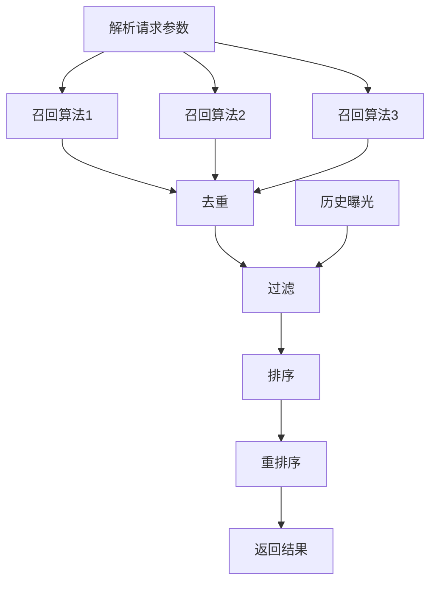
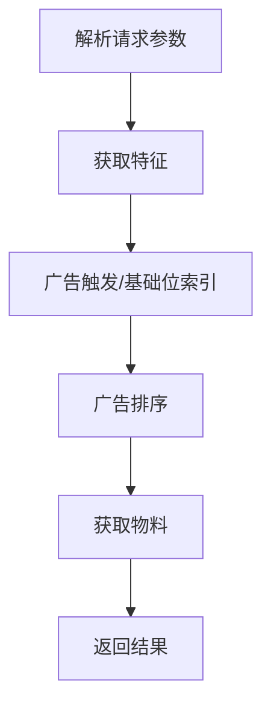
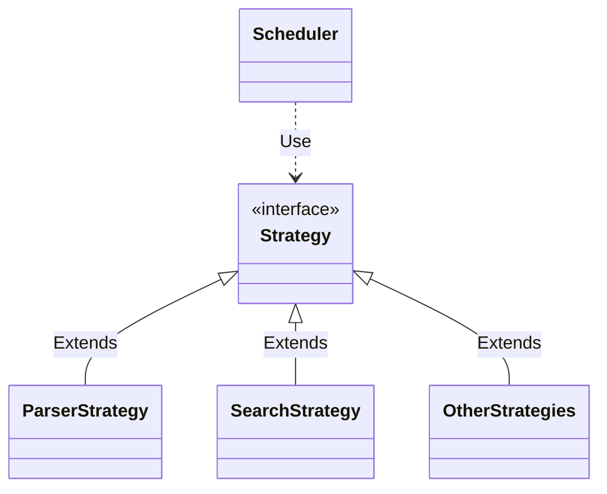
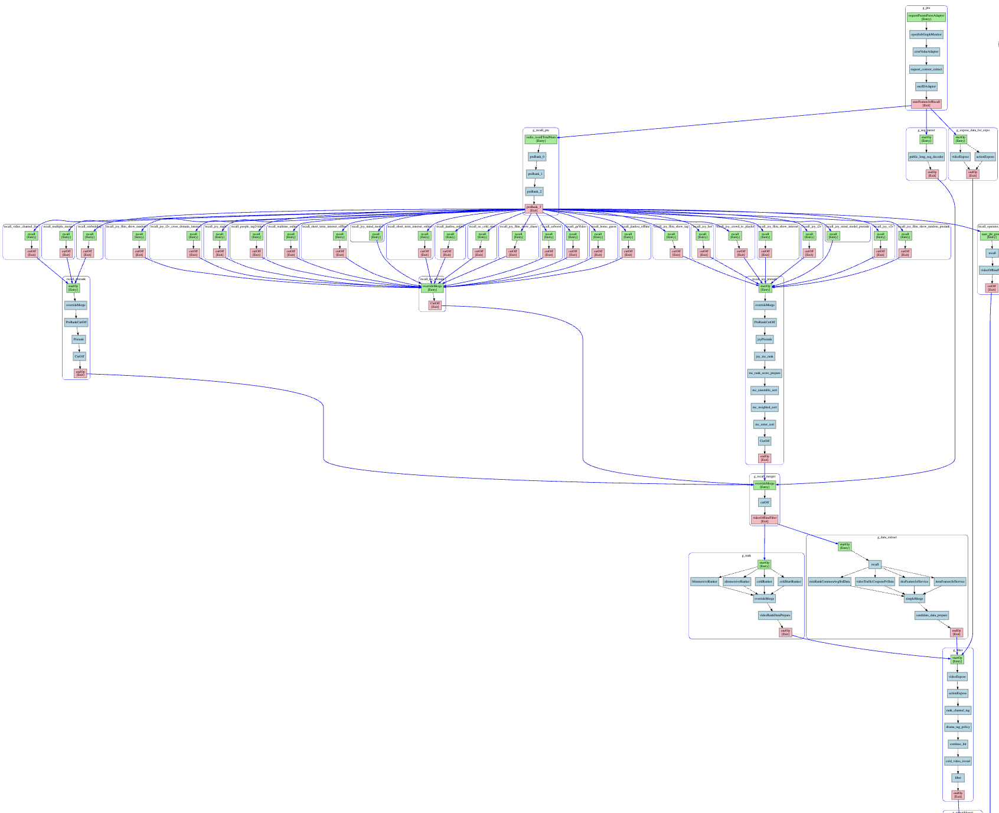
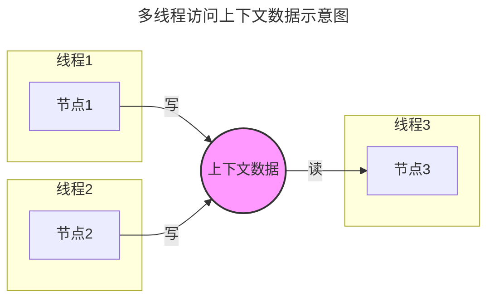
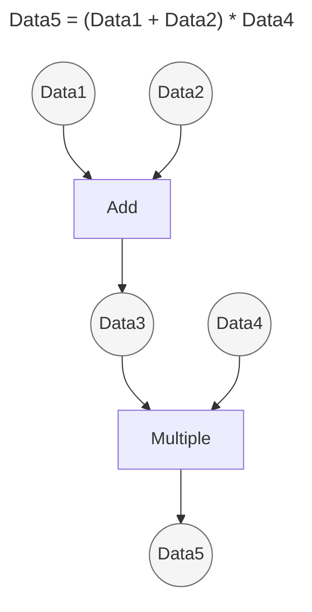
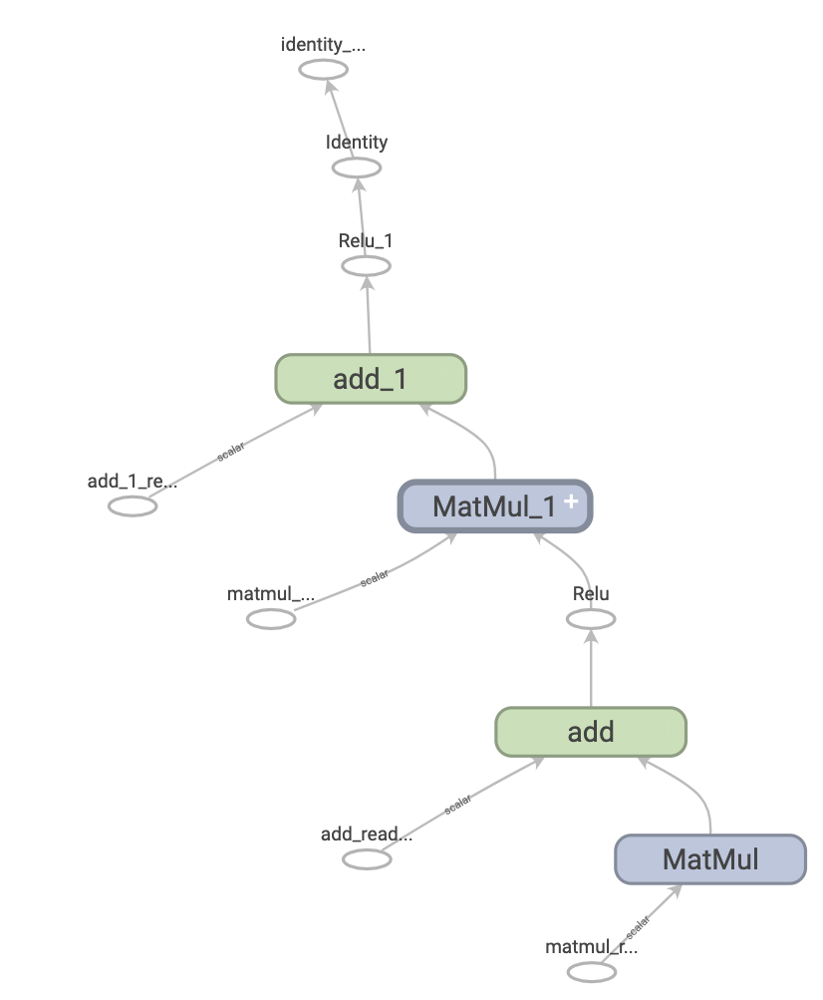
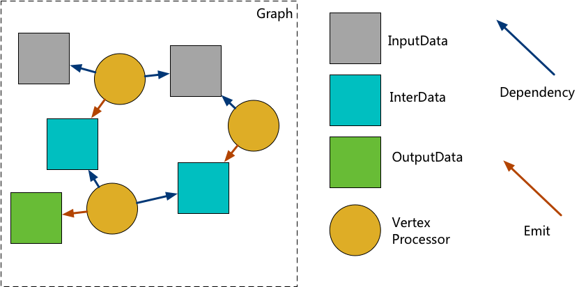
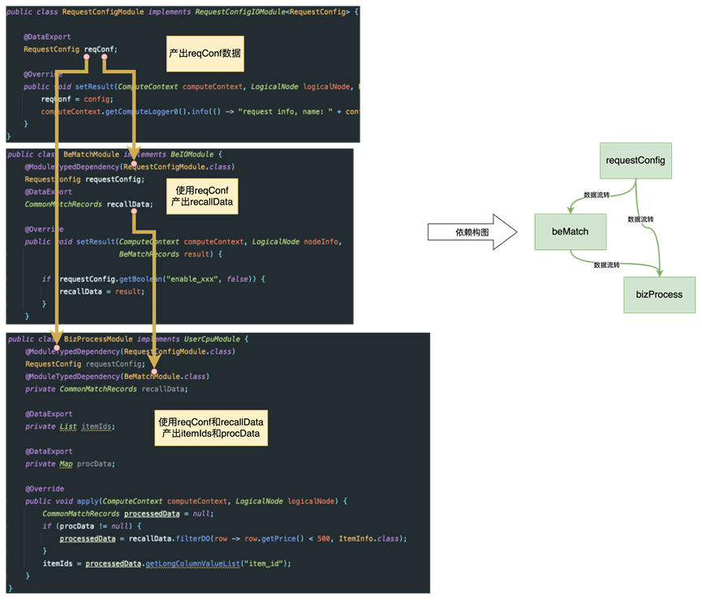

+++
title = "策略调度引擎的演进"
date = 2025-10-02T13:00:00+08:00
author = "Skyan"
tags = ["framework", "programming"]
ShowToc = true
ShowBreadCrumbs = true
+++

在搜索、推荐和广告等高复杂度在线系统中，“策略算法的调度执行”是支撑系统智能的基础能力。为了高效运行各种策略算法，几乎所有大型平台最终都走向了相同的抽象：将策略算法封装为算子（Operator），并通过 DAG（有向无环图）驱动其有序并发执行。这种调度引擎的设计已经历二十余年的演进，并在实践中不断向更高层次的智能和复杂性发展。

策略调度引擎通常位于算法密集型在线服务的执行框架之中。下图展示了一个典型推荐系统的策略流程（搜索和广告系统也类似）：

上述流程只是推荐系统的一个高层抽象。真实系统中，这样的流程会跨越数十甚至上百个微服务，每个微服务内部都可能执行一个多步骤策略流水线，规模可达几十到几百万行代码。在这种背景下，如何高效开发各阶段策略，并以流程化方式调度执行，成为系统设计的基础问题。

## 第一代引擎——算子调度（2004～2014）

第一代引擎诞生于桌面互联网兴起到移动互联网爆发前夜的十年间。当时以搜索和广告为代表的复杂在线系统，开始采用面向对象和微服务的设计思想，并把策略算法抽象为算子对象，由调度引擎顺序执行。

这一代的核心特征是：

* **策略抽象为算子，实现配置化的调度执行**

算子化的设计带来了低耦合、高内聚的好处。推荐各阶段复杂算法被封装为独立算子，不同策略可以交给不同的开发者负责，调度引擎只负责顺序调度，从而实现了调度逻辑与策略逻辑的解耦。

但受制于当时的硬件和语言特性，这一代调度主要是单线程串行执行，对多核 CPU 的利用率极低。随着硬件演进和业务规模增长，这种调度方式逐渐暴露出瓶颈。

第一代策略调度引擎一般没有统一的标准，即使在一个系统中，每个微服务内部都有各自不同的调度框架。配置的方式，调度的方式也各有差别。以广告系统为例，一个典型的高级排序服务内部流程如下：

类结构如下：

框架通过Strategy设计模式，实现了逻辑上的抽象和隔离。策略算子的调度以顺序执行为主，并行计算很少。

第一代引擎结构上简单，但缺点也很明显，无法支持更复杂的并行调度方式，无法充分利用多核CPU资源。随着数据中心服务器核数的不断增多，可供在线服务使用的CPU资源越来越多，而第一代调度引擎，无法充分利用多核CPU资源，逐步落后于时代。

## 第二代引擎——DAG 调度（2014～2019）

第二代调度引擎诞生于移动互联网大爆发时期，引入了 DAG（Directed Acyclic Graph）调度的思想，将每个算子抽象为图中的节点，按拓扑序并发执行。这使得策略调度的并行度大幅提升，多核 CPU 资源得以充分利用。各个在线系统可以实现更为复杂的图结构。

下图展示了某推荐场景下的 DAG 拓扑示意：

上述的策略调度图，一共有几十个策略节点，中间还有各种并行执行阶段，包括多层扇入和扇出的拓扑结构，整体执行流程已经足够复杂。这只是一个一般规模的流程图，更大规模的调度图中，包含上百个策略节点可以执行各种并行、串行的调度运行。由于并行度大幅提升，这种调度引擎可以充分利用多核CPU的性能优势，顺应了多核多CPU硬件系统的发展趋势。

第二代调度引擎具备很强的通用性，可以在多个服务中作为基础组件使用。在很多搜索/广告和推荐系统内部，都有类似实现的调度引擎来实现DAG调度。以taskflow[^7]为代表的开源DAG调度引擎，实现了类似的功能。

然而，这种调度却存在先天的缺陷，导致了在更大规模DAG图和算子节点的线程安全性之间，存在天然的矛盾。第二代引擎虽然继承了第一代引擎抽象算子的思想，将策略算法抽象为节点。然而，算法和数据是密不可分，每个算子节点都需要读和写变量数据的。以下面一个典型的三节点并行调度为例，可以看到多节点并行执行时，很难避免对同一对象的读写：

在第二代DAG引擎中，对于数据的处理很容易发生上述的多线程读写冲突问题，当多个线程同时读写同一份数据对象时，会导致数据错误，甚至会抛异常，对于C++程序而言，还会导致内存段错误引起的进程崩溃问题。

在真实的生产环境中，这样的问题往往难以排查，定位和解决问题的效率很低。尤其对于成百上千算子的DAG图，排查这类race condition问题将耗费大量的人力。

有的二代调度引擎，也考虑了数据的流转关系，设计了类似Pandas Dataframe的共享数据结构，希望将节点间共享的数据，统一读写到类似Dataframe的数据对象中。这类对象具备多列表格式的并发读写接口，可以方便编程开发。这种数据读写接口一般是采用加锁的方式来实现并发安全，但这样又会限制DAG整体运行的并发度。因此在并发度和并发安全之间，两者无法两全。总得来说，无论如何优化，并不能摆脱其设计思想的过时：**无法将数据和计算分离**，是这类调度引擎刻在基因中的缺陷和不足。

综上，第二代策略调度引擎实现了DAG调度能力，实现了算子节点之间的调度执行。然而，这一代引擎很难解决数据依赖和并发读写问题，这样引发了第三代引擎的诞生和发展。

## 第三代引擎——数据流调度（2019 ～ 今）

在2019年前后，国内各大互联网公司内部开始意识到第二代引擎的缺陷，从而不约而同地提出第三代引擎，其核心思想在各平台实现中有异曲同工之妙。它同时兼顾了数据并发安全和节点并行计算的优点，最大的特点就是：

* **将数据和计算解耦，实现数据与计算的协同调度**

以下图为例，可以清楚看到第三代调度引擎的调度方式：

整个图分解为数据和算子节点两种，当数据就绪时触发计算，计算产出新的数据，再驱动下游算子执行，如此递归推进。这种引擎最大的好处是将数据和计算的依赖关系在图中显式定义。在引擎调度中，可以避免类似多节点并发写数据，以及并发读写同一个数据对象的问题，最大程度上解决了数据并发读写和算子并发执行之间的矛盾。

第三代引擎的思想本质上源自Tony Hoare于1978年提出[^2]的CSP(Communicating Sequential Processes)[^1]的古老思想。它以通信代替共享数据同步，天然无锁、易于理解，并成为并发编程最具生命力的思想之一。经过几十年的发展，CSP的思想在Unix系统中的管道，以及Go语言的goroutine和channel[^3]等设计中大放异彩。

第三代调度引擎的代表性实现有tensorflow项目的计算图[^4]。它以边为tensor数据，节点为计算函数，实现了tensor在节点之间的流动。

同样，在著名开源项目anyflow[^5]中，实现了采用同样思想的图引擎，实现了数据和计算节点的并发调度。同时扩展了数据和边的类型，支持条件边（condition），pipeline数据（channel）等高级能力。功能丰富，性能优秀，具备工业级质量。

淘宝的TPP图引擎[^6]，本质上也是这类思想。它通过java的annotation机制，定义数据字段之间的依赖关系，通过图化编排的方式实现了算子的DAG调度和数据的流转，同时配合AIRec平台，实现整图运行时的可视化。

第三代引擎在国内发展已经有6年多时间，基本上在成熟的搜广推系统中得到了广泛的应用。它的生命力还不止如此，在机器学习引擎、数据流计算、甚至深度学习编译器领域都有同样思想的不同框架实现。

## 下一代引擎——全局图调度
随着2023年AI大模型的迅速爆发式发展，搜索、广告和推荐领域产生了巨大的变化。首当其中的就是各种生成式模型被用来改造搜广推系统。伴随着大模型引入到在线服务中，分布式微服务的耗时和内存带宽是一个巨大的约束条件。如何实现低延迟高吞吐的在线系统的同时，还能最大化整个分布式系统的CPU、GPU、内存、网络、SSD等资源的利用率，充分发掘生成式大模型的智能能力，是下一代策略调度需要面临的挑战。

下一代的策略调度引擎，将会延续“数据与计算解耦并协同调度”的思想，将视角放到全局分布式系统的数据和计算调度中，催生出新的愿景：
* **从单机图调度演进为跨服务、跨节点的全局图调度系统**

在这种模式下，整个分布式系统被抽象为一个全局运行时图（Global Execution Graph）。调度对象从算子拓展到子图、微服务、RPC 调用、消息流甚至模型本身。数据流不仅包括内存数据，还包括网络数据、消息事件和持久化状态。

这一代引擎可能具备的新特性包括：
* 跨语言 / 跨协议 / 跨基础设施的统一 IR 层（如 MLIR for system）；
* 节点可以是模型、算子、RPC 调用、异步流、消息队列事件；
* 调度器能做全局最优（性能、延迟、收益、成本）规划；
* 图本身是动态演化的（支持拓扑自适应和在线重排）。

这意味着，调度引擎将不再是某个服务内部的“算法执行器”，而是整个系统的分布式操作系统内核，实现端到端全局调度与在线自适应。这在具体实现中，将面临巨大的挑战。

## 总结
我们可以将策略调度引擎的发展概括如下：

| 代际 | 名称 | 核心思想 | 本质变化 | 代表项目 |
|------|------|----------|-----------|-----------|
| 第一代 | 算子调度引擎 | 算法算子化、串行配置化调度 | 调度粒度：函数级 | 各公司内部框架 |
| 第二代 | DAG调度引擎 | 支持复杂依赖和并行调度，部分数据路径优化 | 调度粒度：任务级 | taskflow等 |
| 第三代 | 数据流调度引擎 | 节点是计算，边是数据流，数据与计算完全解耦并协同调度 | 数据成为一等公民，调度基于数据流拓扑 | anyflow、TPP等 |
| 第四代 | 全局图调度引擎 | 跨服务、跨节点的统一 DAG 调度，RPC/消息流也纳入图内统一调度 | 调度对象：系统级图，具备全局最优能力 | 即将出现 |

伴随着 GPU 等硬件的进步和大模型的普及，策略调度引擎正在向更高层次的智能和复杂性演化。第四代“全局图调度引擎”代表了面向 AI 时代的新一代引擎形态。
虽然数据与计算的协同调度的思想源远流长，但它的生命力却在每个时代都焕发出新的活力。

## 参考文献
[^1]: [Communicating sequential processes wikipedia](https://en.wikipedia.org/wiki/Communicating_sequential_processes)
[^2]: Hoare, C. A. R. (1978). "Communicating sequential processes". Communications of the ACM. 21 (8): 666–677. doi:10.1145/359576.359585. S2CID 849342.
[^3]: [Bell Labs and CSP Threads](https://swtch.com/~rsc/thread/)
[^4]: [Introduction to graphs and tf.function](https://www.tensorflow.org/guide/intro_to_graphs)
[^5]: [anyflow document](https://github.com/baidu/babylon/blob/main/docs/anyflow/README.zh-cn.md)
[^6]: [打造算法在线服务领域极致开发体验与性能 — 阿里 TPP 图化框架技术实践](https://mp.weixin.qq.com/s/lsvNNogV_dg-Xd6h_5TKmQ)
[^7]: [taskflow: A General-purpose Task-parallel Programming System](https://taskflow.github.io/)