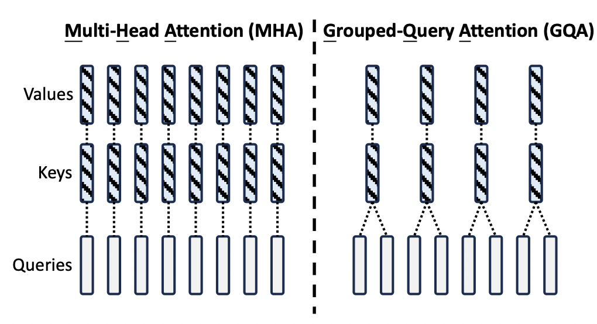

+++
title = 'llama2.c 源码阅读'
date = 2024-07-06T13:50:00+08:00
author = "Skyan"
tags = ["LLM", "programming"]
ShowToc = true
ShowBreadCrumbs = true
+++

## 1. 概述
前OpenAI著名工程师Andrej Kapathy开源了[llama2.c](https://github.com/karpathy/llama2.c)项目，该项目是llama2模型推理代码的C语言实现，用大概970行C代码实现了LLama2模型的推理算法。整个项目代码简洁高效，值得深度阅读。对掌握大模型推理算法的细节有极大的帮助。

## 2. 源码阅读
### 2.1 基础算法
RMS归一化公式是：
$$
o_i = w_i \times x_i \times \frac {1}{\sqrt{\frac{1}{n}\sum_{j=0}^{n-1} x_j^2 + \epsilon}}
$$
其中，\(\epsilon\) 为防止分母为0的数值。还有RMS因子是对x的归一化，w变量是gain变量，重新缩放标准化后的输入向量。

```c
// ----------------------------------------------------------------------------
// neural net blocks; the dynamics of the Transformer
void rmsnorm(float* o, float* x, float* weight, int size) {
    // calculate sum of squares
    float ss = 0.0f;
    for (int j = 0; j < size; j++) {
        ss += x[j] * x[j];
    }
    ss /= size;
    ss += 1e-5f;
    ss = 1.0f / sqrtf(ss);
    // normalize and scale
    for (int j = 0; j < size; j++) {
        o[j] = weight[j] * (ss * x[j]);
    }
}
```

softmax函数公式是：
$$
o_i = \frac {e^{x_i-x_{max}}}{\sum_{j=0}^{n-1} e^{x_j-x_{max}}}
$$

代码如下，注释说的很清楚，减去最大值是为了防止数值溢出，数值更稳定。通过简单数学变换可以得知，最终结果不变。
```c
void softmax(float* x, int size) {
    // find max value (for numerical stability)
    float max_val = x[0];
    for (int i = 1; i < size; i++) {
        if (x[i] > max_val) {
            max_val = x[i];
        }
    }
    // exp and sum
    float sum = 0.0f;
    for (int i = 0; i < size; i++) {
        x[i] = expf(x[i] - max_val);
        sum += x[i];
    }
    // normalize
    for (int i = 0; i < size; i++) {
        x[i] /= sum;
    }
}
```

W (d,n) @ x (n,) -> xout (d,)的矩阵乘法，采用naive的矩阵乘法，即外层循环是行，内层循环是列。代码如下：
```c
void matmul(float* xout, float* x, float* w, int n, int d) {
    // W (d,n) @ x (n,) -> xout (d,)
    // by far the most amount of time is spent inside this little function
    int i;
    #pragma omp parallel for private(i)
    for (i = 0; i < d; i++) {
        float val = 0.0f;
        for (int j = 0; j < n; j++) {
            val += w[i * n + j] * x[j];
        }
        xout[i] = val;
    }
}
```
### 2.2. forward计算

模型中一个attention block的计算如下图所示：


项目代码是按照每一个token来计算QKV的，其中参数dim是transformer的向量维度。l是layer序号。

第一步是rmsnorm，即归一化。输入是x (d,)，rms权重向量是w->rms_att_weight + l*dim，计算结果输出到s->xb (d,)中。
```c
// attention rmsnorm
rmsnorm(s->xb, x, w->rms_att_weight + l*dim, dim);
```

第二步是QKV的矩阵乘法，注意kv_dim和dim的区别，是为了同时兼容multi head attention和grouped query attention两种算法。如下图所示：


kv_dim是key和value的总维度，dim是transformer的向量总维度。在multi head attention中，kv_dim = dim。在grouped query attention中，kv_dim = dim * n_kv_heads / n_heads。以图中为例，n_kv_heads = 4, n_heads = 8，则kv_dim = dim / 2。

对于各矩阵的维度，以及在MHA、GQA等算法中的关系，参考下图：


Q、K、V三个向量计算的详细代码如下，即Wq(d,d) @ xb(d,) -> q(d,)，Wk(dkv,d) @ xb(d,) -> k(dkv,), Wv(dkv,d) @ xb(d,) -> v(dkv,)
```c
// key and value point to the kv cache
int loff = l * p->seq_len * kv_dim; // kv cache layer offset for convenience
s->k = s->key_cache + loff + pos * kv_dim;
s->v = s->value_cache + loff + pos * kv_dim;

// qkv matmuls for this position
matmul(s->q, s->xb, w->wq + l*dim*dim, dim, dim);
matmul(s->k, s->xb, w->wk + l*dim*kv_dim, dim, kv_dim);
matmul(s->v, s->xb, w->wv + l*dim*kv_dim, dim, kv_dim);
```

接下来需要给Q和K向量添加RoPE位置编码，按照如下公式计算，其中m就是当前token的序号pos。需要注意的是，llama模型是给每一层的Q和K向量都添加这个编码。
$$
\begin{aligned}
\theta_i &= \frac{1}{10000^{2i/hs}}= 10000^{-2i/hs} \\
Q(i) &=Q(i)\cos (m\theta_i) - Q(i+1)\sin(m\theta_i)\\
Q(i+1) &=Q(i)\sin (m \theta_i) + Q(i+1)\cos(m\theta_i)\\
K(i) &=K(i)\cos (m \theta_i) - K(i+1)\sin(m\theta_i)\\
K(i+1) &=K(i)\sin (m \theta_i) + K(i+1)\cos(m\theta_i)\\
\end{aligned}
$$

详细代码如下，注意在GQA中，K的向量长度小于Q的向量长度，所以在i < kv_dim时，计算Q和K的向量。在i >= kv_dim时，只计算Q的向量。

```c
// RoPE relative positional encoding: complex-valued rotate q and k in each head
for (int i = 0; i < dim; i+=2) {
    int head_dim = i % head_size;
    float freq = 1.0f / powf(10000.0f, head_dim / (float)head_size);
    float val = pos * freq;
    float fcr = cosf(val);
    float fci = sinf(val);
    int rotn = i < kv_dim ? 2 : 1; // how many vectors? 2 = q & k, 1 = q only
    for (int v = 0; v < rotn; v++) {
        float* vec = v == 0 ? s->q : s->k; // the vector to rotate (query or key)
        float v0 = vec[i];
        float v1 = vec[i+1];
        vec[i]   = v0 * fcr - v1 * fci;
        vec[i+1] = v0 * fci + v1 * fcr;
    }
}
```

接下来针对每个头，计算attention score。attention score的计算公式如下：
$$
score(i) = softmax(\frac{ Q_i  K^T}{\sqrt{d}})V , \quad Q_i \in \R^{1 \times d},K \in \R^{n\times d},V\in\R^{n\times d}
$$
具体计算的时候，先遍历每个head，在每个head中，先计算Qi和K的点积，然后除以sqrt(d)，得到att (1,n)向量，最后softmax得到attention score。

在GQA中，由于分组共享了Q和K的向量，在计算attention score的时候，需要把Q和K的向量“展开”还原为(n,d)的矩阵，具体做法是通过h / kv_mul，保证
kv_mul个Q和K向量共享一个权重。

然后计算attention score (1,n)和V (n,d)的乘积，得到xb (1,d)。这个计算并不是完全按照普通矩阵乘来计算的，而是把每个位置的attention score和V的
每一行相乘，然后累加到xb中。这样计算的好处是对cache更加友好，是一种常见的矩阵乘算法。

对于每个头，每个token的attention score计算过程的可视化如图所示：


图中可以清楚看出，每个token都计算了一遍和其他token的相关度，再进行加权求和得到最终的attention score。

具体代码如下：
```c
for (h = 0; h < p->n_heads; h++) {
    // get the query vector for this head
    float* q = s->q + h * head_size;
    // attention scores for this head
    float* att = s->att + h * p->seq_len;
    // iterate over all timesteps, including the current one
    for (int t = 0; t <= pos; t++) {
        // get the key vector for this head and at this timestep
        float* k = s->key_cache + loff + t * kv_dim + (h / kv_mul) * head_size;
        // calculate the attention score as the dot product of q and k
        float score = 0.0f;
        for (int i = 0; i < head_size; i++) {
            score += q[i] * k[i];
        }
        score /= sqrtf(head_size);
        // save the score to the attention buffer
        att[t] = score;
    }

    // softmax the scores to get attention weights, from 0..pos inclusively
    softmax(att, pos + 1);

    // weighted sum of the values, store back into xb
    float* xb = s->xb + h * head_size;
    memset(xb, 0, head_size * sizeof(float));
    for (int t = 0; t <= pos; t++) {
        // get the value vector for this head and at this timestep
        float* v = s->value_cache + loff + t * kv_dim + (h / kv_mul) * head_size;
        // get the attention weight for this timestep
        float a = att[t];
        // accumulate the weighted value into xb
        for (int i = 0; i < head_size; i++) {
            xb[i] += a * v[i];
        }
    }
}
```

从代码中也能看出，为什么需要把K和V的矩阵进行cache。因为对于一个位置的token而言，Q矩阵每次参与计算的只有当前位置的一行，而K和V矩阵，则是每行都需要
参与计算。最终得到的也是该位置的(1,d)向量作为attention score。因此，为了减少计算量，把K和V矩阵进行cache也是理所当然。

接下来的计算就非常简单，注释也非常直观。详细步骤如下：

1. 计算Wo (d,d) @ xb^T (d,)得到xb2 (d,)
1. 通过残差连接，叠加x (d,)向量：x += xb2
1. x再经过一个RMSNorm(x)，得到xb (d,)
1. 计算hb和hb2：W1(hd, d) @ xb (d,) -> hb1(hd,) , W3(hd, d) @ xb (d,) -> hb2(hd, )
1. hb经过silu非线性激活函数变换，计算方式为：$$silu(hb) = hb (1/ (1 + e^{-hb}))$$
1. 然后计算逐位相乘 hb * hb2, 得到hb (hd,)
1. 计算W2(d, hd) @ hb (hd,) -> xb (d,)
1. 最终再通过残差连接，叠加xb向量：x += xb

```c
// final matmul to get the output of the attention
matmul(s->xb2, s->xb, w->wo + l*dim*dim, dim, dim);

// residual connection back into x
for (int i = 0; i < dim; i++) {
    x[i] += s->xb2[i];
}

// ffn rmsnorm
rmsnorm(s->xb, x, w->rms_ffn_weight + l*dim, dim);

// Now for FFN in PyTorch we have: self.w2(F.silu(self.w1(x)) * self.w3(x))
// first calculate self.w1(x) and self.w3(x)
matmul(s->hb, s->xb, w->w1 + l*dim*hidden_dim, dim, hidden_dim);
matmul(s->hb2, s->xb, w->w3 + l*dim*hidden_dim, dim, hidden_dim);

// SwiGLU non-linearity
for (int i = 0; i < hidden_dim; i++) {
    float val = s->hb[i];
    // silu(x)=x*σ(x), where σ(x) is the logistic sigmoid
    val *= (1.0f / (1.0f + expf(-val)));
    // elementwise multiply with w3(x)
    val *= s->hb2[i];
    s->hb[i] = val;
}

// final matmul to get the output of the ffn
matmul(s->xb, s->hb, w->w2 + l*dim*hidden_dim, hidden_dim, dim);

// residual connection
for (int i = 0; i < dim; i++) {
    x[i] += s->xb[i];
}
```

继续每一层的计算，每一层的输入都是x，输出也是x，循环计算。在每一层都算完以后，最后再计算：

1. RMSNorm(x)，把x向量进行归一化。
1. 计算Wc(dvoc, d) @ x (d,) -> logits (dvoc,)，其中dvoc为词典大小。

至此，最终得到的logits就是该位置的在token词典中的分类概率。

```c
// final rmsnorm
rmsnorm(x, x, w->rms_final_weight, dim);

// classifier into logits
matmul(s->logits, x, w->wcls, p->dim, p->vocab_size);
return s->logits;
```

### 2.3 抽样方法
拿到logits之后，需要通过抽样来最终确定输出哪个token，常见的抽样方法有greedy(argmax)，随机抽样，以及top-p (nucleus) 抽样。

#### 2.3.1 Greedy Sampling
Greedy Sampling是直接选择概率最大的token作为输出。代码简单直观，如下：
```c
int sample_argmax(float* probabilities, int n) {
    // return the index that has the highest probability
    int max_i = 0;
    float max_p = probabilities[0];
    for (int i = 1; i < n; i++) {
        if (probabilities[i] > max_p) {
            max_i = i;
            max_p = probabilities[i];
        }
    }
    return max_i;
}
```

#### 2.3.2 Random Sampling
Random Sampling是随机选择一个token作为输出。代码也很简单，如下：
```c
int sample_mult(float* probabilities, int n, float coin) {
    // sample index from probabilities (they must sum to 1!)
    // coin is a random number in [0, 1), usually from random_f32()
    float cdf = 0.0f;
    for (int i = 0; i < n; i++) {
        cdf += probabilities[i];
        if (coin < cdf) {
            return i;
        }
    }
    return n - 1; // in case of rounding errors
}
```

#### 2.3.3 Top-p (Nucleus) Sampling
Top-p (Nucleus) Sampling是随机选择概率大于某个阈值的token作为输出。代码也很简单，如下：
```c
int sample_topp(float* probabilities, int n, float topp, ProbIndex* probindex, float coin) {
    // top-p sampling (or "nucleus sampling") samples from the smallest set of
    // tokens that exceed probability topp. This way we never sample tokens that
    // have very low probabilities and are less likely to go "off the rails".
    // coin is a random number in [0, 1), usually from random_f32()

    int n0 = 0;
    // quicksort indices in descending order of probabilities
    // values smaller than (1 - topp) / (n - 1) cannot be part of the result
    // so for efficiency we crop these out as candidates before sorting
    const float cutoff = (1.0f - topp) / (n - 1);
    for (int i = 0; i < n; i++) {
        if (probabilities[i] >= cutoff) {
            probindex[n0].index = i;
            probindex[n0].prob = probabilities[i];
            n0++;
        }
    }
    qsort(probindex, n0, sizeof(ProbIndex), compare);

    // truncate the list where cumulative probability exceeds topp
    float cumulative_prob = 0.0f;
    int last_idx = n0 - 1; // in case of rounding errors consider all elements
    for (int i = 0; i < n0; i++) {
        cumulative_prob += probindex[i].prob;
        if (cumulative_prob > topp) {
            last_idx = i;
            break; // we've exceeded topp by including last_idx
        }
    }

    // sample from the truncated list
    float r = coin * cumulative_prob;
    float cdf = 0.0f;
    for (int i = 0; i <= last_idx; i++) {
        cdf += probindex[i].prob;
        if (r < cdf) {
            return probindex[i].index;
        }
    }
    return probindex[last_idx].index; // in case of rounding errors
}
```

#### 2.3.4 选择抽样策略
具体执行抽样前，需要做一些变换，比如：
* 除以temperature，用来调整概率分布，温度越高，概率分布越平滑
* 计算softmax(logits)，得到概率分布
代码如下所示：

```c
// apply the temperature to the logits
for (int q=0; q<sampler->vocab_size; q++) { logits[q] /= sampler->temperature; }
// apply softmax to the logits to get the probabilities for next token
softmax(logits, sampler->vocab_size);
```

然后根据不同的采样策略，选择不同的采样函数。

### 2.4 encode和decode
#### 2.4.1 encode
encode函数将输入文本转化为token id序列。token id为int类型，长度为max_len。encode算法非常直观，先是在tokenize词典中查询每个UTF-8字符。如果找不到，则将文本编码为byte fallback。注意每个UTF-8字符长度是1到3个字节之间，需要针对UTF-8编码的规范进行判断。

代码如下：
```c
// process the raw (UTF-8) byte sequence of the input string
for (char *c = text; *c != '\0'; c++) {

    // reset buffer if the current byte is ASCII or a leading byte
    // 0xC0 is 11000000, so (*c & 0xC0) keeps the first 2 bits and zeros the rest
    // 0x80 is 10000000
    // in UTF-8, all continuation bytes start with "10" in first two bits
    // so in English this is: "if this byte is not a continuation byte"
    if ((*c & 0xC0) != 0x80) {
        // this byte must be either a leading byte (11...) or an ASCII char (0x...)
        // => reset our location, as we're starting a new UTF-8 codepoint
        str_len = 0;
    }

    // append the current byte to the buffer
    str_buffer[str_len++] = *c; // ++ is post-increment, incremented after this line
    str_buffer[str_len] = '\0';

    // while the next character is a continuation byte, continue appending
    // but if there are too many of them, just stop to avoid overruning str_buffer size.
    if ((*(c+1) & 0xC0) == 0x80 && str_len < 4) {
        continue;
    }

    // ok c+1 is not a continuation byte, so we've read in a full codepoint
    int id = str_lookup(str_buffer, t->sorted_vocab, t->vocab_size);

    if (id != -1) {
        // we found this codepoint in vocab, add it as a token
        tokens[(*n_tokens)++] = id;
    } else {
        // byte_fallback encoding: just encode each byte as a token
        // +3 is here because the first 3 vocab elements are <unk>, <s>, </s>
        // so the individual bytes only start at index 3
        for (int i=0; i < str_len; i++) {
            tokens[(*n_tokens)++] = (unsigned char)str_buffer[i] + 3;
        }
    }
    str_len = 0; // protect against a sequence of stray UTF8 continuation bytes
}
```

其次，尝试合并临近的字符，并查询tokenize词典，如果存在，则将临近的token缩对应的字符串合并为一个token。
并反复迭代，直到找不到相邻的两个token可以合并为一个token为止。代码也很直观，如下：

```c
// merge the best consecutive pair each iteration, according the scores in vocab_scores
while (1) {
    float best_score = -1e10;
    int best_id = -1;
    int best_idx = -1;

    for (int i=0; i < (*n_tokens-1); i++) {
        // check if we can merge the pair (tokens[i], tokens[i+1])
        sprintf(str_buffer, "%s%s", t->vocab[tokens[i]], t->vocab[tokens[i+1]]);
        int id = str_lookup(str_buffer, t->sorted_vocab, t->vocab_size);
        if (id != -1 && t->vocab_scores[id] > best_score) {
            // this merge pair exists in vocab! record its score and position
            best_score = t->vocab_scores[id];
            best_id = id;
            best_idx = i;
        }
    }

    if (best_idx == -1) {
        break; // we couldn't find any more pairs to merge, so we're done
    }

    // merge the consecutive pair (best_idx, best_idx+1) into new token best_id
    tokens[best_idx] = best_id;
    // delete token at position best_idx+1, shift the entire sequence back 1
    for (int i = best_idx+1; i < (*n_tokens-1); i++) {
        tokens[i] = tokens[i+1];
    }
    (*n_tokens)--; // token length decreased
}
```

#### 2.4.2 decode
decode函数将token id序列转化为文本。代码也直观，有一些比较tricky之处，代码也注释清楚：
```c
char* decode(Tokenizer* t, int prev_token, int token) {
    char *piece = t->vocab[token];
    // following BOS (1) token, sentencepiece decoder strips any leading whitespace (see PR #89)
    if (prev_token == 1 && piece[0] == ' ') { piece++; }
    // careful, some tokens designate raw bytes, and look like e.g. '<0x01>'
    // parse this and convert and return the actual byte
    unsigned char byte_val;
    if (sscanf(piece, "<0x%02hhX>", &byte_val) == 1) {
        piece = (char*)t->byte_pieces + byte_val * 2;
    }
    return piece;
}
```

### 2.5 文本生成
文本生成是最基础的inference逻辑，对话也是基于文本生成而实现的。整个代码逻辑也非常简单：
1. 将每一个token id逐个进行forward计算
2. 判断当前token位置是否还在prompt长度内，如果不在则执行sampling策略，通过logits向量选取下一个token
3. 否则直接从prompt中读取下一个token。
4. 将下一个token进行decode，并打印出来。

代码详见：
```c
while (pos < steps) {

    // forward the transformer to get logits for the next token
    float* logits = forward(transformer, token, pos);

    // advance the state machine
    if (pos < num_prompt_tokens - 1) {
        // if we are still processing the input prompt, force the next prompt token
        next = prompt_tokens[pos + 1];
    } else {
        // otherwise sample the next token from the logits
        next = sample(sampler, logits);
    }
    pos++;

    // data-dependent terminating condition: the BOS (=1) token delimits sequences
    if (next == 1) { break; }

    // print the token as string, decode it with the Tokenizer object
    char* piece = decode(tokenizer, token, next);
    safe_printf(piece); // same as printf("%s", piece), but skips "unsafe" bytes
    fflush(stdout);
    token = next;

    // init the timer here because the first iteration can be slower
    if (start == 0) { start = time_in_ms(); }
}
```

### 2.6 其他
其他部分的代码就是一些简单的数据结构定义，以及helper函数和main函数，这里就不再赘述了。

## 3. 总结
总体来说，这个项目是一个toy项目，代码逻辑比较简单，但是也提供了非常多的细节参考。特别是兼容了MHA和GQA算法，对于理解这些算法的原理非常有帮助。

但也要看出，这个代码中并没有实现prefill阶段，而是采用逐个token输入的方式填充kv cache。效率的确比较低，但好在逻辑清晰，容易理解。

如果需要进一步优化这个代码，其实有很多可优化点，例如prefill的并行加载优化，减少重复decode等，但这些都超出了这个项目的范围，留给读者自己探索。
