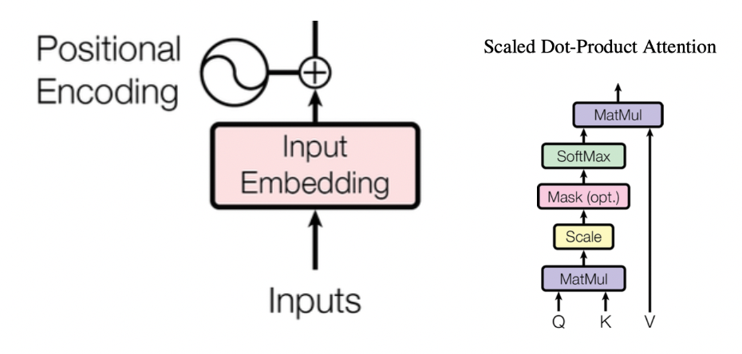
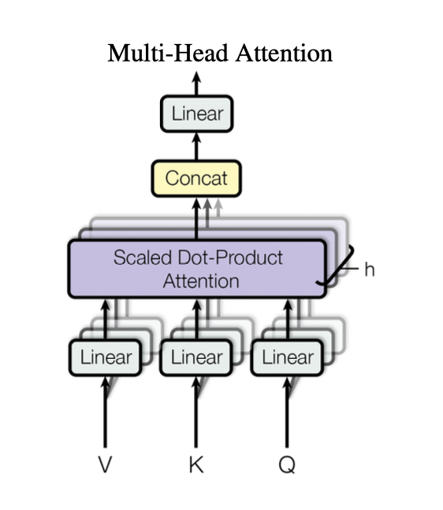
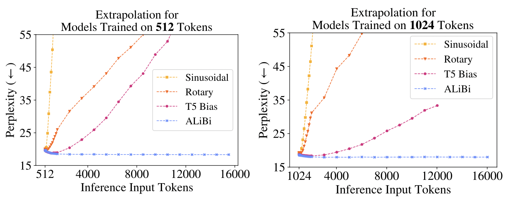
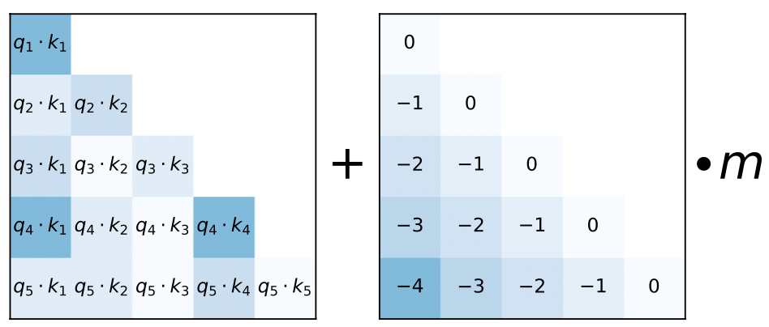
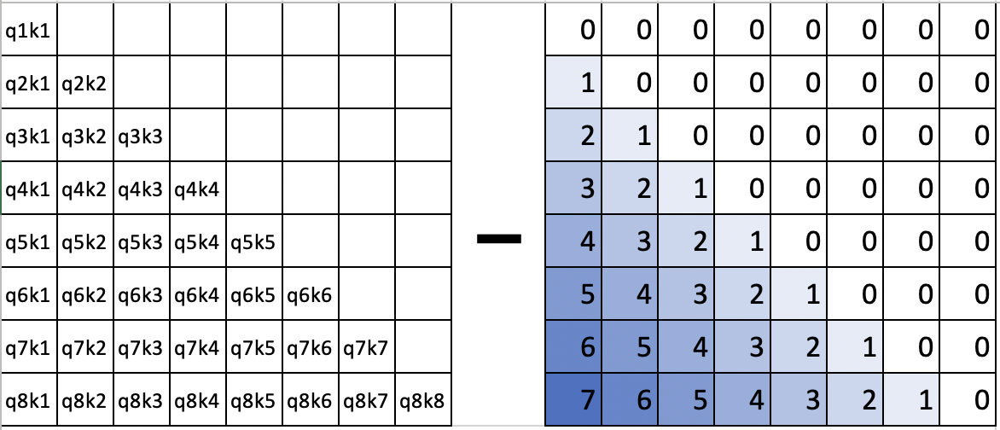
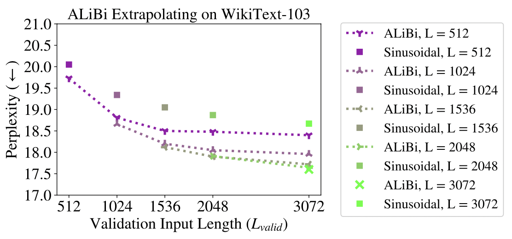
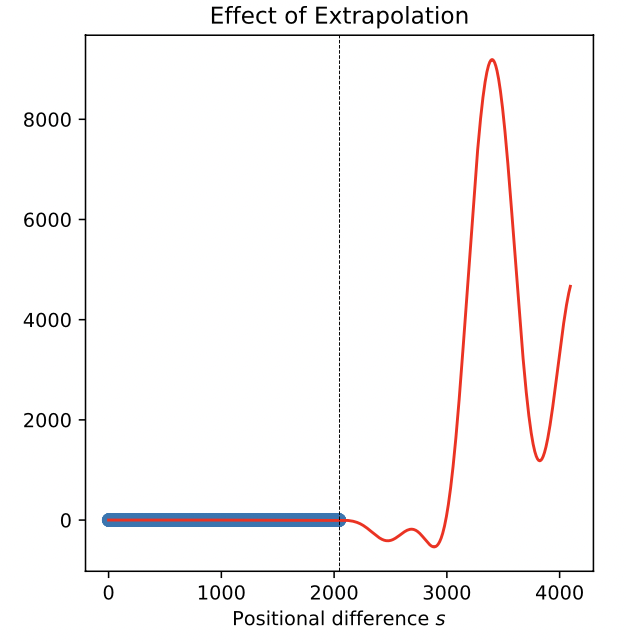
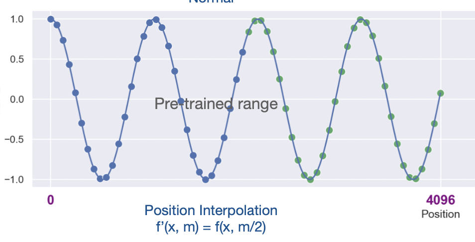
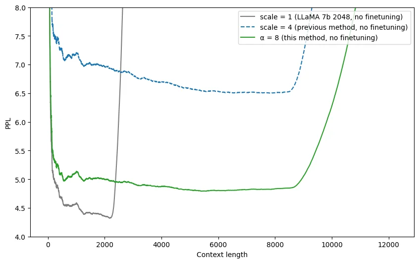
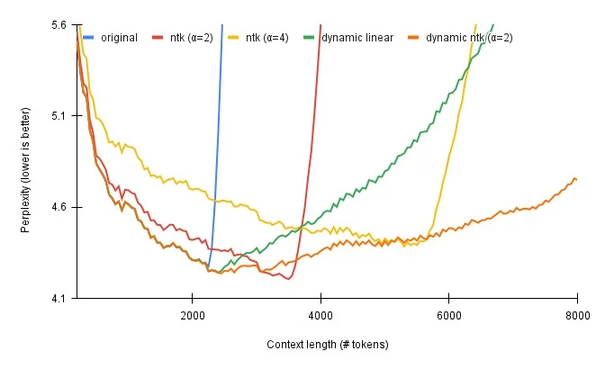

+++
title = '大语言模型如何扩充上下文长度？'
date = 2023-08-04T11:21:00+08:00
author = "Skyan"
tags = ["LLM", "machine learning"]
ShowToc = true
ShowBreadCrumbs = true
+++

我们在应用大语言模型遇到的最典型的限制就是输入文本的上下文长度。开源的模型的上下文长度限制从2K到32K不等，商业模型最大上下文限制从2K到100K范围。上下文长度对应用大语言模型有着非常关键的影响，包括知识增强、记忆等Agents完成的工作，都是为了解决大语言模型上下文长度限制而设计的。大语言模型为什么会有上下文长度限制？是否有方法能扩充长度到几倍甚至十几倍？这几个问题困扰我很久。最近一段时间经过调研之后，我发现这些问题已经有了令人兴奋的进展，我也收获一些心得，记录于此。

先说结论：
1. LLM的训练和计算都是没有上下文长度限制的，限制的只有计算资源和模型效果
2. 头部公司和开源社区都有了阶段性的成果，最新的transformers，llama.cpp等开源项目已经内置了扩充上下文长度方法
3. 如何在扩充上下文长度的同时，降低训练成本，保证模型效果，是一个还在不断探索的话题

## LLM的上下文长度限制之谜
实际上，目前以Transformer为核心的LLM，理论上而言是没有上下文长度限制的。唯一限制上下文长度的，只有训练时的资源消耗，以及预测时的输出效果。如果不考虑这两点，LLM完全可以支持任意长度的上下文，这里本质原因是，Transformer的核心：Attention算法和上下文长度无关。

为说明这个本质原因，我们回顾下Attention的计算，参考「Attention is all your need」经典论文[^1] :


定义n为输入的token数量，vocab_size为token词典大小，d为文本embedding的维度大小，k为Query和Key向量的维度大小。那么整个Attention计算过程如下：

1. Inputs是n个token序列，查找(vocab_size, d)大小的Embedding词典，转化为(n, d)的输入矩阵X
2. 类似的，将输入的token位置i经过位置向量计算（查表或者实时计算），转化为(n, d)的词典，和上面的X词典相加，获得带上位置向量的X作为输入。注意位置向量的计算有两种方法，一种是通过查表的方式，即查找一个(pos_size, d)大小的Embedding词典，另外一种是实时计算，根据token的位置i，通过位置embedding算法，计算出对应的位置向量。这两种方法各有优缺点，这将是突破上下文长度限制的重点。
3. 将X乘以\(W^Q，W^K和W^V\)三个Q,K,V权重矩阵，获得Q，K，V值矩阵。其中\(W^Q\)形状为(d, k), \(W^K\)形状为(d,k), \(W^V\)形状为(d, v)，注意着三个权重矩阵都和输入长度无关，获得的Q和K矩阵大小是(n, k)，V矩阵大小是(n, v)
4. 如下计算attention：

$$Attention(Q,K,V) =softmax(\frac {QK^T}{\sqrt{k}})V$$

其中\(QK^T\)计算结果为(n, n)矩阵，再乘以V的，输出结果为(n,v)矩阵。注意这些计算都是实时计算，计算复杂度和输入长度有关。


5. 在Multi-Head Attention算法中，上述4个步骤所有矩阵变成了张量，增加了h个header，输入矩阵X变成(h, n, d)大小，\(W_q\)大小为(h, d, k), \(W_k\)大小为(h, d, k), \(W_v\)大小为(h, d, v)。Q, K, V矩阵分别大小为(h, n, k), (h, n, k), (h, n, v)。通过将多头concat，输出(n, hv)大小的结果\(Attention(Q,K,V)\)，再经过一次线性变化，最终Attention结果为：

$$MultiHead(Q, K, V) = Concat(Attention(Q, K, V))W^O$$

\(W^O\)大小为(hv, d)，所以最终Attention结果\(MultiHead\)维度为(n, d)。

从上面的计算可见，整个模型的参数，只有位置向量需要查表的时候，是和上下文长度有关，而其他的所有权重矩阵，都和上下文长度无关。如果位置向量实时计算时，attention算法所依赖的所有参数都和上下文长度无关。

那么限制到底在哪里呢？上面已经提到，限制就在：
1. 计算资源
2. 模型效果


先说计算资源的限制，可以证明（过程略），上述第三步计算Q,K,V矩阵的计算复杂度是\(O(nd^2)\)，第四步计算attention的计算复杂度是\(O(n^2d)\)，所以计算attention总体的计算复杂度是\(O(nd^2+n^2d)\)，如果d > n，则\(O(nd^2)\)占计算复杂度的大头，例如LLaMa1模型的n为2048，d为4096，所以可以估计训练复杂度和训练输入的上下文长度呈线性关系。以LLaMa1模型举例，训练一次的计算成本约为300万美元，如果将输入长度扩大到8倍（即16K），那么训练成本将增长到2400万美元。因此如果要在预训练阶段用更长的上下文长度训练，这个成本将变得难以接受。

那是否可以在大模型的预训练阶段采用固定的上下文长度训练，例如2K，而在预测阶段采用更长的上下文长度，例如4K，16K甚至更大，是否可行？

答案还是不行。原因就是第二个限制，模型效果的退化。

在Meta和合作机构于21年发表的论文「TRAIN SHORT, TEST LONG」[^2]中，作者展示了采用这一思路的评估结论。它比较了Sinusoidal，Rotary Position和T5 Bias三种位置embedding算法在固定长度训练，变长的序列输入做预测时，perplexity指标[^3]变化的情况。perplexity也叫困惑度指标，用于评估LLM的生成能力。困惑度越低，模型生成的文本越符合语言的统计规律，越可能是人类写的文本。反之则越不符合人类习惯，越像胡说八道。

评估结果如下图所示：



上面左图是当模型按照512 token长度序列训练后，测试512-16000个token长度的输入序列预测后的perplexity指标变化情况。右图和左图类似，只是模型是按照1024 token长度训练。可以明显看出，Sinusoidal，Rotary Position和T5 Bias三种算法的perplexity随着预测序列长度的增加而迅速上涨，说明此时大模型输出的文本已经不可用，完全无意义了。

至此，我们可以总结一下LLM的上下文长度限制之谜的答案：

1. LLM在预训练阶段按照固定长度的序列训练，但这个长度受到资源和成本的限制，无法无限扩展
2. LLM在预测阶段是不受上下文长度限制，但当超过预训练时的固定长度之后，模型效果将迅速变差而不可用

## 是否有方法扩充上下文长度？

那么是否有方法可以低成本扩充上下文长度呢？有。自Transformer模型诞生以来，业界对如何扩展上下文长度预测的方法，已经有了阶段性研究成果。下面是三个经典方案：
1. 2021年中，Meta公司和合作机构提出的ALiBi方法[^2]，通过外延法扩充位置embedding向量
2. 2023年6月底网友@kaiokendev [^4]和Meta公司[^5]同时提出的位置线性内插法，双方基本同时提出了相似的思路方法，令人惊奇。
3. 2023年6月底Reddit网友@bloc97 [^6]提出的NTK-Aware Scaled RoPE方法，结合了外延和内插的优点，不用微调就可以扩展Context长度的效果，更加实用可靠

这三个方法的思想也分别介绍一下。
### ALiBi方法
ALiBi方法的思想是采用外延的方式。去掉position embedding叠加这一步骤，改为在query和key向量点乘之后，增加一个bias：

$$softmax(q_iK^T+m \cdot [-(i-1),\dots,-2, -1, 0])$$

其中i为token的位置偏移量\((1\le i \le L)\)，m为每个head分配的倾斜常量，当head为n的时候，m为几何数列：\(\frac{1}{2^{\frac{8}{n}}}, \frac{1}{2^{\frac{16}{n}}},\dots, \frac{1}{2^8}\) 。
通过增加这样一个bias，模型在训练时将学习到位置关系，起到了position embedding的效果。可视化效果如下：


其实就是在softmax之前减掉了一个非负矩阵，可以看做：

$$q_ik_j-m \cdot |i-j|$$

类似减去这样一个矩阵：


从上图可以看出，本质上是将token之间的注意力权重，按照距离进行了线性降权，两个token之间的距离越远，降权越多。距离越近，降权越低。这样当预测时序列长度距离远超过训练训练长度时，整个注意力集中在局部区域内，相当于一种局部attention机制了。

ALiBi论文认为，这种方法相对经典的Sinusoidal方法延展性性更好，预测超过训练长度的上下文长度，也能给出较低的perplexity值，下图也给出了测试数据。



实际上，BLOOM[^7], MPT[^8]，baichuan-13B模型[^9]采用的就是ALiBi位置编码，据baichuan官方文档介绍，采用ALiBi位置编码后，计算量更小，对推理性能有显著提升；与标准的 LLaMA-13B 相比，平均推理速度 (tokens/s) 实测提升 31.6%（但没给出perplexity评估数据）。

## 线性内插法

从2021年到2023年期间，业界也出现了很多类似做外推方法的扩展，典型的如Microsoft公司发表的XPOS方法[^10]等。但这些方法一直通过外延的思路来解决问题，效果上并没有特别大的突破，尤其是如何在现有流行的RoPE位置编码算法的基础上进行扩展，并没有特别好的方法。直到2023年6月，由网友kaiokendev在他的博客上发表了一篇博文，只需在RoPE编码算法的基础之上增加2行代码，就能搞定上下文长度扩展问题。据作者说明，他花了1个月的时间研究各种文献，最终从AliBi作者的一次演讲中获得灵感，发现只需要2行代码就能搞定。这种方法最大可以将LLaMa这样的模型支持的上下文长度稳定地从2K扩展到8K，可谓神来之笔。

后来我们可以看出，这种方法是一种线性内插法。介绍这种方法需要对RoPE位置编码算法[^11]有一些了解。RoPE是由苏剑林等人发明的一种旋转式位置编码算法，被用于LLaMa等一众开源LLM中。RoPE的基本原理很简单，给定一个位置序号\(m \in [1,c)\)和一个嵌入向量 \(x:=[x_1,x_2,\dots,x_d]^T\)，其中d为每个attention head的维度。RoPE算法定义如下矩阵变换：

$$f_{q,k}(x_m,m) = R^d_{\Theta,m}W_{q,k}x_m$$

其中:
$$
R^d_{\Theta,m} = \begin{pmatrix}
   cos(m\theta_1) & -sin(m\theta_1) & 0 & 0 & \dots & 0 & 0 \\
   sin(m\theta_1) & cos(m\theta_1) & 0 & 0 & \dots & 0 & 0 \\
   0 & 0 & cos(m\theta_2) & -sin(m\theta_2) & \dots & 0 & 0 \\
   0 & 0 & sin(m\theta_2) & cos(m\theta_2) & \dots & 0 & 0 \\
  \vdots & \vdots &\vdots &\vdots &\ddots &\vdots &\vdots & \\
   0 & 0& 0 & 0 & \dots & cos(m\theta_{d/2}) & -sin(m\theta_{d/2})  \\
   0 & 0 & 0 & 0 & \dots & sin(m\theta_{d/2}) & cos(m\theta_{d/2}) \\
\end{pmatrix}
$$

其中\(\theta_i=10000^{-2(i-1)/d},i \in [1,2,\dots,d/2]\)。
通过这个函数变换query和key向量，就能在这两个向量中叠加了位置信息。这种编码相对Transformer算法经典的Sinusoidal方法而言，采用了相对位置编码，不受绝对位置影响。可以证明两个token之间的attention score仅依赖于两个token之间的距离。实际应用中，将每一层attention算子的query和key向量进行RoPE函数变换即可。

RoPE作为国产原创算法，一经提出，被业界迅速采纳。Google PaLM，LLaMA，GLM-130B都通过这个位置编码获得稳定性能提升。这个算法的实现简洁，效率较高，兼容性强。

但RoPE用来外推更长序列的时候遇到了困难。实际测试发现，如果用2048个token来训练模型，但在超过2048个token的位置预测输出回答问题，那么回答的问题将是乱七八糟，完全不会考虑前面2048个token的上下文。更有甚者，如果我们在第3000个token的位置回答问题，模型将无法利用2900位置的上下文信息。也就是说，上下文关联性完全丧失。

为什么会发生这个现象，如下图可看出端倪，如果我们将超过训练上下文长度的attention score随着长度变化展示出来，可以发现一旦超过训练长度，attention score将远超过正常值(例如\(>10^3\)倍)，完全不可用，输出无意义的序列也是可想而知的。



既然外推可不行，是否还有其他方法？网友kaiokendev[^4]和Meta的田渊栋团队[^5]几乎同时发现了线性内插法。内插法顾名思义，不再是预测出超过训练上下文长度的位置向量值，而是将现有的位置向量进行缩放，使之支持更长的长度，如下图所示：


而线性内插法的思想非常简单，就是将上面RoPE算法中的m替换成\(\dfrac{mL}{L'}\)即可，其中\(L\)为训练长度，\(L'\)为预测长度。举个例子，如果训练长度是2048，预测时支持4096长度，只需要将位置序号\([1, 2, \dots, 2048,\dots, 4096]\)替换成\([0.5, 1, 1.5, \dots, 2048]\)即可。而kaiokendev修改的两行代码，也就是下面RotaryEmbedding代码实现的最后两行：
```python
class ScaledRotaryEmbedding(torch.nn.Module):
    def __init__(self, dim, max_position_embeddings=2048, base=10000, device=None):
        super().__init__()
        inv_freq = 1.0 / (base ** (torch.arange(0, dim, 2).float().to(device) / dim))
        self.register_buffer("inv_freq", inv_freq)
        
        max_position_embeddings = 8192

        # Build here to make `torch.jit.trace` work.
        self.max_seq_len_cached = max_position_embeddings
        t = torch.arange(
            self.max_seq_len_cached,
            device=self.inv_freq.device,
            dtype=self.inv_freq.dtype,
        )

        # These two lines:
        self.scale = 2048 / max_position_embeddings
        t *= self.scale
```

但如果只是预测时变换了位置序号直接计算，效果并不好，这个方法还需要配合fine-tuning。fine-tuning过程需要按照期望的扩展上下文长度，用新的语料做Supervised Fine-tuning，按照缩放后的位置向量进行fine-tuning。按照论文[^5]的介绍，只需要fine-tuning 1000步，即可获得理想的效果。在一些数据集中，上下文长度扩展到32K效果还保持不衰减。

## 动态内插法

那有没有什么更好的办法，不需要fine-tune就能直接在预测时扩充上下文长度呢？Reddit网友@bloc97在线性内插法提出一周后，就提出了新的NTK-Aware Scaled RoPE算法[^6]。该算法无需fine-tune，轻松将2K上下文长度的LLama模型扩充到8K，而且perplexity值相对线性内插法更优，如下图所示：


动态内插法只是将RoPE公式中的$\theta_i$的计算改造成\(\theta_i=(10000\alpha^{d/(d-2)})^{-2(i-1)/d}\)，python实现也就三行代码。如此轻量级的改动就能实现无需fine-tune还能扩充预测上下文长度，实在是令人惊奇。按照苏剑林的解释[^12]，RoPE算法本质是数字n的\(\beta\)进制编码，动态内插法本质上是一种进制转换，通过换成更高进制的数字表示，可以在缩放范围的同时，提供更高的精度，从而实现更好的位置embedding表示。

在NTK-Aware Scaled RoPE算法基础上，reddit网友@emozilla提出了Dynamically NTK-Aware Scaled RoPE算法[^15]，实际上将算法中的\(\alpha\)参数进一步动态缩放。按照他的评估结果，dynamic ntk算法效果最优，如下图所示：


上述所有的线性内插法和动态内插法，都已经在开源的transformers[^13]，llama.cpp[^14]等项目中落地应用了，感兴趣的同学可以参考具体实现的源代码。

在7月31日的苏剑林博客[^16]中，作者按照\(\beta\)进制编码理论，进一步推导出一种据称更优的位置编码算法NTK-RoPE-mixed，感兴趣可以进一步阅读下。

P.S. 最新发布的大模型都已经内置NTK等内插算法，普遍支持8K到16K的上下文长度，本文所讲的内容实际上都已经过时。

## 未来发展
大语言模型的技术发展瞬息万变，日新月异。开源社区和商业公司竞相创新，在训练，预测，算法，效果等各个方面不断涌现出新的想法和创意。我们也要看到，开源社区已经成了一股不可忽视的力量，在reddit，twitter，zhihu，blogger各种社交媒体上，各路大神纷纷提出自己的想法和成果，并不比商业公司落后太多，甚至略有赶超。在一个星期以前，我也曾经以为ChatGPT的32K，Claude的100K上下文长度是一个遥不可及的商业机密，但了解了业界最新进展之后，我发现上下文长度扩展到32K以上也不过如此，并没有什么机密可言。由此可见，如果不及时拥抱社区的最新进展，不持一种开放的态度，闭源封锁的开发方式必然走向落后。希望那些看到了差距的团队能迎头赶上，勇敢迈出应该迈出的改变。


## 参考文献
[^1]: Ashish Vaswani, Noam Shazeer, Niki Parmar, Jakob Uszkoreit, Llion Jones, Aidan N Gomez, L ukasz Kaiser,and Illia Polosukhin. Attention is all you need. In I. Guyon, U. V. Luxburg, S. Bengio, H. Wallach,R. Fergus, S. Vishwanathan, and R. Garnett, editors, Advances in Neural Information Processing Systems,volume 30. Curran Associates, Inc., 2017. 

[^2]: Ofir Press, Noah Smith, and Mike Lewis. Train short, test long: Attention with linear biases enablesinput length extrapolation. In International Conference on Learning Representations, 2022.

[^3]: [Perplexity of fixed-length models](https://huggingface.co/docs/transformers/perplexity#perplexity-of-fixedlength-models)

[^4]: [Extending Context is Hard…but not Impossible](https://kaiokendev.github.io/context)

[^5]: Shouyuan Chen, Sherman Wong, Liangjian Chen, Yuandong Tian. Extending Context Window of Large Language Models via Positional Interpolation. arXiv preprint arXiv:2306.15595v2 

[^6]: [NTK-Aware Scaled RoPE allows LLaMA models to have extended (8k+) context size without any fine-tuning and minimal perplexity degradation](https://www.reddit.com/r/LocalLLaMA/comments/14lz7j5/ntkaware_scaled_rope_allows_llama_models_to_have/)

[^7]: Scao, Teven Le, Angela Fan, Christopher Akiki, Ellie Pavlick, Suzana Ilić, Daniel Hesslow, Roman Castagné et al. "Bloom: A 176b-parameter open-access multilingual language model." arXiv preprint arXiv:2211.05100 (2022).

[^8]: [Introducing MPT-7B: A New Standard for Open-Source, Commercially Usable LLMs](https://www.mosaicml.com/blog/mpt-7b)

[^9]: [Baichuan-13B](https://github.com/baichuan-inc/Baichuan-13B)

[^10]: Sun, Yutao, Li Dong, Barun Patra, Shuming Ma, Shaohan Huang, Alon Benhaim, Vishrav Chaudhary, Xia Song, and Furu Wei. "A length-extrapolatable transformer." arXiv preprint arXiv:2212.10554 (2022).

[^11]: Su, Jianlin, Yu Lu, Shengfeng Pan, Ahmed Murtadha, Bo Wen, and Yunfeng Liu. "Roformer: Enhanced transformer with rotary position embedding." arXiv preprint arXiv:2104.09864(2021).

[^12]: 苏剑林，[Transformer升级之路：10、RoPE是一种β进制编码](https://kexue.fm/archives/9675)

[^13]: [Transformers pull request](https://github.com/huggingface/transformers/pull/24653)

[^14]: [llama.cpp pull request](https://github.com/ggerganov/llama.cpp/pull/2054)

[^15]: [Dynamically Scaled RoPE further increases performance of long context LLaMA with zero fine-tuning](https://www.reddit.com/r/LocalLLaMA/comments/14mrgpr/dynamically_scaled_rope_further_increases/)

[^16]: 苏剑林，[Transformer升级之路：11、将β进制位置进行到底](https://kexue.fm/archives/9706)
