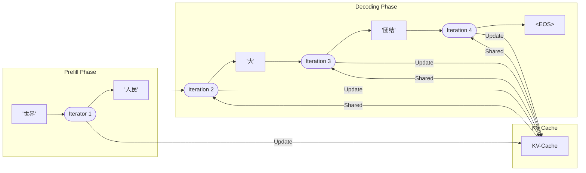
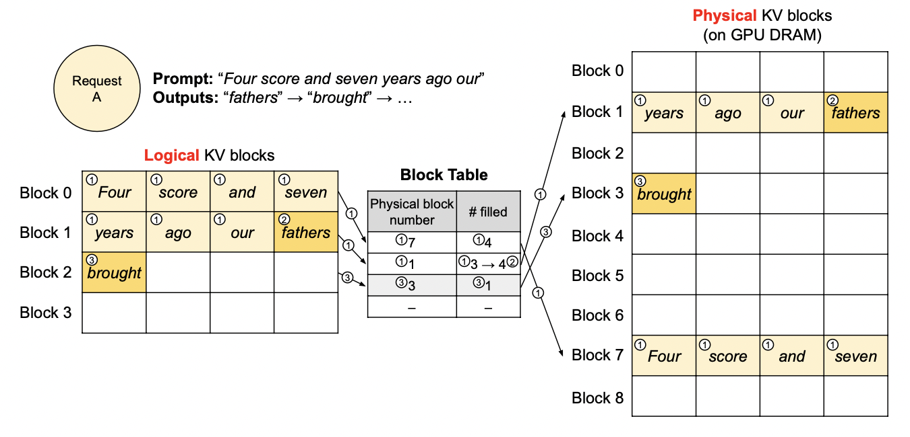

+++
title = 'LLM推理优化技术（一）'
date = 2025-01-13T10:02:00+08:00
author = "Skyan"
tags = ["LLM", "inference"]
ShowToc = true
ShowBreadCrumbs = true
+++

## 1. 前言
随着2022年底以ChatGPT为代表的LLM（大语言模型）爆发式发展，LLM成为智能时代新的增长引擎，受到学术和工业界广泛的关注。业界对于LLM的深度研究极其火热，从训练、推理、可解释性、数据集、评估方法，甚至神经科学的交叉方向都有丰富的研究成果。

作为大模型应用领域最为关心的话题，还是如何能进一步降低大模型的成本，降低响应延迟，在不影响模型效果的前提下，提升模型推理性能。这方面的工作自从2023年以来，已有诸多新技术新思想的出现，而且已经迅速成熟，成为「开箱即用」的开源组件。本文主要介绍一些工业界成熟落地的推理优化技术，作为LLM推理技术的阶段性总结。

## 2. LLM推理技术原理
现代主流的大语言模型都是基于decoder-only的自回归transformer模型结构。这种模型预测方式是：已知一个token序列，预测下一个token的概率。整个模型的计算非常简洁，只需前向执行多层堆叠的transformer结构，经过抽样(sampling)计算，输出下一个token。而且现代服务一般采用GPU等专用AI芯片用于推理加速计算。

模型执行一次推理分为两个阶段：
1. 第一阶段称为prefill，将输入的文本token序列执行一遍前向计算，填充内部每一个transformer层的key-value cache，实现初始化内部KV Cache的目的，准备下一阶段的计算。此时KV Cache缓存在GPU的HBM高速缓存中。
2. 第二阶段称为decoding，这是一个循环计算，模型使用prefill阶段填充好的KV Cache，预测下一个token，将下一个token加入输入序列的尾部，重新执行一遍前向计算并更新KV Cache，再预测下一个token，更新KV Cache，再将新生成的token加入输入序列的尾部，如此循环反复，直到遇到结尾token`<EOS>`或者最大输出长度限制停止，此时将生成的文本序列返回。

整个流程如下图所示：

从上面的推理流程可以看出，prefill阶段和decoding阶段是完全不同的两个阶段。prefill阶段主要是批量计算，由于整个序列可以一次输入计算，并行度更高，所需要的GPU算力也更高，所以属于计算密集型，GPU的算力（FLOPS）越高，运算越快，模型的首token耗时(TTFT)也就越低。

而decoding阶段由于每次只计算一个token在各层的KV tensor，计算量并不大，但并行度不高，由于每轮前向计算，都需要将需要的KV Cache从GPU的HBM传输到计算单元中，这里耗费的时间成为了瓶颈，因此GPU的内存带宽成为瓶颈，属于IO密集型。GPU的内存带宽越大，decoding越快，模型的token间耗时(ITL)也就越低。

两个阶段的计算特色不同，对算力和内存带宽的需求也不同，因此LLM推理服务往往针对这两个阶段的特点，而实现不同的优化技术。

接下来，我们将从内存优化，系统优化，解码优化，以及其他优化手段，来分别介绍当前成熟的优化技术。当然，大模型推理技术发展日新月异，还会有更新的优化技术不断出现，同时本文所介绍的推理优化技术，也会逐步被时代所淘汰。一切都在快速发展中。

## 3. 内存优化
由于大模型推理性能和GPU内存大小密切相关，尤其在decoding阶段依赖内存带宽。如果缩小模型图里期间的内存大小，则可以加快HBM内存读取访问的速度，提升性能。

大模型在GPU中消耗的内存主要有两部分组成：大模型权重和KV Cache。其他运行时也有一些tensor数据在HBM和计算单元交换，但这些数据占比较小可以忽略。当小批量推理并且输入序列长度较短时，加载权重的耗时更高。当大批量推理并且序列长度较长时，加载KV Cache耗时更高。

大模型权重占用内存大小基本等于参数量级乘以推理数据精度大小。例如500B模型采用float16推理时，权重参数将占用1T空间。

KV Cache则等于以下参数的乘积：批量大小batch size，序列长度context length，模型隐层维度大小hidden size，层数layer以及推理数据精度大小。对于一个512 batch size，context length 2048的500B模型，其KV Cache将占据3TB空间，是权重空间的三倍。而每次decoding一个token时，这3TB的数据都需要从HBM传输到GPU片上SRAM内存，其耗费的时长将占据主导地位，因此，如何进一步优化KV Cache将是内存优化的重点。

### 3.1 量化
最为自然的，降低大模型内存消耗的想法是量化方法，通过降低数据精度，压缩单个参数占用空间大小，来降低KV Cache的空间占用。量化有QAT(quantization-aware training)，PTQ(post-training quantization)两种类型。常见的是PTQ量化，它基本原理是在训练后对参数和tensor向量进行优化。而QAT则是在训练过程中和推理协同量化。

LLM-QAT[^1]是一种经典的大模型QAT算法，通过蒸馏原始模型，调优量化模型，可以实现权重、激活参数以及KV Cache的4bit量化。此外还有TSLD、PB LLM等方法可以进一步实现2bit量化，这达到了量化的极限。

然而，PTQ量化方法却获得了更广泛的应用。这主要是因为PTQ实现节省存储和计算量的同时，无需重训模型。进一步降低了使用成本，是一种简便高效的量化压缩方法。一般为了标记量化精度，一般采用W（weight），A（activation），KV（KV Cache）后面加上数字来表示精度。例如W4A8KV4表示权重采用4-bit量化，激活参数采用8-bit量化，KV Cache采用4-bit量化。

PTQ类量化方法中，有一系列专注于模型权重量化的方法，例如GPTQ，AWQ，OWQ，QuIP等，这些量化方法着重于如何能尽量减少精度损失，同时还能进一步降低权重参数大小。另外一个系列的PTQ方法，专注于同时量化权重和激活参数。SmoothQuant[^2]就是其中的典型代表方法，可以有效去除量化过程中异常值的影响。RPTQ，OliVe都是这一思想的进一步演进。ZeroQuant-FP[^3]可以支持FP8和FP4量化，其精度比INT8和INT4量化更高。

随着LLM上下文长度继续扩大，例如Google Gemini 1.5[^4]已经支持1M token长度，以及多模态大模型支持上万token长度，KV Cache占据了内存的绝大部分。PTQ也进一步发展覆盖了KV Cache量化，以减少内存占用。像是KIVI[^5]量化甚至支持KV Cache的2-bit量化，WKVQuant[^6]联合量化权重和KV Cache，实现W4KV4量化能和W4效果持平。此外还有Gear，MiniCache等方法，这个方向还在持续发展中。

### 3.2 内存使用率优化
除了量化方法，另一类研究方向是如何尽量提高GPU的内存使用效率，降低footprint消耗以及存取消耗。

前面已经提过，模型参数的内存占用相对比较固定，中间激活层参数也相对较小，而KV Cache的内存占用却随着上下文增加不断增长。因此，更为活跃的研究集中在如何有效使用KV Cache内存，实现更高的批量大小和更长的上下文。

#### 3.2.1 PagedAttention
PagedAttention[^7]本质上是借鉴了操作系统的虚拟内存设计思想。它的出发点很简单：
* 大模型输入的序列长度难以预测，并不固定，如果按照实际情况分配内存，由于长度不对齐，则会出现非常严重的内存碎片问题，降低内存使用率
* 将内存分配改为两阶段:
   1. 首先使用逻辑内存块存储KV Cache，
   1. 然后将逻辑内存块映射到非连续的实际GPU内存空间。
* 通过这种方法，可以有效降低内存碎片，提升使用率。

论文中的图示如下：

PagedAttention方法当前已经非常成熟，效果显著，已经成为各大主流大模型推理引擎（vLLM，TensorRT-LLM，TGI等）的默认功能。

同时新的方法也不断出现，例如vAttention[^8]提出新的底层系统调用API，模仿操作系统虚存分配模式，使应用层直接使用连续虚存，不感知底层不连续的物理内存分配。

此外vTensor[^9]也提出类似想法，通过vTensor结构来解耦内存的连续分配和tensor数据的动态分配。这些方法无一例外都借鉴经典操作系统的虚拟内存思想，这也是经典计算机体系结构在大模型领域的典型应用。

#### 3.2.2 Prefix Cache
在典型的对话类大模型应用中，一般在每次对话都会有一个统一的system prompt，用于角色性格，防御围栏等设定，同时每次对话会将上文对话历史也一起输入，这些都会导致KV Cache的重复计算。一个显然的优化方法就是将同样前缀的prompt的KV Cache缓存起来，称为Prefix Cache。

在[vLLM](https://docs.vllm.ai/en/latest/index.html)等主流大模型推理框架中，已经内置了Prefix Caching能力。当匹配到同样前缀后，引擎直接复用生成好的KV Cache，减少了首token耗时。这对聊天机器人场景非常合适。

SGLang[^10]提出了RadixAttention算法用于高效匹配前缀，本质思想还是来自前缀树(Radix tree)，但和经典前缀是不同的是，树的边是不等长的token序列。这棵树将prompt前缀映射到对应的KV Cache tensor内存块中。

除此以外，AttentionStore[^11]对Prompt缓存的预计算，加载和淘汰机制进行了深入设计，这个方向已经日趋成熟，并被大模型服务厂商作为API能力的一部分对外输出。

## 参考文献
[^1]: Liu S, Liu Z, Huang X, et al. Llm-fp4: 4-bit floating-point quantized transformers[J]. arXiv preprint arXiv:2310.16836, 2023.
[^2]: G. Xiao, J. Lin, M. Seznec, H. Wu, J. Demouth, and S. Han, “Smoothquant: Accurate and efficient post-training quantization for large language models,” in International Conference on Machine Learning. PMLR, 2023, pp. 38 087–38 099.
[^3]: X. Wu, Z. Yao, and Y. He, “Zeroquant-fp: A leap forward in llms post-training w4a8 quantization using floating-point formats,” arXiv preprint arXiv:2307.09782, 2023.
[^4]: Team G, Georgiev P, Lei V I, et al. Gemini 1.5: Unlocking multimodal understanding across millions of tokens of context[J]. arXiv preprint arXiv:2403.05530, 2024.
[^5]: Z. Liu, J. Yuan, H. Jin, S. Zhong, Z. Xu, V. Braverman, B. Chen, and X. Hu, “Kivi: A tuning-free asymmetric 2bit quantization for kv cache,” arXiv preprint arXiv:2402.02750, 2024.
[^6]: Yue, Y., Yuan, Z., Duanmu, H., Zhou, S., Wu, J., and Nie, L. (2024). Wkvquant: Quantizing weight and key/value cache for large language models gains more. arXiv preprint arXiv:2402.12065
[^7]: W. Kwon, Z. Li, S. Zhuang, Y. Sheng, L. Zheng, C. H. Yu, J. Gonzalez, H. Zhang, and I. Stoica, “Efficient memory manage- ment for large language model serving with pagedattention,” in Proceedings of the 29th Symposium on Operating Systems Principles, 2023, pp. 611–626.
[^8]: R. Prabhu, A. Nayak, J. Mohan, R. Ramjee, and A. Panwar, “vattention: Dynamic memory management for serving llms without pagedattention,” arXiv preprint arXiv:2405.04437, 2024.
[^9]: Xu J, Zhang R, Guo C, et al. vtensor: Flexible virtual tensor management for efficient llm serving[J]. arXiv preprint arXiv:2407.15309, 2024.
[^10]: Zheng L, Yin L, Xie Z, et al. Sglang: Efficient execution of structured language model programs[J]. Advances in Neural Information Processing Systems, 2025, 37: 62557-62583.
[^11]: Gao B, He Z, Sharma P, et al. AttentionStore: Cost-effective Attention Reuse across Multi-turn Conversations in Large Language Model Serving[J]. arXiv preprint arXiv:2403.19708, 2024.