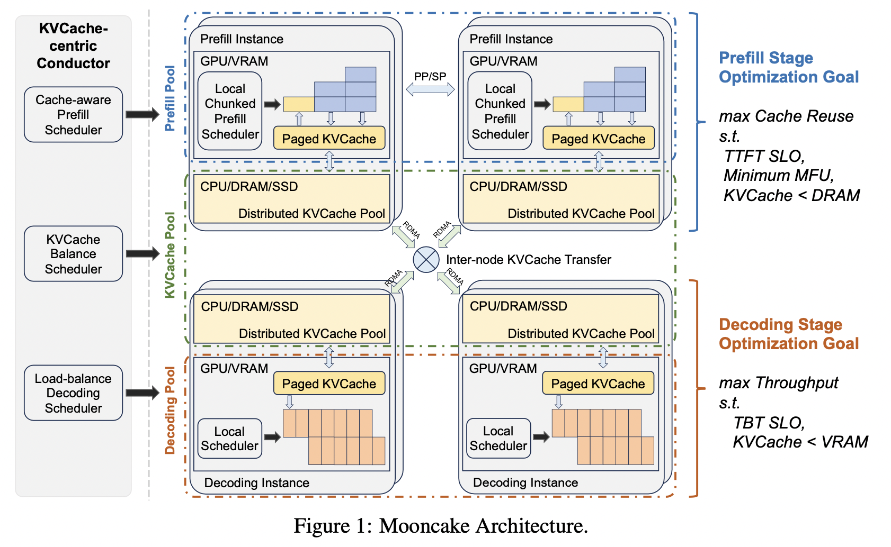

+++
title = 'LLM推理优化技术（二）'
date = 2025-02-18T15:00:00+08:00
author = "Skyan"
tags = ["LLM", "inference"]
ShowToc = true
ShowBreadCrumbs = true
+++

## 4. 系统优化
### 4.1 Iteration-level Scheduling
传统上的模型推理批量计算都是将一批请求合并到一起，然后一起发送到GPU批量推理计算，完成后返回结果。但这会引起两个问题：
1. 大语言模型请求到达时间不固定，这样先到的请求得等待后到的请求集齐一个批量，并且等待上一批量计算完成之后，才能一起发送到GPU进行批量推理计算，这对于先到的请求而言，浪费了等待时间
2. 大语言模型每次输入和输出序列的长度不定，一般会采用padding的方法插入一些空白token用于对齐。这种批量计算对于较短的序列并不公平，它虽然已经完成，但仍然等待长序列完成之后才能返回，而且空白token用于padding计算也是浪费，GPU整体利用率也很低。

为此，2022年Orca论文[^1]提出了iteration-level scheduling方法，将每次批量decoding作为一个迭代(iteration)，每次批量decoding输出一批token之后，检查有没有完成输出的序列，如果有则从批量token序列中删除，而从排队的请求中挑选一个请求序列插入到空出的序列位置。

通过这种方法，可以有效节省等待时间，只要一个迭代中有完成的请求，就可以加入新请求继续批量decoding，而且还无需特别处理长度不一致导致的padding。这种方法将会极大提升GPU利用率，并在各个主流LLM引擎中得到了广泛应用，例如[vLLM](https://github.com/vllm-project/vllm)和[Huggingface TGI](https://huggingface.co/docs/text-generation-inference/main/en/index)的continuous batching，[TensorRT-LLM](https://github.com/NVIDIA/TensorRT-LLM)的In-flight Batching，都是这种技术的实际应用。

### 4.2 Chunked Prefills
Iteration-level scheduling可以极大提升GPU利用率，但还未能将GPU利用率压榨到极致。主要有两点问题：
1. 如前所述，推理中的Prefill阶段是计算密集型，Decoding阶段是内存密集型。GPU执行prefill阶段任务时，由于大部分计算都是矩阵和矩阵乘法，因此GPU利用率可以达到最大。但当GPU在执行decoding计算时，由于大部分计算都是向量和矩阵乘法，计算受到内存带宽瓶颈限制，整体利用率很难达到最大化。
2. 由于prefill和decoding阶段分别批量计算，存在两个阶段调度互相抢占问题。如果优先decoding，则会影响首token延迟（TTFT）。如果优先prefill，则会影响生成token间耗时（ITL）。这些调度方法都对整体的延迟长尾不友好。

Chunked prefill技术[^2]通过将prefill拆分为多段，和decoding的序列拼在一起批量计算，来提升GPU吞吐和利用率，而且对整体服务的延迟长尾能有较好的提升。拆分主要有如下两种：

1. 长prompt拆分为多段，调度到多次迭代批量计算中，只有最后一个段才真正使用生成的token
2. 短prompt和decode token一起拼凑成一次批量计算，但是prompt和decode token在attention计算时分开计算。这种可以充分利用GPU算力。

Chunked Prefill的好处是将访存密集型的decode预算通过和prefill融合，从而转换为算力密集型。将decode效率得到较大提升。一些测试报告显示，chunked prefill调度相对vLLM的continuous batching调度，吞吐提升2.3倍，延迟降低50%。

该项技术已经成熟，已经被引入到[vLLM](https://docs.vllm.ai/en/latest/performance/optimization.html#chunked-prefill)，[DeepSpeed](https://github.com/deepspeedai/DeepSpeed/tree/master/blogs/deepspeed-fastgen)等项目中，成为可以配置开启的调度类型。

### 4.3 PD分离
除了chunked prefill调度优化，另外一种提升GPU利用率的方法就是将prefill和decoding分别运行在不同的GPU集群[^3] [^4]。这种优化可以针对算力瓶颈不同的两阶段，分配不同的GPU算力，甚至不同型号的GPU，来最大化整个集群的利用率。

典型的架构可以参考MoonCake[^4]架构图，如下所示：

这种调度方法原理上比较直观。在prefill集群只运行prefill计算，将计算完成后得到的KV Cache传输到decoding集群，decoding集群自回归式计算输出token，完成文本生成。整个过程可以发生在一台机器中的多卡之间，通过NVLink完成卡间通讯。也可以发生在多机之间，通过IB或者RDMA网卡来通讯传输KV Cache数据。

为什么这种调度会提升GPU利用率，节省整体的GPU资源呢。可以这样模拟计算一下：

假设prefill的最大吞吐为5.6 RPS（request per second），decoding最大吞吐为10 RPS，那么如果放在一起，平均每卡吞吐最大为`min(5.6, 10)/2=2.8` RPS。而将prefill阶段放在两张GPU运行，decoding阶段放在一张GPU，这样平均每卡吞吐最大为`min(5.6 * 2, 10)/3=3.3` RPS，相对运行在一张卡，吞吐提升了18%。

更进一步，prefill和decoding可以采用不同的GPU型号，例如prefill集群采用算力较强的GPU，而decoding阶段采用内存带宽更大的型号，整体利用率还可以进一步提升。

PD分离带来的优势有：
1. 可以分别优化首token延迟（TTFT）和token间延迟（ITL），由于PD分离，可以针对P和D分别采用不同的并行策略（TP或者PP），两种延迟之间不互相影响
2. 有效控制ITL的长尾延迟。由于单卡调度Prefill和decoding，会导致prefill和decoding互相抢占GPU资源，导致最坏情况下，输出token发生严重的长尾延迟。

当然，PD分离带来的性能提升，也是建立在保证SLO目标基础上。如果不考虑SLO，PD分离带来的收益并不显著，相反，还会导致运维复杂性提高，P和D集群资源规划更加复杂。这些都是需要考虑的因素。目前PD分离也作为实验功能，进入[vLLM](https://docs.vllm.ai/en/latest/features/disagg_prefill.html)等开源项目中。

### 4.4 多GPU并行推理
对于参数规模在数百B量级以上的大语言模型而言，单GPU的显存大小已经无法承载如此数量的参数和KV Cache了，这必然依赖多GPU共同加载模型，实现并行推理服务。Google在这个领域很早就开始布局[^5]，PaLM的540B大模型就是成功部署在64块TPU v4芯片上。

多GPU并行推理，核心的难题是如何拆分模型，使得推理延迟，MFU(model FLOPS utilization)，以及显存使用量同时达到帕累托最优。这个拆分还依赖模型结构和GPU的体系结构特点。例如MHA和MQA下需要考虑不同的分片方法。

模型网络每个阶段，可以采用不同的分片方法，例如在前馈神经网络层(feedforward layer)可以精巧的设计tensor的拆分，通过all-gather操作实现并行推理，在attention层则可以通过batch维度拆分，来降低显存消耗，同时降低卡间通信量，提升MFU。通过这类优化，PaLM 540B大模型的Prefill MFU可以达到76%，Decoding MFU可以达到33%。

多GPU并行推理技术非常依赖模型结构的设计，后面我们还会看到，MoE结构的大语言模型推理，将天然适合多GPU并行推理的优化。

## 参考文献
[^1]: Gyeong-In Yu, Joo Seong Jeong, Geon-Woo Kim, Soojeong Kim, and Byung-Gon Chun. 2022. Orca: A Distributed Serving System for {Transformer-Based} Generative Models. In 16th USENIX Symposium on Operating Systems Design and Implementation (OSDI 22). 521–538.
[^2]: Agrawal A, Panwar A, Mohan J, et al. Sarathi: Efficient llm inference by piggybacking decodes with chunked prefills[J]. arXiv preprint arXiv:2308.16369, 2023.
[^3]: Y. Zhong, S. Liu, J. Chen, J. Hu, Y. Zhu, X. Liu, X. Jin, and H. Zhang, “Distserve: Disaggregating prefill and decoding for goodput-optimized large language model serving,” arXiv preprint arXiv:2401.09670, 2024.
[^4]: Qin R, Li Z, He W, et al. Mooncake: A kvcache-centric disaggregated architecture for llm serving[J]. arXiv preprint arXiv:2407.00079, 2024.
[^5]: Pope R, Douglas S, Chowdhery A, et al. Efficiently scaling transformer inference[J]. Proceedings of Machine Learning and Systems, 2023, 5: 606-624.