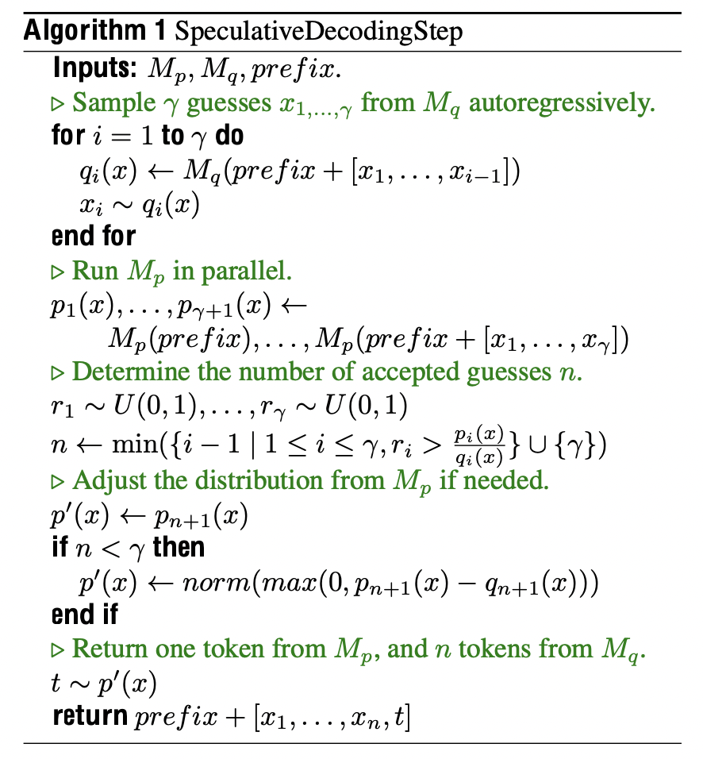
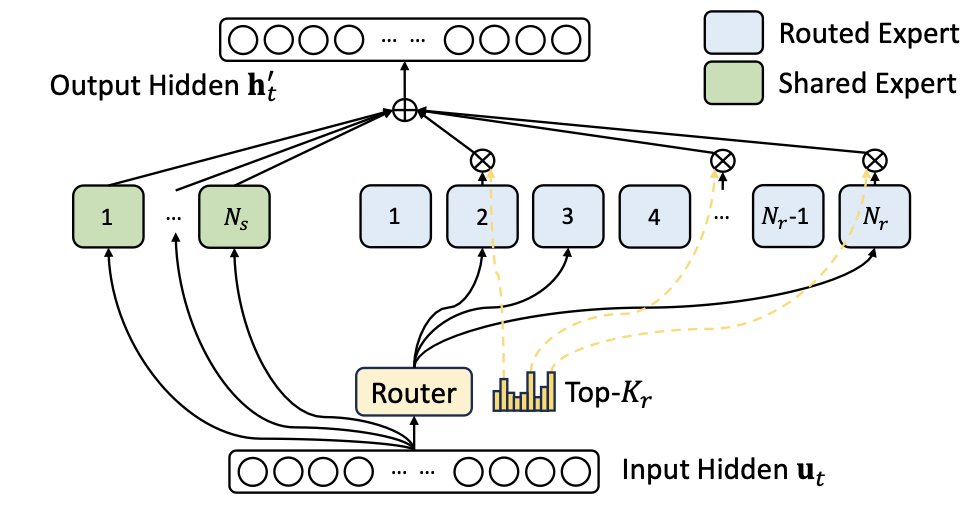
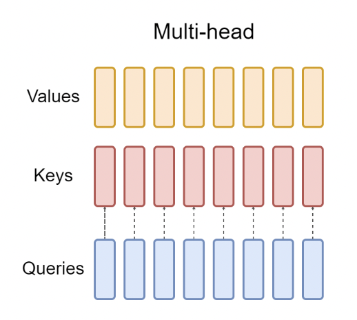
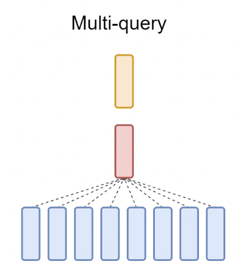
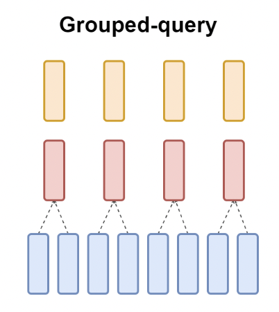
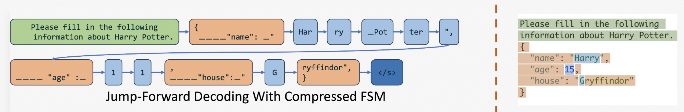

+++
title = 'LLM推理优化技术（三）'
date = 2025-02-20T12:00:00+08:00
author = "Skyan"
tags = ["LLM", "inference"]
ShowToc = true
ShowBreadCrumbs = true
+++

## 5. 解码优化
### 5.1 Speculative Decoding
投机解码(推测解码)[^1]是一种非常成熟的优化技术，并被吸收进各开源大模型推理引擎项目中。它的基本原理非常简单：由于decoding阶段是内存带宽瓶颈限制，LLM输入一个token前向推理一次花费的时间，和批量输入N个token前向推理一次的时间基本一致。那么就有个比较巧妙的办法是，通过某种方法让一次前向推理输出N个token作为草稿（draft），然后批量输入这N个draft token并行前向推理，比较draft token和对应位置的LLM输出token，如果一致则直接跳过推理，如果不支持则从这个位置重新开始下一轮推理。如果猜测的N个draft token准确率足够高，那么整个推理过程将会从每次推理1个token，提升到多个token，推理速度显著提升。

思想很简单，但到具体实现，需要考虑的是如何解决一次推理能猜测N个后续token，并保证一定的准确率。这里就有两种常见的方法：
1. 通过一个小模型来快速预测后续N个token。这个小模型可以是一个参数量更小的LLM，例如Llama 7B作为Llama 70B的猜测模型，也可以是一个更加轻量的n-gram的统计模型，可以根据实际需求挑选。这种方法的好处是，不需要重新训练模型，只需要升级推理过程，即可享受解码加速。缺点是需要两个模型配合，可能会浪费一些内存和算力。
2. 通过修改LLM网络结构，增加多个推测头(speculative head)，使得模型一次推理可以同时输出多个token。典型有Medusa[^2]和Multi-token Prediction[^3]。这种方法的好处是比较节省算力和内存资源，缺点也很明显，需要后训练模型，增加网络训练参数。

一个经典的，通过小模型作为draft model的投机解码算法如下图所示：

在实际落地过程中，投机解码中的draft model，也可以是一个n-gram统计模型，这样可以极大减少draft model的开销，而且适应性更强，比较适合输入和输出有较多重复内容的场景，例如文本总结场景。

应用投机解码过程中，还有一个绕不开的话题是投机解码是否对模型效果无损。投机解码影响模型效果主要有三个方面：
1. 浮点数精度影响。由于硬件对于浮点数运算过程中，还是有可能引入精度误差，最终导致结果差异
2. 算法实现影响。不同推理引擎在实现投机解码时，对于sampling阶段的算法，如果无法保证和原模型的分布一致，则会产生结果的差异
3. 随机因素影响。当批量大小不同，GPU数值计算精度将会有细微差别，这个在pytorch等深度学习框架都有类似问题。这个不稳定性累计下来会影响logprobs结果，最终导致输出的差异。

综合上述原因，投机解码还是会或多或少影响LLM的输出效果。需要实际应用时充分完成效果的评测，才能确保该优化是否可使用。

###  5.2 MoE(Mixture of Experts)
LLM在训练时遵循scaling law的规律，即参数量越大，计算量越大，训练token量越大，模型的效果越好。但这种scaling law对推理并不友好。随着参数量的增长，推理的计算量也随之增长，导致推理成本的上升。在深度学习时代，MoE技术就已经被深入研究，可以有效解决训练和推理算力需求不平等问题。

MoE是一种稀疏模型结构。它通过在网络中增加一个门结构来路由多个子网络，在推理过程中动态选择部分子网络参与推理计算，而训练时则是将所有子网络都参与训练参数中。这样既可以增加训练时的模型参数量，也可以有效降低推理时参与计算的参数量。

MoE的典型网络结构，可以参考DeepSeek-V3的结构[^4]，如下图所示：

LLM MoE一般将FFN结构替换为多个子FFN网络，在Multi Head Attention结构之后，增加一个门算子，决定路由到哪几个子FFN网络进一步计算。一般子专家网络分为共享专家和路由专家，共享专家是每次推理都会参与计算的子网络，而路由专家则是根据门算子决定选择其中几路专家网络参与计算。

对于数百B量级的MoE大模型的推理部署，是天然适合多GPU并行部署的。例如著名的DeepSeek-V3模型[^4]，每个MoE层有1个共享专家网络，256个子专家网络，每个token推理将会激活8路专家网络和1路共享专家网络。

在部署的时候，Prefilling集群最小部署套餐是4台节点32张H100。每个GPU卡部署8个专家网络，为了避免不同专家计算量的不平衡，实际的Prefilling集群部署的时候，每个GPU卡在8个专家网络之外，还额外部署了一个冗余专家，这样每个token推理激活9个专家网络。通过动态跨节点迁移这个冗余专家网络，来尽量实现计算量的动态平衡。

而V3模型的Decoding集群，最小部署套餐是40个节点320张H100，其中256个GPU卡，每卡部署1个专家网络，其余64个GPU卡，每卡部署冗余专家以及共享专家网络。所有卡间通过直接点到点的IB网络来通信。整个调度需要精巧的设计，来降低通信耗时。

MoE的网络结构天然只会部分激活参数，因此对于推理更加友好。特别是随着DeepSeek的大火，这种网络结构也受到越来越多的关注和重视。

### 5.3 算子融合
算子融合是一种常见的成熟模型推理优化技术。它将模型网络计算图中的多个算子或者多层，进行编译期融合，来降低中间数据交换，降低计算开销，从而达到提升推理性能的目标。

自从深度学习迅速发展以来，算子融合就已经成为推理优化方向成熟的技术。著名的TVM[^5]开源项目，实现全自动化的编译期算子识别和融合，覆盖经典的深度学习模型。

然而进入大语言模型时代，特别是以decoding-only模式大行其道的今天，专门针对decoding网络的优化更加适合当前业界的需要。著名的FlashAttention[^6]，FlashAttention2[^12]，FlashDecoding[^7]，FlashDecoding++[^11]算法，将attension的多步算子计算，融合为一个算子。这样极大减少了读写attention矩阵的开销，提升了LLM推理计算中最重要的算子的性能。

开源项目DeepSpeed-inference[^8]提出了Deep-Fusion融合技术，实现了：
1. QKV矩阵计算和输入层归一化的融合
1. 转置和attention算子的融合
1. 后attention层归一化和中间矩阵计算的融合
1. 偏置叠加和残差网络的融合

xFormers[^9] 提供了各种可以增强Transformer网络结构性能的融合内核。这些包括融合 softmax算子，融合线性层、融合层归一化，以及融合SwiGLU。

TensorRT-LLM [^10] 是NVidia开发的提供各种高性能融合内核的框架。它集成了一个强大的模式匹配算法，可以检测各种 LLM 中的潜在融合。由于TensorRT-LLM和NVidia GPU紧密结合，使之成为NVidia GPU上推理服务的重要优化工具，深受NVidia GPU开发者的喜爱。

### 5.3 MQA, GQA, MLA
解码优化的另一个方向，就是在多头注意力模型的attention结构中进行优化。这也需要和训练相配合，而不是纯粹的推理优化。

经典的多头注意力算法(Multiple Head Attention)[^13]，如下图所示：

可以明显看出，QKV矩阵计算，每个头分别计算，但Keys和Values矩阵需要占用大量的显存存储KV Cache。一个自然的想法是，是否可以在多个Queries矩阵中共享一个K和V矩阵，这就是MQA(Multi-query Attention)[^14]的基本思想，其结构如下所示：

然而，MQA虽然节省了KV Cache的存储开销，但影响了大语言模型的效果。为此，Google的研究人员综合了MHA和MQA两种方法，提出了中间方案GQA(Grouped-query Attention)[^15]，即多个Queries矩阵共享一组K和V矩阵，结构如下图所示：

GQA综合了MHA和MQA的优点，即效果上接近MHA，但在计算速度上却媲美MQA。在MLA出现之前，这个算法一直是Llama等主流大模型所采用的核心attention算法。

MLA(Multi-Head Latent Attention)[^16]是由DeepSeek首先提出，完全国产的大模型核心算法。这个算法巧妙的通过矩阵的低秩变换压缩，极大降低了KV Cache的显存开销，却达到比MHA更好的效果。整个算法充满了数学的美感，是大模型优化领域最为迷人之处。

强烈推荐阅读苏剑林关于MLA介绍的[文章](https://kexue.fm/archives/10091)，这篇文章将MHA，MQA，GQA以及MLA进行了详细而精彩的介绍。本质上这些attention算法的演进，目标都是在保持模型效果的同时，尽量降低KV Cache的开销。

MLA算法还有一个非常tricky的点，就是如何兼容RoPE位置编码，而苏剑林恰好又是RoPE算法的作者，经过他和DeepSeek团队的讨论，最终破解了这一难题，成功落地MLA算法。可以说，MLA算法就是DeepSeek极低成本训练的秘密武器之一，国产之光，值得骄傲和自豪。

### 5.4 结构化输出
当希望大模型推理的输出格式为指定格式时，推理解码又有一些额外的优化手段。例如，当用户指定大模型输出格式为Json，SQL等标准格式时，大模型的输出需要遵循BNF语法，那么在大模型解码过程中，可以利用这个结构化语法的约束，来进一步提升解码效率。

最直观的实现结构化解码的方式就是，在decoding完成后，sampling之前，根据语法约束，通过一个token掩码，过滤掉不符合规则的token，比如把这些token的logit概率置为-∞，然后再进行后续的sampling阶段。这样虽然可以避免输出不符合语法规则的token，但如果每次都需要对token词表的每个元素都进行一次判断语法规则，计算开销很大。因此很多研究集中在如何提升这种筛选的效率。

XGrammar[^17]提出可以将上下文无关的token分离，对于上下文无关的token的掩码全部缓存起来，推理时直接使用。而对于执行栈，则采用树形数据结构最大化复用，节省内存和计算开销。同时通过一种特殊的状态机优化算法，进一步压缩状态数量，节省计算。实现上，还将掩码生成和大模型解码并行化，对CPU-GPU混合运算更加友好。

SGLang[^18]提出了Jump-Forward Decoding方法，这种decoding方法本质上根据输出格式的语法约束，建立了有限状态机，这样当下一个状态为确定token时，直接输出格式要求的token，而无需执行一次昂贵的LLM解码操作，这样极大节省推理性能开销，将计算集中在未确定状态的token输出中。示意图如下所示：

SGLang的Jump-Forward Decoding方法可以和XGrammar进一步结合，实现双赢。在确定性状态下执行Jump-Forward解码，对于不确定状态采用XGrammar掩码，极大提升了结构化解码效率。

## 参考文献
[^1]: Y. Leviathan, M. Kalman, and Y. Matias, “Fast inference from transformers via speculative decoding,” in International Confer- ence on Machine Learning. PMLR, 2023, pp. 19 274–19 286.
[^2]: T. Cai, Y. Li, Z. Geng, H. Peng, J. D. Lee, D. Chen, and T. Dao, “Medusa: Simple llm inference acceleration framework with mul- tiple decoding heads,” 2024.
[^3]: Gloeckle F, Idrissi B Y, Rozière B, et al. Better & faster large language models via multi-token prediction[J]. arXiv preprint arXiv:2404.19737, 2024.
[^4]: Liu A, Feng B, Xue B, et al. Deepseek-v3 technical report[J]. arXiv preprint arXiv:2412.19437, 2024.
[^5]: Chen, T., Moreau, T., Jiang, Z., Zheng, L., Yan, E., Shen, H., Cowan, M., Wang, L., Hu, Y., Ceze, L., et al. (2018). Tvm: An automated end-to-end optimizing compiler for deep learning. In 13th USENIX Symposium on Operating Systems Design and Implementation (OSDI 18), pages 578–594.
[^6]: Dao, T., Fu, D., Ermon, S., Rudra, A., and Re ́, C. (2022). Flashat- tention: Fast and memory-efficient exact attention with io- awareness. Advances in Neural Information Processing Sys- tems, 35:16344–16359.
[^7]: Dao, T., Haziza, D., Massa, F., and Sizov, G. (2023). Flash- decoding for long-context inference.
[^8]: Aminabadi, R. Y., Rajbhandari, S., Awan, A. A., Li, C., Li, D., Zheng, E., Ruwase, O., Smith, S., Zhang, M., Rasley, J., et al. (2022). Deepspeed-inference: enabling efficient inference of transformer models at unprecedented scale. In SC22: Interna- tional Conference for High Performance Computing, Network- ing, Storage and Analysis, pages 1–15. IEEE.
[^9]: Lefaudeux, B., Massa, F., Liskovich, D., Xiong, W., Caggiano, V., Naren, S., Xu, M., Hu, J., Tintore, M., Zhang, S., Labatut, P., Haziza, D., Wehrstedt, L., Reizenstein, J., and Sizov, G. (2022). xformers: A modular and hackable transformer modelling library. [https://github.com/facebookresearch/xformers](https://github.com/facebookresearch/xformers).
[^10]: Vaidya, N., Oh, F., and Comly, N. (2023). [Optimizing inference on large language models with nvidia tensorrt-llm, now publicly available.](https://developer.nvidia.com/blog/optimizing-inference-on-llms-with-tensorrt-llm-now-publicly-available/)
[^11]: Hong, K., Dai, G., Xu, J., Mao, Q., Li, X., Liu, J., Chen, K., Dong, H., and Wang, Y. (2023). Flashdecoding++: Faster large language model inference on gpus. arXiv preprint arXiv:2311.01282.
[^12]: Dao, T. (2023). Flashattention-2: Faster attention with better par- allelism and work partitioning.
[^13]: A. Vaswani, N. Shazeer, N. Parmar, J. Uszkoreit, L. Jones, A. N. Gomez, Ł. Kaiser, and I. Polo- sukhin. Attention is all you need. Advances in neural information processing systems, 30, 2017.
[^14]: Shazeer N. Fast transformer decoding: One write-head is all you need[J]. arXiv preprint arXiv:1911.02150, 2019.
[^15]: J. Ainslie, J. Lee-Thorp, M. de Jong, Y. Zemlyanskiy, F. Lebrón, and S. Sanghai. Gqa: Training generalized multi-query transformer models from multi-head checkpoints. arXiv preprint arXiv:2305.13245, 2023.
[^16]: Liu A, Feng B, Wang B, et al. Deepseek-v2: A strong, economical, and efficient mixture-of-experts language model[J]. arXiv preprint arXiv:2405.04434, 2024.
[^17]: Dong Y, Ruan C F, Cai Y, et al. Xgrammar: Flexible and efficient structured generation engine for large language models[J]. arXiv preprint arXiv:2411.15100, 2024.
[^18]: Zheng L, Yin L, Xie Z, et al. Sglang: Efficient execution of structured language model programs[J]. Advances in Neural Information Processing Systems, 2025, 37: 62557-62583.