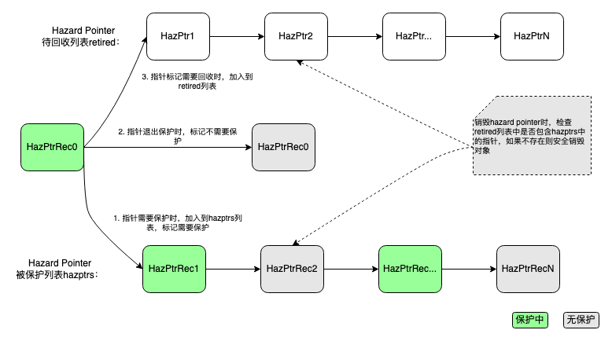

+++
title = '并行编程之内存管理(二)'
date = 2022-06-08T16:15:19+08:00
author = "Skyan"
tags = ["programming", "parallel programming"]
ShowToc = false
ShowBreadCrumbs = false
+++

## Hazard Pointer

Hazard Pointer的思想和引用计数恰好相反。不在数据内部存储一份引用计数，而是从外部来管理对象。流程如下：首先为每个需要管理的对象标记一个指针，放到一个全局或者per-thread的list中。在这个list中的标记指针就叫做hazard pointer。需要销毁对象的时候将hazard pointer放到一个待回收list，根据一些策略来决定是否正式销毁对象。销毁待回收的对象的方式还有主动和异步的接口，主动的方式是直接调用接口回收销毁。异步是通过异步线程定期销毁。销毁回收对象的时候，首先查看下hazard pointer list中有没有指向这个对象指针，有就不回收，没有就可以安全回收。其实本质上通过统计指向这个对象的hazard pointer数量来作为“引用计数”。将复杂性放到回收阶段，这也是为什么hazard pointer适合读多写少的场景的原因。

实现Hazard Pointer的主要复杂度在于管理正确处理被保护的hazard pointer和待回收的hazard pointer之间的关系。对于C++来说，可以通过构造/析构函数(RAII)来自动实现加入/退出hazard pointer的保护。整个流程可以见如下示意图所示：



从上图可以看出，销毁hazard pointer所管理的对象是通过延迟销毁来解决。通过对比被销毁的hazard pointer地址和当前正在被保护的hazard pointer地址，从而避免销毁掉正在使用中的指针对象，从而实现保护的目的。

作为样例，我们首先实现一个全局的hazard pointer基类，所有需要拥有hazard pointer保护功能的类都需要继承这个基类。
```cpp
// 该类实现基本的hazard pointer回收方法
class HazPtrObj {
  using ReclaimFnPtr = void (*)(HazPtrObj*);
  template <typename T> 
  friend class HazPtrObjBase;
  friend class HazPtrDomain;
  // 对象回收函数
  ReclaimFnPtr reclaim_;
  // 下一个待回收对象。本质上是通过这个指针，将所有待回收对象连成一个链表
  HazPtrObj* next_;
  // 将自身加入到待回收对象list中，依赖全局对象domain，domain统一管理所有已保护和待回收的hazard pointer list
  void push_obj(HazPtrDomain& domain) {
    hazptr_domain_push_retired(this, this, domain);
  }
  // 对象回收函数
  ReclaimFnPtr reclaim() noexcept { return reclaim_; }
  // 原始指针
  const void* raw_ptr() const { return this; }

public:
  HazPtrObj() noexcept : next_(this) {}
  HazPtrObj(const HazPtrObj& o) noexcept : next_(this){}
  HazPtrObj(HazPtrObj&& o) noexcept : next_(this) {}

  /** Copy operator */
  HazPtrObj& operator=(const HazPtrObj&) noexcept { return *this; }
  /** Move operator */
  HazPtrObj& operator=(HazPtrObj&&) noexcept { return *this; }
  HazPtrObj* next() const noexcept { return next_; }
  void set_next(HazPtrObj* obj) noexcept { next_ = obj; }
};

// hazard pointer基类，所有需要保护的类都继承该类
template <typename T>
class HazPtrObjBase: public HazPtrObj {
  // 默认的对象回收函数
  void delete_obj(T* p) { delete p; }

  public:
  // 将this放到待回收list中，准备被回收
  void retire(HazPtrDomain& domain = default_hazptr_domain()) {
    assert(next_ == this);
    this->reclaim_ = [](HazPtrObj* p) {
      auto hobp = static_cast<HazPtrObjBase*>(p);
      auto obj = static_cast<T*>(hobp);
      hobp->delete_obj(obj);
    };
    this->push_obj(domain);
  }
};
```

实现代码也比较直观，通过继承HazPtrObjBase类，任意一个对象都可以拥有一个retire方法，这个方法可以认为和delete等同用于销毁对象，但并不是立即回收，而是通过hazard pointer的延迟回收。
接下来需要实现一个保护HazPtrObjBase的对象，如下样例代码所示：
```cpp
// 通过RAII机制来加入/退出hazard pointer保护
class HazPtrHolder {
  HazPtrRec* hprec_;  // 被保护的指针对象，HazPtrRec是对裸指针的一个包装
  friend HazPtrHolder make_hazard_pointer(HazPtrDomain& domain);   // 用来创建holder对象
  /** Private constructor used by make_hazard_pointer */
  explicit HazPtrHolder(HazPtrRec* hprec) : hprec_(hprec) {}

 public:
  /** Default empty constructor */
  HazPtrHolder() noexcept : hprec_(nullptr) {}

  /** For nonempty construction use make_hazard_pointer. */

  // holder对象可以被move
  HazPtrHolder(HazPtrHolder&& rhs) noexcept
      : hprec_(std::exchange(rhs.hprec_, nullptr)) {}

  HazPtrHolder& operator=(HazPtrHolder&&rhs) noexcept {
    if (this != &rhs) {
      this->~HazPtrHolder();
      new (this) HazPtrHolder(rhs.hprec_);
      rhs.hprec_ = nullptr;
    }
    return *this;
  }

  HazPtrHolder(const HazPtrHolder&) = delete;

  // 销毁的时候并不直接删除被管理的对象，而是通过全局domain对象来回收hprec
  ~HazPtrHolder() {
    if (hprec_ != nullptr) {
      hprec_->reset_hazptr();
      auto domain = hprec_->domain();
      domain->release_hprec(hprec_);
    }
  }

  // 尝试保护一个指针，多线程并发时可能会失败，可能需要重试
  template <typename T>
  bool try_protect(T*& ptr, const std::atomic<T*>& src) noexcept {
    auto p = ptr;
    reset_protection(p);
    // 内存屏障，用来避免写入和读取之间的乱序
    std::atomic_thread_fence(std::memory_order_seq_cst);
    ptr = src.load(std::memory_order_acquire);
    if (p != ptr) {
      reset_protection();
      return false;
    }
    return true;
  }

  // 保护一个指针，注意裸指针需要用atomic来保护
  template <typename T>
  T* protect(const std::atomic<T*>& src) noexcept {
    T* ptr = src.load(std::memory_order_relaxed);
    while (!try_protect(ptr, src)) {
      /* Keep trying */;
    }
    return ptr;
  }
  // 设置hprec中被保护的指针地址
  template<typename T>
  void reset_protection(T* fp) {
    hprec_->reset_hazptr(fp);
  }
  // 清空被保护的指针地址，也说明该指针不需要被保护了
  void reset_protection(nullptr_t fp=nullptr) {
    hprec_->reset_hazptr();
  }
};

// 一个全局函数用来创建holder对象，注意这里受益于Return Value Optimization(RVO)，性能无开销
HazPtrHolder make_hazard_pointer(HazPtrDomain& domain = default_hazptr_domain()) {
  auto hprec = domain.acquire_hprecs();
  return HazPtrHolder(hprec);
}


依赖的HazPtrRec类实现样例如下：
// 对被保护的hazard pointer裸指针的包装类，用来组织链表以及是否被保护对象的地址
class HazPtrRec {
  std::atomic<const void*> hazptr_ {nullptr}; // the hazard pointer
  HazPtrDomain* domain_ {nullptr};
  HazPtrRec* next_ {nullptr}; // Next in the main hazard pointer list. Immutable.
  std::atomic<bool> activate_ {false};

public:
  // 返回管理的对象裸指针
  const void* hazptr() const noexcept {
    return hazptr_.load(std::memory_order_acquire);
  }
  // 重置被管理的对象裸指针
 void reset_hazptr(const void* p = nullptr) noexcept {
    hazptr_.store(p, std::memory_order_release);
  }

  HazPtrRec* next() { return next_; }

  void set_next(HazPtrRec* rec) { next_ = rec; }

  bool try_acquire() {
    bool a = activate();
    return !a && activate_.compare_exchange_weak(a, true, std::memory_order_acq_rel, std::memory_order_relaxed);
  }

  bool activate() const {
    return activate_.load(std::memory_order_acquire);
  }

  void set_activate() {
    activate_.store(true, std::memory_order_release);
  }
  // 标记该HazPtrRec可被复用
  void release() {
    activate_.store(false, std::memory_order_release);
  }

  HazPtrDomain* domain() { return domain_; }

  void set_domain(HazPtrDomain* dom) { domain_ = dom; }
};
```

HazPtrHolder类通过RAII机制来自动化管理对象的保护。从上面的代码可以看出，所有保护和回收最终都是通过domain对象来管理的，domain也是hazard pointer实现的关键。如下所示：
```cpp
class HazPtrDomain {
  using Set = std::unordered_set<const void*>;
  std::atomic<HazPtrRec*> hazptrs_ {nullptr};  // 被保护的hazard pointer列表
  std::atomic<HazPtrObj*> retired_ {nullptr};  // 待回收的hazard pointer列表
 public:
  /** Constructor */
  HazPtrDomain() = default;

  /** Destructor */
  ~HazPtrDomain() {
    reclaim_all_objects();
    free_hazptr_recs();
  }

  HazPtrDomain(const HazPtrDomain&) = delete;
  HazPtrDomain(HazPtrDomain&&) = delete;
  HazPtrDomain& operator=(const HazPtrDomain&) = delete;
  HazPtrDomain& operator=(HazPtrDomain&&) = delete;
  // 分配一个被保护的HazPtrRec对象，同时加入到被保护列表中
  HazPtrRec* acquire_hprecs() {
    // try acquire from existed hazptr
    auto h = head();
    while (h) {
      auto next = h->next();
      if (!h->try_acquire()) {
        return h;
      }
      h = next;
    }
    // create new hazptr
    auto rec = new HazPtrRec();
    rec->set_domain(this);
    while (true) {
      auto h = head();
      rec->set_next(h);
      if (cas_head(h, rec)) {
        break;
      }
    }
    return rec;
  }
  // 重置HazPtrRec管理的指针不被保护
  void release_hprec(HazPtrRec* hprec) noexcept {
    hprec->release();
  }
  // 将HazPtrObj加入到回收列表中
  void push_retired(HazPtrObj* head, HazPtrObj* tail) {
    // 一个关键的memory fence，用来保证加入retired列表的数据一致性
    std::atomic_thread_fence(std::memory_order_seq_cst);
    while (true) {
      auto r = retired();
      tail->set_next(r);
      if (retired_.compare_exchange_weak(
              r, head, std::memory_order_release, std::memory_order_acquire)) {
        break;
      }
    }
  }
  // 安全回收所有待回收对象
  void cleanup() noexcept {
    bulk_reclaim();
  }
  // 通过对比retired和haztrs列表，来决定是否可以安全销毁对象，回收内存
  void bulk_reclaim() noexcept {
    auto obj = retired_.exchange(nullptr, std::memory_order_acquire);
    // 一个关键的memory fence，用来避免retired和hazptrs之间的乱序
    std::atomic_thread_fence(std::memory_order_seq_cst);
    
    auto rec = hazptrs_.load(std::memory_order_acquire);
    // 第一步：将hazptrs所有指针存储到一个局部hashset变量中
    Set hashset;
    for (; rec; rec = rec->next()) {
      hashset.insert(rec->hazptr());
    }
    // 第二步，遍历retired列表中的裸指针，查找是否在hashset存在，如果不存在则说明该对下可以被安全地销毁
    int rcount = 0;
    HazPtrObj* head = nullptr;
    HazPtrObj* tail = nullptr;
    while (obj) {
      auto next = obj->next();
      if (hashset.count(obj->raw_ptr()) == 0) {
        (*(obj->reclaim()))(obj);
      } else {
        obj->set_next(head);
        head = obj;
        if (tail == nullptr) {
          tail = obj;
        }
      }
      obj = next;
    }
    // 如果还存在未回收的对象，则通过递归方式重新尝试回收
    if (tail) {
      push_retired(head, tail);
    }
  }

  void reclaim_all_objects() {
    auto retired = retired_.exchange(nullptr);
    while (retired) {
      auto obj = retired;
      while (obj) {
        auto next = obj->next();
        (*(obj->reclaim()))(obj);
        obj = next;
      }
      retired = retired_.exchange(nullptr);
    }
  }

  void free_hazptr_recs() {
    auto rec = head();
    while (rec) {
        auto next = rec->next();
        delete rec;
        rec = next;
    }
  }

private:
  bool cas_head(HazPtrRec* expvalue, HazPtrRec* newvalue) {
    return hazptrs_.compare_exchange_weak(expvalue, newvalue, std::memory_order_acq_rel, std::memory_order_acquire);
  }
  HazPtrRec* head() const noexcept {
    return hazptrs_.load(std::memory_order_acquire);
  }

  bool cas_retired(HazPtrObj* expvalue, HazPtrObj* newvalue) {
    return retired_.compare_exchange_weak(expvalue, newvalue, std::memory_order_acq_rel, std::memory_order_acquire);
  }
  HazPtrObj* retired() const noexcept {
    return retired_.load(std::memory_order_acquire);
  }
};
// 标记HazPtrObj对象可以回收
void hazptr_domain_push_retired(
    HazPtrObj* head,
    HazPtrObj* tail,
    HazPtrDomain& domain) noexcept {
  domain.push_retired(head, tail);
}
// 全局默认HazPtrDomain对象
HazPtrDomain& default_hazptr_domain() {
    static HazPtrDomain domain;
    return domain;
}
```

至此，一个hazard pointer的简单实现完成。使用起来如下例所示：
```cpp
std::atomic<Foo*> f1 = new Foo();
{
  HazPtrHolder holder = make_hazard_pointer();
  auto fp1 = holder.protect(f1);
  fp1->Do();
}
f1.load()->retire();
default_hazptr_domain().cleanup();
```

当需要保护指针时，创建一个HazPtrHolder对象保护该指针，该对象销毁时可以自动退出保护。当需要回收对象时，通过retire方法标记可回收。最后，通过HazPtrDomain对下的cleanup方法销毁所有可回收对象。

需要注意的是，上述代码所实现的hazard pointer并不是性能最优，特别是HazPtrHolder的性能甚至比上篇介绍的AtomicSharedPtr还差。原因有：
   1. 全局对象管理hazard pointer，中间会有多线程竞争问题；
   2. 内存cache不友好，例如HazPtrRec容易发生false sharing问题。
   3. 采用的memory fence比较重，我们所使用的atomic_thread_fence(memory_order_seq_cst)，x86实现是mfence。但实际上在一些简单路径上可以通过非对称内存屏障来保证编译器指令不重排即可。即使需要所有线程内存一致，Linux下还有系统调用membarrier来高效实现，也可以通过mprotec强制所有线程内存一致。

因此虽然样例代码是一个lock-free算法，但实现并不高效。工业界普遍通过线程本地存储TLS来优化hazard pointer。通过TLS为每个线程缓存HazPtrRec对象，为retired列表进行分桶存储(尽量避免多线程冲突)，再加上内存对齐(align)，非对称内存屏障的优化和CPU Cache友好性设计等优化，整体性能可以达到：hazard pointer的一次保护或者退出调用只需要8ns左右，基本达到了频繁读场景可用的地步了。

Hazard Pointer适合内存访问读多写少，对性能敏感的场景，优点有性能非常好，读线程之间无竞争，lock-free，可扩展，甚至在阻塞场景也可以使用。缺点在于性能非常依赖高效的TLS，还有内存的回收不是全自动，依赖一些回收策略或者手工回收。

开源的folly基于Hazard Pointer实现了ConcurrentHashMap，UnboundedQueue等性能很好的并发数据结构，同时开源的MongoDB，OpenBSD，Rust都使用了Hazard Pointer。在生产环境中都可以找到合适的场景应用。
