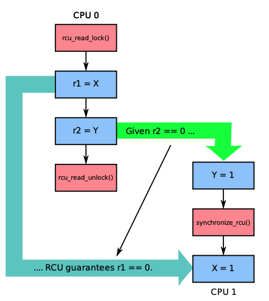
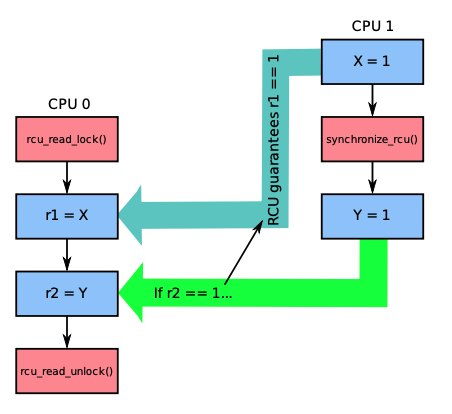
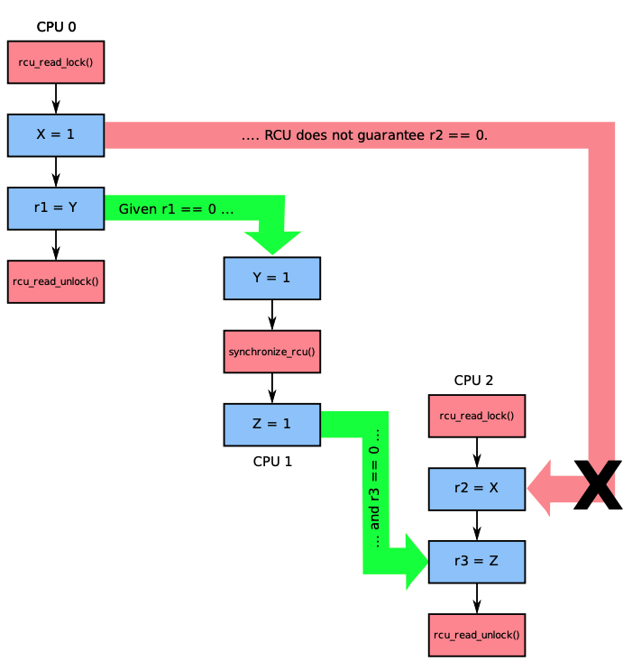
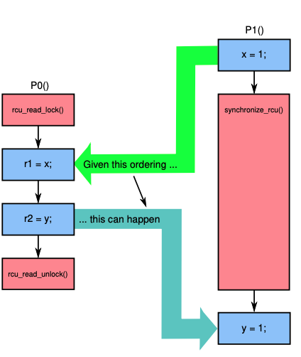

+++
title = '并行编程之内存管理(三)'
date = 2022-06-08T20:25:10+08:00
author = "Skyan"
tags = ["programming", "parallel programming"]
ShowToc = false
ShowBreadCrumbs = false
+++

## RCU(Read-Copy-Update)

前述的几种内存管理方式只能同时管理一个内存对象，而RCU是一种同时管理多个对象的并发读写的方法。它实际上是提供了一种受保护的内存区域，通过RCU方法，将对象关联到受保护内存区域后，可以保证读操作完成以后才会回收对象，而且读操作开销极其低(5ns左右)，适合多个对象的批量保护，以及读多写少的场景。自从2002年RCU功能引入Linux内核以后，在内核中使用次数突飞猛进，如下图所示：

在内核中RCU API被广泛应用于网络，内存管理，文件系统等内核组件中。除了内核，RCU也有开源的user space RCU库，被广泛应用于QEMU模拟器，DPDK，Go语言的垃圾回收等项目中。

那么RCU到底是什么神秘的方法呢？其实原理正如其名：Read-Copy-Update。当需要修改对象的时候，先拷贝这个对象，修改产生新版本对下，然后变更新版本对象，等待老版本对象的reader完成读操作，再销毁老版本对象。可以明显看出，这个思想和Copy-On-Write思想一脉相承，和MVCC的思想更是极其类似。在生产环境中，按照类似原理实现的支持并行变更的数据结构也屡见不鲜，例如索引领域的hashmap，B+树等数据结构都可以按照类似思想实现并发读写。因此，思想并不新，但如果要正确实现，有三个原则需要保证，有很多细节需要处理，这也是RCU比较神秘之处。

RCU正确实现的三个原则是：宽限期保证(grace-period guarantee)，发布-订阅保证(publish-subscribe)和内存顺序保证(memory-order guarantee)。解释如下：

### 宽限期保证
允许所有的更新操作等待之前存在的读操作完成。之前存在的读操作其实就是还在访问修改前的内存对象的reader，因此如果不等待这些reader就销毁老版本的对象，则会导致并发错误。在一个链表的场景中，先删除一个节点的链接，然后通过宽限期保证等待所有该节点的访问结束之后，就可以安全销毁这个节点。

相关的RCU接口有rcu_read_lock，rcu_read_unlock, synchronize_rcu，其中rcu_read_lock，rcu_read_unlock用于读操作，标记当前线程正在读该内存区域，rcu_read_lock，rcu_read_unlock之间访问的所有内存对象被称为读端临界区(read-side critical section)。synchronize_rcu接口用于执行宽限期保证，等待所有还在读老版本数据的线程完成。

### 发布-订阅保证
该保证是说所有reader读取一个新版本对象的时候，可以保证该对象已经初始化好了。这里reader就是所谓的订阅者，RCU通过rcu_assign_pointer接口实现发布操作，RCU的这个保证可以保证订阅者看到的一定是发布者发布时刻的对象，不存在乱序等因素的干扰。实现上，发布方可以通过std::memory_order_release操作来更新对象，而读方可以通过std::memory_order_consume来读取对象，这样就可以避免乱序读取的情况发生。

## 内存顺序保证
该保证是宽限期保证的自然延续。读端临界区之间保护的内存对象和synchronize_rcu调用之间，存在一个严格保证的内存顺序关系。
下面几个例子说明该顺序的含义，其中X和Y的初始值都为0：

| 类别 | 图示  | 描述 |
| --- | ---   | --- |
| 情况1 |  | 如果按照绿色箭头的顺序执行，RCU可以保证读端临界区之后，即rcu_read_unlock发生之后才发生synchronize_rcu，这样如果r2==1，那么可以保证r1==0 |
| 情况2 |  | 如果CPU 0在读端临界区间运行时发生synchronize_rcu调用，RCU可以保证synchronize_rcu之前发生的事件一定在读端临界区中生效。在这个例子中，如果r2==1，那RCU一定保证r1==1 |
| 情况3 |  | 如果两个读端临界区并行执行，RCU是无法保证两者之间的内存顺序的。在这个例子中，CPU0和CPU2的读端临界区中对象的读取顺序是无法保证的，因此如果按照绿色箭头执行，r1==0，r3==0，是无法保证X=1和r2=X之间不乱序的  |
| 情况4 |  | 如果RCU的读端临界区和宽限期保证synchronize_rcu调用重叠，如果按照绿色箭头执行顺序，RCU可以保证读端临界区先于synchronize_rcu执行之前，即r1==1，r2==0 |


那么，如何实现RCU的呢？实际上，一个最简单的实现方式只需要10行代码，如下所示：
```cpp
static void rcu_read_lock(void) {
    spin_lock(&rcu_gp_lock);
}
static void rcu_read_unlock(void) {
    spin_unlock(&rcu_gp_lock);
}
void synchronize_rcu(void) {
    spin_lock(&rcu_gp_lock);
    spin_unlock(&rcu_gp_lock); 
}
```

可以看出rcu_read_lock和rcu_read_unlock通过一把锁来保证和synchronize_rcu之间严格的顺序关系，同时synchronize_rcu必须等待rcu_read_unlock执行完成之后才能执行。当然，这种naive的实现性能最低，而且不支持并发读，在生产环境中完全不可用。

有几种可以考虑的改进思路：
1. 通过引用计数的方式来实现并发读；
2. 通过TLS的方式减少读之间的竞争；
3. 通过多版本的方式来减少锁竞争。

这样一个优化的实现如下所示：
```cpp
DEFINE_SPINLOCK(rcu_gp_lock);  // 全局spin lock，用于保证并发只有一个写线程
DEFINE_PER_THREAD(int [2], rcu_refcnt);  // 每个线程缓存一个引用计数
long rcu_idx;  // 全局多版本号
DEFINE_PER_THREAD(int, rcu_nesting);  // 每个线程缓存一个内嵌计数，用于支持读端临界区的重复进入
DEFINE_PER_THREAD(int, rcu_read_idx);  // 每个线程缓存一个版本号
// 进入读端临界区
static void rcu_read_lock(void)
{
	int i;
	int n;

	n = __get_thread_var(rcu_nesting);
	if (n == 0) {  // 第一次进入的时候更新引用计数
		i = atomic_read(&rcu_idx);  // 获取可用的全局版本号
		__get_thread_var(rcu_read_idx) = i;  // 在对应版本计数
		__get_thread_var(rcu_refcnt)[i]++;
	}
	__get_thread_var(rcu_nesting) = n + 1;  // TLS内嵌计数++
	smp_mb();
}
// 退出读端临界区
static void rcu_read_unlock(void)
{
	int i;
	int n;

	smp_mb();
	n = __get_thread_var(rcu_nesting);
	if (n == 1) {// 最后一次退出的时候更新引用计数
		i = __get_thread_var(rcu_read_idx); // 获取可用的全局版本号
		__get_thread_var(rcu_refcnt)[i]--; // 在对应版本更新计数
	}
	__get_thread_var(rcu_nesting) = n - 1; // TLS内嵌计数--
}
// 反转全局版本号，保证所有读线程完成
static void flip_counter_and_wait(int i)
{
	int t;
	atomic_set(&rcu_idx, !i);  // 反转版本号，这样后续进入的读线程都会使用新版本号
	smp_mb();
	for_each_thread(t) {  // 遍历所有线程TLS
		while (per_thread(rcu_refcnt, t)[i] != 0) {  // 等待每个线程TLS缓存的引用计数为0
			poll(NULL, 0, 10);
		}
	}
	smp_mb();
}
// 宽限期保证实现
void synchronize_rcu(void)
{
	int i;
	smp_mb();
	spin_lock(&rcu_gp_lock);  // spin lock保证只有一个写线程
	i = atomic_read(&rcu_idx);  // 读取全局版本号

    // 先反转一次版本号，等待老版本读线程结束
    // 但还是有可能会在30-31行之间，执行了flip，因此需要再反转等待一次
	flip_counter_and_wait(i);
	flip_counter_and_wait(!i);

	spin_unlock(&rcu_gp_lock);
	smp_mb();
}
```

这个实现离生产可用的实现更进一步，实际上，已经开源的RCU库有user space RCU和folly RCU，都可以学习参考。

基于RCU，我们可以实现多种并发数据结构。这里不再详述。

总的来说，RCU适合读多写少的场景，它避免了读线程之间的竞争，使用简单，读性能极其好(~5ns)，并发扩展性好。缺点在于对于阻塞敏感，如果读线程发生阻塞，写线程可能会导致延迟。如果对速度和并发扩展性要求很高，而且发生阻塞的时候不需要对内存对象保护，可以考虑使用RCU。
